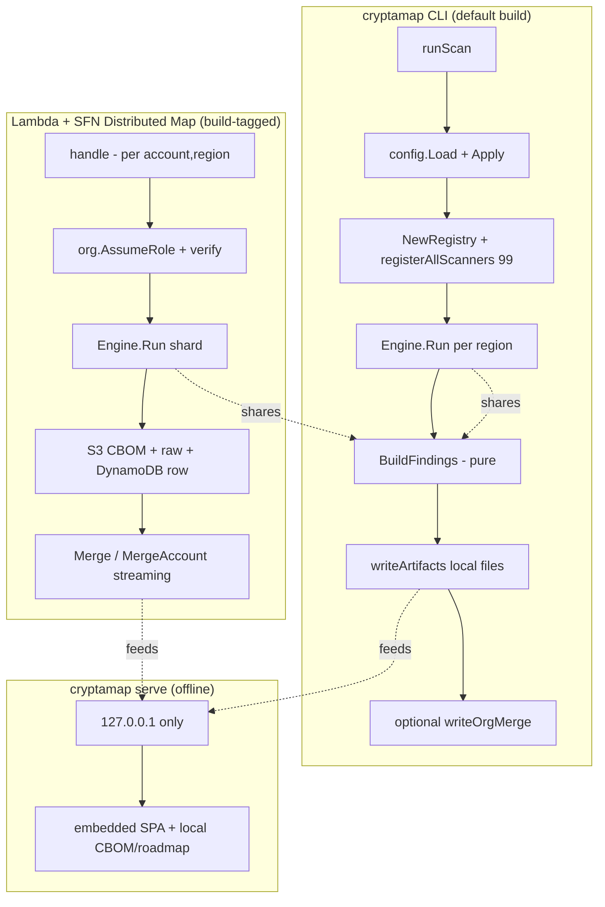
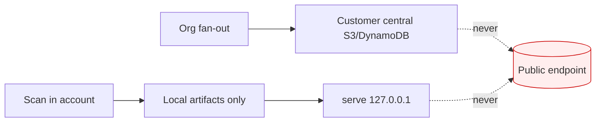

# CryptaMap — Requirements Specification

> **Audience & purpose:** Engineers, security reviewers, and compliance stakeholders. This document reverse-engineers the *functional* (FR) and *non-functional* (NFR) requirements that CryptaMap actually implements today, derived from the source code, with each requirement traceable to the implementing file:line and to its test (where one exists). It is descriptive of the built system, not aspirational.

CryptaMap is an AWS post-quantum-cryptography (PQC) readiness scanner. It discovers cryptographic assets across many AWS services, classifies each into a quantum-posture, scores migration urgency with Mosca's Theorem, ranks a remediation roadmap, maps findings to regulatory frameworks, and emits a CycloneDX 1.7 CBOM plus regulator-facing reports — all under a local-first, data-stays-in-account security model.

---

## Table of Contents

1. [Scope & Definitions](#1-scope--definitions)
2. [System Context (diagram)](#2-system-context)
3. [Functional Requirements](#3-functional-requirements)
   - [3.1 Discovery / Scanning](#31-discovery--scanning-fr-1--fr-12)
   - [3.2 Classification (Posture Model)](#32-classification-posture-model-fr-13--fr-22)
   - [3.3 Risk Scoring (Mosca) & Severity](#33-risk-scoring-mosca--severity-fr-23--fr-28)
   - [3.4 Finding Generation](#34-finding-generation-fr-29--fr-32)
   - [3.5 Compliance Mapping](#35-compliance-mapping-fr-33--fr-37)
   - [3.6 Roadmap](#36-roadmap-fr-38--fr-43)
   - [3.7 Output Formats](#37-output-formats-fr-44--fr-53)
   - [3.8 Org Fan-out & Merge](#38-org-fan-out--merge-fr-54--fr-61)
   - [3.9 Dashboard / Serve](#39-dashboard--serve-fr-62--fr-65)
   - [3.10 Configuration & CLI](#310-configuration--cli-fr-66--fr-71)
4. [Non-Functional Requirements](#4-non-functional-requirements)
5. [Data-Localization & Security Constraints](#5-data-localization--security-constraints)
6. [Requirements Traceability Matrix](#6-requirements-traceability-matrix)
7. [Known Gaps & Stale-Spec Notes](#7-known-gaps--stale-spec-notes)

Sibling SDLC docs: [02-USER-STORIES.md](./02-USER-STORIES.md) · [03-USER-JOURNEYS.md](./03-USER-JOURNEYS.md) · [04-HIGH-LEVEL-DESIGN.md](./04-HIGH-LEVEL-DESIGN.md) · [05-LOW-LEVEL-DESIGN.md](./05-LOW-LEVEL-DESIGN.md) · [06-DATA-FLOW.md](./06-DATA-FLOW.md) · [07-API-FLOW.md](./07-API-FLOW.md) · [08-TECH-STACK.md](./08-TECH-STACK.md) · [09-TEST-COVERAGE.md](./09-TEST-COVERAGE.md) · [10-SECURITY-AND-DATA-LOCALIZATION.md](./10-SECURITY-AND-DATA-LOCALIZATION.md).

---

## 1. Scope & Definitions

| Term | Meaning in this codebase |
|---|---|
| **Asset** | One cryptographic resource discovered by a scanner: `models.CryptoAsset` (`pkg/models/asset.go:153-168`). |
| **Posture** | The quantum-risk classification of an asset, stored as a string in `asset.Properties["posture"]` and enumerated by `models.CryptoPosture` (`pkg/models/finding.go:35-43`). |
| **Finding** | The regulator-facing record built from an asset+posture: `models.Finding` (`pkg/models/finding.go:66-85`). |
| **Mosca score** | `X + Y − Z` (data shelf-life + migration time − CRQC horizon); positive ⇒ harvest-now-decrypt-later (HNDL) exposure (`internal/risk/mosca.go:12-23`). |
| **Scanner** | A per-service implementation of the `ServiceScanner` interface (`internal/scanner/types.go:14-18`). |
| **CBOM** | CycloneDX 1.7 cryptographic bill of materials (`internal/output/cyclonedx.go`). |
| **Shard** | One per-(account, region) `models.ScanResult` (`pkg/models/scan.go:25-37`). |

**Scanner inventory (verified by counting `r.Register` calls):** 99 live scanners — certmgmt 10, keymgmt 9, sdkpqc 3, datarest 49, transit 27, runtime 1 (`cmd/cryptamap/register.go:16-56`, `cmd/cryptamap/register_datarest.go:9-48`, `cmd/cryptamap/register_transit.go:9-37`). The `--mock` generator covers all **99** scanners 1:1 (`internal/mock/templates.go`, enforced by `internal/mock/coverage_test.go:TestMockCoverageNoDrift`). Updated 2026-06-15 (coverage-expansion): 86 → 99 scanners (the skipped-services audit promoted 13 to v1 — datarest +11, certmgmt +2). Updated 2026-06-16: mock templates extended to all 99.

---

## 2. System Context

The same pure finding-generation and merge code paths are shared across live CLI, org Lambda, mock, and offline file-merge — a deliberate single-source-of-truth design (`internal/scanner/findings.go:29-71` reused at `cmd/cryptamap/main.go`, `cmd/cryptamap/lambda.go:130`, `internal/scanner/mock_engine.go:34`, `cmd/cryptamap/org_merge_files.go:97`).

---

## 3. Functional Requirements

### 3.1 Discovery / Scanning (FR-1 — FR-12)

**FR-1 — Per-service scanner contract.** Every discovery unit MUST implement `ServiceScanner` = `Name()`, `Category()`, `Scan(ctx, aws.Config) ([]CryptoAsset, error)`, where one `Scan` covers one (account, region). *Impl:* `internal/scanner/types.go:14-18`.

**FR-2 — Scanner registry with deterministic ordering.** Scanners MUST be held in a concurrency-safe map keyed by `Name()` and enumerated in sorted-name order so scan ordering is stable. *Impl:* `internal/scanner/registry.go:9-24` (Register), `:27-40` (All, `sort.Strings`).

**FR-3 — Full scanner set registered.** The CLI MUST register all 99 scanners spanning data-at-rest, data-in-transit, certificate, key-management, sdk-library, and runtime-evidence categories. *Impl:* `cmd/cryptamap/register.go:16-56`; data-at-rest `register_datarest.go:9-48`; transit `register_transit.go:9-37`. *Test:* `internal/scanner/registry_test.go` mirrors the exact registration set and reconciles its size against `taxonomy.All()`, and asserts a read-only-middleware contract over a representative scanner (every SDK op is a non-mutating read verb); `cmd/cryptamap/count_guard_test.go` pins `registeredScannerCount() == 99`.

**FR-4 — Bounded concurrent fan-out.** The engine MUST scan services concurrently via a worker pool of `min(MaxGoroutines, #scanners)` goroutines (default `MaxGoroutines=50`), draining buffered job/result channels sized to the scanner count. *Impl:* `internal/scanner/engine.go:39-56` (defaults), `:72-163` (Run).

**FR-5 — Per-service asset cap.** The engine MUST truncate a single pathological service's assets to `PerServiceCap[name]` and log the truncation to stderr. *Impl:* `internal/scanner/engine.go:96-100`. *(See FR-71 gap: the CLI never populates this from config.)*

**FR-6 — Per-scanner truncation guard.** Each scanner MUST stop emitting at `MaxAssetsPerScanner = 25000` and log a loud stderr message via `TruncationCapReached`. *Impl:* `internal/services/common.go:23,38`. Some older keymgmt/sdkpqc/certmgmt scanners use a local `maxItems = 1000` cap instead (e.g. `keymgmt/kms_rotation.go:33`, `certmgmt/acmpca.go:80`, `sdkpqc/container_images.go:42`).

**FR-7 — Always-surface scanner errors.** Per-scanner errors MUST be written to stderr regardless of `--verbose`, so silent auth failures never masquerade as an empty (clean) account; an aggregate error line is printed if any scanner errored. A scanner MUST therefore RETURN (not swallow) an AWS API error so the engine records it as errored. *Impl:* `internal/scanner/engine.go:129-145`. **Note:** `apigw_http` previously swallowed a `GetDomainNames` error (treating a denied/throttled call as a clean empty success); it now returns the error so a denied scan is visibly incomplete (`internal/services/transit/apigw_http.go:77-84`). *Test:* `internal/services/transit/apigw_http_test.go` (`TestAPIGWHTTPScanDomainNamesErrorPropagates`).

**FR-8 — Transient-error retry without throttle amplification.** The engine MAY retry a whole `Scan` with exponential backoff + jitter ONLY for coarse transient errors (`i/o timeout`, `connection reset`); it MUST NOT retry throttle classes (`Throttling`/`TooManyRequests`/`RequestLimitExceeded`/`503`) because the AWS SDK adaptive retryer owns those. *Impl:* `internal/scanner/engine.go:166-187` (runWithRetries), `:198-210` (shouldRetry), `:221-229` (backoff). *Test:* none direct; behavior asserted indirectly.

**FR-9 — Bounded inner concurrency.** Scanners that fan out across many resources MUST use `MapConcurrent` (order-preserving, `DefaultInnerConcurrency = 12`). *Impl:* `internal/services/common.go:272,313`. Used by s3, dynamodb, athena, kms_spec, kms_usage, paymentcryptography, signer, etc.

**FR-10 — Region-scoped scanning.** Each `Scan` MUST receive a region-pinned `aws.Config`; the CLI copies the base config per region (`regionCfg = awsCfg.Copy()` with the region set). *Impl:* `cmd/cryptamap/main.go:188-206`.

**FR-11 — Global-service single-run guards.** Globally-scoped services MUST run exactly once and pin their asset/client region appropriately (e.g. Global Accelerator gated to `gaRunOnceRegion us-east-1`, endpoints pinned to `us-west-2`; CloudFront viewer certs resolved in `us-east-1`). *Impl:* `internal/services/transit/globalaccelerator.go:32,35`; `internal/services/transit/acm_cert.go:49`. *Test:* `internal/services/transit/globalaccelerator_test.go`.

**FR-12 — Graceful skip for opt-in / retired regional services.** When a service is not subscribed / not in-region / has a retired endpoint, the scanner MUST return `(zero assets, nil error)` so the shard is not flagged errored. *Impl:* `internal/services/datarest/qldb.go` (endpoint DNS), `datarest/timestream.go` (not-subscribed), `keymgmt/payments.go:224` (not-in-region). *Test:* `internal/services/datarest/qldb_test.go`, `keyspaces_test.go`.

### 3.2 Classification (Posture Model) (FR-13 — FR-22)

**FR-13 — Seven posture classes.** Classification MUST resolve to one of: `no-encryption`, `legacy-tls`, `non-pqc-classical`, `symmetric-only`, `pqc-hybrid`, `pqc-ready`, `unknown`. *Impl:* `pkg/models/finding.go:35-43`.

**FR-14 — Posture carried in `Properties["posture"]`.** Scanners MUST stamp the posture string via `PostureProperty`; `BuildFindings` reads it back (absent ⇒ `unknown` ⇒ MEDIUM, never an error). *Impl:* `internal/services/common.go:420`; consumed at `internal/scanner/findings.go:33-38`.

**FR-15 — At-rest classification archetypes.** At-rest scanners MUST classify into one of three archetypes: **(A)** always-on / doc-guaranteed ⇒ unconditional `symmetric-only` (absent KMS key = AWS-owned default, never `no-encryption`); **(B)** boolean / opt-in ⇒ `symmetric-only` when on, `no-encryption` when off; **(C)** honest-`unknown` when undetermined. *Impl (examples):* always-on `datarest/dynamodb.go:81-88`, boolean `datarest/rds.go:41-47`, unknown `datarest/lightsail.go:54-57`.

**FR-16 — Dated-default ("Type-B not-retroactive") MUST NOT be a clean all-clear.** Where a service's default encryption began on a date and is not retroactive (S3 default SSE-S3 from 2023-01-05), the scanner MUST emit `unknown` with an explanatory confidence note rather than asserting `symmetric-only`. *Impl:* `internal/services/datarest/s3.go:158-206`. *Test:* `internal/services/datarest/s3_test.go`.

**FR-17 — Key-spec → posture mapper.** Key-management scanners MUST derive posture from the key's own algorithm spec: `ML_DSA` ⇒ `pqc-ready`; `RSA_*`/`ECC_*`/`SM2` ⇒ `non-pqc-classical`; `SYMMETRIC`/`HMAC` ⇒ `symmetric-only`; unknown ⇒ `unknown` (never false-safe). *Impl:* `internal/services/keymgmt/kms_spec.go:36`; parallel mapper `keymgmt/payments.go:79`. *Test:* `internal/services/keymgmt/kms_usage_test.go`.

**FR-18 — Certificate classification by algorithm.** Certificate scanners MUST classify by signature/public-key algorithm: `ML_DSA` ⇒ `pqc-ready`; RSA/EC/ECDSA ⇒ `non-pqc-classical`; an unparseable / unknown-OID cert ⇒ `unknown` (never fabricate classical). *Impl:* `internal/services/certmgmt/acm.go:35`, `acmpca.go:38`, shared PEM parser `certparse.go:41`.

**FR-19 — Transit TLS-policy classification from real protocol/cipher data.** ELBv2 (ALB/NLB) scanners MUST resolve the SSL policy's real `SslProtocols`+`Ciphers` to derive TLS version, PQ-hybrid detection, and the negotiation floor; an unverified default MUST be marked `observed=false`. *Impl:* `internal/services/transit/ssl_policy.go:73,106,275`. *Test:* `internal/services/transit/ssl_policy_test.go`.

**FR-20 — `pqc-hybrid` is reserved for an observed ML-KEM TLS KEX.** Because no KMS/ACM key spec exposes ML-KEM, hybrid MUST only be asserted from an observed `X25519MLKEM768`-class KEX (ELB policy name/cipher, CloudFront 1.3 negotiation, CloudTrail evidence). *Impl:* `internal/services/transit/ssl_policy.go:118-136,275-287`; runtime `internal/services/runtime/cloudtrail_evidence.go:196`. *Test:* `internal/services/transit/transit_classify_test.go`, `cloudfront_test.go`.

**FR-21 — Symmetric/AES transit MUST classify as `symmetric-only`, not `non-pqc-classical`.** Direct Connect MACsec (AES-GCM) MUST be `symmetric-only` (quantum-resistant) to avoid a false alarm. *Impl:* `internal/services/transit/directconnect.go:52-58`.

**FR-22 — Anti-false-safe defaults.** Classification MUST prefer `unknown` over `symmetric-only`/`pqc-hybrid` when evidence is incomplete: KMS alias resolves the *target* key spec (`keymgmt/kms_usage.go:114`); CloudFront viewer certs are `non-pqc-classical`, not hybrid (`certmgmt/cloudfront_certs.go:75`); TDES is `symmetric-only` (Grover-class, kept out of the PQC denominator) with a weak-cipher annotation (`keymgmt/payments.go`). Runtime evidence skips `invokedBy` (AWS-on-your-behalf) events (`runtime/cloudtrail_evidence.go:314`).

### 3.3 Risk Scoring (Mosca) & Severity (FR-23 — FR-28)

**FR-23 — Mosca's Theorem.** Risk MUST be computed as `Score = X + Y − Z`, where X = data shelf-life (yrs), Y = migration time (yrs), Z = CRQC threat horizon (yrs); positive ⇒ HNDL exposure active. *Impl:* `internal/risk/mosca.go:12-23`. *Test:* `internal/risk/mosca_test.go`.

**FR-24 — Per-service Mosca defaults (Indian BFSI bias).** Each service MUST have X/Y/Z defaults (e.g. long-lived data stores rds/aurora/dynamodb = 10/2/3; S3 = 7/2/3; session services = 1/1/3), falling back to a 5/1/3 baseline. *Impl:* `internal/risk/defaults.go:14-85`.

**FR-25 — Posture → severity mapping.** `no-encryption`⇒CRITICAL, `legacy-tls`⇒HIGH, `non-pqc-classical`⇒MEDIUM, `symmetric-only`/`pqc-hybrid`/`pqc-ready`⇒INFORMATIONAL, default⇒MEDIUM. *Impl:* `internal/risk/severity.go:7-20`.

**FR-26 — Mosca → severity mapping.** `Score ≥ 7`⇒CRITICAL, `≥4`⇒HIGH, `≥1`⇒MEDIUM, `≤0`⇒INFORMATIONAL. *Impl:* `internal/risk/severity.go:24-35`.

**FR-27 — Effective severity is worse-of, but ONLY for genuinely at-risk postures.** A finding's severity MUST be `SeverityFromPosture(posture)`, with the Mosca/HNDL bump (`HighestSeverity` against `SeverityFromMosca`) applied ONLY when the posture is NOT already quantum-safe. Quantum-safe postures (`symmetric-only`/`pqc-hybrid`/`pqc-ready`) keep their posture severity (INFORMATIONAL) regardless of data shelf-life, because the cryptography is already quantum-resistant; the genuinely vulnerable postures (`no-encryption`/`legacy-tls`/`non-pqc-classical`/`unknown`) keep the full worse-of behavior. *Impl:* `internal/risk/severity.go:52-57` (HighestSeverity), `:42-49` (IsQuantumSafePosture); gated at `internal/scanner/findings.go:47-50`. **Note:** previously the worse-of was applied *unconditionally*, so a long-lived `symmetric-only` store (e.g. RDS Mosca = 9) was wrongly stamped CRITICAL — a quantum-safe AES-256 store flagged as a top vulnerability. That same store is now correctly INFORMATIONAL (verified on a mock scan: quantum-safe-stamped CRITICAL/HIGH 38→0, total assets unchanged, so the asset is still inventoried — just no longer over-alarmed).

**FR-28 — ASFF-normalized severity.** Severity labels MUST normalize to ASFF scores (CRITICAL=90, HIGH=70, MEDIUM=40, INFORMATIONAL=0, default 1). *Impl:* `pkg/models/finding.go:16-29`.

### 3.4 Finding Generation (FR-29 — FR-32)

**FR-29 — Single pure finding generator.** `BuildFindings([]CryptoAsset, *compliance.Registry, overrides) → []Finding` MUST be the only finding source; it MUST be dependency-light (stdlib + uuid + internal/risk + internal/compliance + pkg/models) and produce deterministic *classification* (posture, worse-of severity, Mosca score, compliance mappings) for identical input. *Impl:* `internal/scanner/findings.go:29-71`. **Caveat (not byte-identical):** two emitted fields are intentionally volatile per call — `Finding.ID = uuid.NewString()` (random UUID v4, `findings.go:50`) and `CreatedAt`/`UpdatedAt = time.Now().UTC()` (`findings.go:30,66-67`). So the deterministic/identical guarantee covers the *classification content*, NOT the serialized record; purity/identity tests MUST exclude `ID` and the timestamps.

**FR-30 — Finding links back to its asset.** Each `Finding` MUST carry `AssetBomRef` linking to `CryptoAsset.BomRef`, plus account/region/service/resource identity, Mosca, compliance mappings, recommendation, and docs URL. *Impl:* `pkg/models/finding.go:66-85`; `internal/scanner/findings.go:49-68`.

**FR-31 — Identical classification across live / mock / offline.** The same `BuildFindings` MUST be reused by the engine, mock engine, and offline org-merge-files so the *classification* (posture, severity, Mosca, compliance) is identical regardless of path. The findings are NOT byte-identical: per FR-29, each call stamps a fresh random `ID` and current timestamps. *Impl:* live `internal/scanner/engine.go:235-237`; mock `internal/scanner/mock_engine.go:34`; offline `cmd/cryptamap/org_merge_files.go:97`. *Test:* `cmd/cryptamap/purity_test.go`.

**FR-32 — Scan summary tally.** Each `ScanResult` MUST aggregate TotalAssets, TotalFindings, per-severity counts, and ServiceCount. *Impl:* `internal/scanner/engine.go:240-259`; model `pkg/models/scan.go:6-14`.

### 3.5 Compliance Mapping (FR-33 — FR-37)

**FR-33 — Nine frameworks.** The default registry MUST include SEBI_CSCRF, RBI_BANK_IN, IRDAI_ICSG, CISA_M2302, MITRE_PQCC, CNSA_2_0, EU_NIS2_DORA, CANADA_PQC, EUROPOL_QSFF, selectable by ID. *Impl:* `internal/compliance/mapper.go:18-68`. *Test:* `internal/compliance/mapper_test.go`.

**FR-34 — Per-(asset, posture) mapping.** `Registry.MapAll(asset, posture)` MUST return the union of every enabled mapper's `ComplianceMapping` entries. *Impl:* `internal/compliance/mapper.go:71-77`; attached at `internal/scanner/findings.go:45-48`.

**FR-35 — Posture → compliance status.** Default status MUST be: `no-encryption`/`legacy-tls`⇒`non-compliant`; `non-pqc-classical`⇒`partial`; `pqc-hybrid`/`pqc-ready`/`symmetric-only`⇒`compliant`; else `informational`. *Impl:* `internal/compliance/mapper.go:80-91`.

**FR-36 — Indian-regulator control IDs MUST be CryptaMap-owned labels.** SEBI/RBI/IRDAI mappers MUST emit `ControlID` values prefixed `CryptaMap→` (never official regulator codes), because those regulators publish no such codes and PQC framing for India is national (CERT-In CIWP-2025-0002). *Impl:* `internal/compliance/mapper.go:5-10`; `internal/compliance/sebi.go:8-15,25`.

**FR-37 — Compliance mapping shape.** Each mapping MUST carry Framework, ControlID, ControlName, Status, Remediation (and optional deadline). *Impl:* `pkg/models/finding.go:46-53`.

### 3.6 Roadmap (FR-38 — FR-43)

**FR-38 — One ranked roadmap item per finding.** `roadmap.Build(scan)` MUST produce one `RoadmapItem` per `Finding`, carrying the verified AWS action (`HowToEnable`), citation (`SourceURL`), upgrade-ease, PQC status, and Mosca. *Impl:* `internal/roadmap/roadmap.go:91-154`. *Test:* `internal/roadmap/roadmap_test.go`, `roadmap_edge_test.go`.

**FR-39 — Priority score formula.** `PriorityScore = MoscaUrgency × PostureMultiplier × ExposureMultiplier + EaseTieBreak`. *Impl:* `internal/roadmap/roadmap.go:174-183`.

**FR-40 — Posture multipliers (vulnerable ranks higher).** `no-encryption`=3.0, `legacy-tls`=2.5, `non-pqc-classical`=2.0 (prime target), `unknown`=1.5, `pqc-hybrid`=0.5, `symmetric-only`=0.25, `pqc-ready`=0.1. *Impl:* `internal/roadmap/roadmap.go:198-228`.

**FR-41 — Primitive sink-rule (no false urgency).** When the underlying primitive is positively non-quantum-vulnerable (AES-256, SHA-2, ML-KEM, ML-DSA…), the posture multiplier MUST be clamped to ≤ `symmetric-only` so quantum-resistant material never outranks a vulnerable RSA/ECDSA asset; an unknown primitive is treated as vulnerable. *Impl:* `internal/roadmap/roadmap.go:176-180`, `primitiveFor` `:300-324`.

**FR-42 — Asset-aware quick-win KPI.** "Quick win" MUST require both a one-flip service AND an effective (asset-aware) status that is genuinely actionable; a quantum-safe asset on a one-flip service MUST NOT inflate the KPI. *Impl:* `internal/roadmap/roadmap.go:288-293`, `EffectivePQCStatus` use `:118`.

**FR-43 — Per-service and per-account roll-ups.** The roadmap MUST roll items up by service and by account, each sorted by max priority. *Impl:* `internal/roadmap/roadmap.go:359-432`.

### 3.7 Output Formats (FR-44 — FR-53)

**FR-44 — CycloneDX 1.7 CBOM.** The system MUST emit a CycloneDX 1.7 BOM (`bomFormat:"CycloneDX"`, `specVersion:"1.7"`) with one `cryptographic-asset` component per asset, keyed by `bom-ref`. *Impl:* `internal/output/cyclonedx.go:70-154`. *Test:* `internal/output/cyclonedx_test.go`.

**FR-45 — Schema-valid additive detail.** Deeper crypto-detail fields (algorithmName, keySizeBits, kmsKeySpec, keyExchangeGroup, pqcHybrid, certSignatureAlgorithm, certKeySizeBits, tlsMinVersion) MUST be emitted as flat `cryptamap:`-namespaced component properties, and the nested `cryptoProperties` MUST be sanitized so the document validates against CDX 1.7 (`additionalProperties:false`). `sanitizeForCDX` MUST additionally strip `ProtocolProperties.Source` (provenance is non-schema and is carried instead as a top-level `cryptamap:source` component property), and `buildCBOM` MUST omit the `cryptoProperties` object entirely when empty (a zero-value `CryptoProperties{}`, e.g. the Lambda runtime scanner, would otherwise emit a `{assetType:""}` block that fails the required non-empty `assetType` enum; such assets stay valid inventory entries and surface as posture `unknown` via their `cryptamap:*` properties). `sanitizeForCDX` MUST additionally coerce enum fields that the scanners can populate with non-schema values: `algorithmProperties.mode` outside the CDX enum (e.g. EBS/FSx/MGN `"xts"`) → `"other"` (true value preserved as `cryptamap:mode`), and `relatedCryptoMaterialProperties.state` outside the CDX enum (e.g. `"unknown"`) → dropped (preserved as `cryptamap:materialState`); `ProtocolProperties.IkeV2TransformTypes` (a model `[]string`, but a CDX *object*) is stripped and re-emitted as the flat `cryptamap:ikev2TransformTypes` property. *Impl:* `internal/output/cyclonedx.go` `buildCBOM` (omit-when-empty + per-component dedup by `bom-ref`), `deeperDetailProps` (flat detail props), `sanitizeForCDX` (`Source`/`mode`/`state`/`ikev2` coercion), `isEmptyCryptoProperties`. **Note:** without these the live and merged CBOMs would fail official CycloneDX 1.7 schema validation (a leaked non-schema `source` key, an empty-`assetType` block, and the enum/shape mismatches above); both paths now validate against the bundled official schema. *Test:* `internal/output/cyclonedx_test.go` (`TestCycloneDXSchemaValidation` live + `TestCycloneDXSchemaValidationMerged` org-merged) + `internal/output/crypto_graph_test.go` + the per-scanner `cdx_conformance_test.go`/`cdx_enum_oracle_test.go` suites, all against `testdata/schemas/cdx-bom-1.7.schema.json`.

**FR-45a — Resolvable crypto dependency graph.** The CycloneDX `cipherSuites[].algorithms[]` and `certificateProperties.signatureAlgorithmRef` fields are `refType` (bom-refs that MUST resolve to an algorithm `cryptographic-asset` component in the same BOM), not free-text. CryptaMap MUST therefore, for each distinct genuine algorithm token a scanner reports, synthesize one minimal algorithm component (deterministic `bom-ref`, marked `cryptamap:synthetic=true`, NO fabricated security levels) and rewrite the references to point at it — yielding a traversable graph (cert → signing algorithm; protocol → constituent algorithms) with ZERO dangling references. Synthetic nodes MUST be excluded from every asset count/shard (they are definitions, not discovered resources). Non-algorithm tokens (service/policy labels, sentinels) MUST stay as the cipher-suite `name`/`identifiers`, never as a (dangling) reference. *Impl:* `internal/output/cyclonedx.go` `linkCryptoAssetGraph`; consumer-exclusion in `cbom_reader.go` (`isSyntheticComponent`) + the dashboard `realComponents` helper. **Note:** before this, 814 refs were dangling name-strings (schema-valid but a broken graph). *Test:* `internal/output/crypto_graph_test.go` (0-dangling, synthetic-node shape, collision-distinct refs, determinism, round-trip excludes synthetic).

**FR-45b — PQ evidence tier (capable vs confirmed).** A PQ-hybrid posture derived from a security-policy NAME or AWS-doc capability means the endpoint *permits* post-quantum key exchange, not that a PQ handshake was *observed*. The CBOM MUST stamp `cryptamap:pqEvidence` = `confirmed` (observed negotiation — only `cloudtrail_evidence`) vs `capable` (config/policy permits) on PQ-hybrid assets, so the headline "% quantum-safe" never reports a permitted-but-unproven endpoint as proven. (Active probing + CloudTrail mining to grow the `confirmed` set is a v2 feature.) *Impl:* `internal/output/cyclonedx.go` `pqEvidenceProps`; dashboard badge in `AssetDetailPanel.tsx`. *Test:* `internal/output/crypto_graph_test.go` (`TestPQEvidence_CapableVsConfirmed`).

**FR-46 — Knowledge-provenance stamp.** Every CBOM MUST record the PQC-knowledge freshness/provenance (source, version, asOf/minAsOf/maxAsOf, factCount, digest, override info) as `knowledge:`-namespaced metadata properties. *Impl:* `internal/output/cyclonedx.go:165-185`.

**FR-47 — Friendly taxonomy in CBOM.** Component names MUST use a friendly display name (raw scanner IDs like `kms_spec` kept only as `cryptamap:service` for traceability), and every registered scanner MUST resolve to a real taxonomy `Entry` (non-empty DisplayName/AWSCategory/CryptoFunction, never the `"Other"` fallback). *Impl:* `internal/output/cyclonedx.go:94-143`; entries `internal/taxonomy/taxonomy.go`. **Note:** 20 previously-uncategorized scanners (EMR, EMR Serverless, DAX, Firehose, Athena, Amazon MQ, Storage Gateway, Directory Service, Classic ELB, Client VPN, VPC Lattice, App Mesh, Cognito, EC2 Key Pairs, KMS Custom Key Stores, CloudFront Key Groups→PKI, AWS Signer→PKI, DocumentDB Elastic, OpenSearch Serverless, Redshift Serverless) fell back to `AWSCategory:"Other"` and leaked that label into the CBOM/PQCC/dashboard; the taxonomy now covers all 99 (verified: real CBOM `"Other"` count → 0). *Test:* `internal/taxonomy/taxonomy_test.go`; `internal/scanner/registry_test.go` (`TestRegistryResolvesToTaxonomy` asserts no scanner resolves to `"Other"` and that the taxonomy mirror size equals the live registry).

**FR-48 — MITRE PQCC Excel workbook.** The system MUST emit an Excel workbook with Overview, Baseline Inventory (one row per finding with owner/vendor POC, PQC needs, planned disposition date, priority), and a Glossary sheet. *Impl:* `internal/output/pqcc_excel.go:64-176`.

**FR-49 — PQCC planning dates are CryptaMap-owned, not regulator deadlines.** Disposition dates MUST be urgency-tiered from Mosca score (≥7⇒2027, 4-6⇒2028, 1-3⇒2029, ≤0⇒2033) and labeled as planning targets, not regulator-published deadlines. *Impl:* `internal/output/pqcc_excel.go:29-40`.

**FR-50 — ASFF v2018-10-08 findings.** The system MUST emit AWS Security Finding Format findings, mapping severity to normalized scores and compliance status to PASSED/FAILED/NOT_AVAILABLE, with posture/Mosca/bom-ref in ProductFields. *Impl:* `internal/output/securityhub.go:64-143`.

**FR-51 — Self-contained offline HTML report.** The HTML report MUST be a single file that opens from `file://` with NO network references; all CSS/JS inlined; data embedded verbatim as a machine-readable JSON blob; out-of-band detached signing supported (no embedded signer). *Impl:* `internal/output/html_report.go:16-57`. *Test:* `internal/output/html_report_test.go`.

**FR-52 — Roadmap JSON + concise Markdown.** The system MUST emit `roadmap.json` (full ranked list) and a Markdown report with a top-N (default 25) "Do These First" table plus per-service/per-account roll-ups. *Impl:* `internal/output/roadmap_writer.go:20-108`.

**FR-53 — Local artifact file naming.** CLI artifacts MUST be written to `cfg.Output.LocalDir` under prefix `cryptamap-scan-<acct>-<region>-<ts>` with extensions `.cbom.json`, `.pqcc.xlsx`, `.report.html`, `.asff.json`, `.scan.json` (raw), `.report.md` (PDF flag), `.roadmap.json`/`.roadmap.md`; org-merge outputs use prefix `cryptamap-org-<ts>` (`.cbom.json`, `.roadmap.*`, `.coverage.json`). *Impl:* `cmd/cryptamap/main.go:216-316` (writeArtifacts), `:351-390` (writeOrgMerge). DynamoDB scan rows (Lambda path) gzip+base64 findings inline up to ~300 KB, else omit and rely on S3 (`internal/output/dynamodb_writer.go:26,79-86`).

### 3.8 Org Fan-out & Merge (FR-54 — FR-61)

**FR-54 — CLI is single-account only.** When invoked with `--org`/`--accounts`, the CLI MUST warn loudly that these are NOT honored by the CLI scan path (only the caller account is scanned); cross-account fan-out is the Lambda/SFN stack. *Impl:* `cmd/cryptamap/main.go:173-177`.

**FR-55 — Lambda org-scan shard.** The build-tagged Lambda MUST accept a `LambdaEvent` (mode, region(s), accountId, roleArn, externalId, runId, Merge/MergeAccount/ExpectedShards) from an SFN Distributed Map, scan one (account, region), and write results centrally. *Impl:* `cmd/cryptamap/lambda_event.go:48-94`; `cmd/cryptamap/lambda.go:56-186`. *Test:* `cmd/cryptamap/lambda_event_test.go`.

**FR-56 — Eager cross-account credential verification.** Before scanning a member account, the Lambda MUST assume the member-account role and EAGERLY verify the assumed credentials via `GetCallerIdentity`, failing the shard if denied or if the account is wrong. *Impl:* `cmd/cryptamap/lambda.go:100-118`; `internal/org/assumerole.go:14-50`.

**FR-57 — Central artifact landing with base credentials.** Shard CBOM partials + RAW `ScanResult` JSON MUST be written to `RESULTS_BUCKET` (`scans/`, `scans/raw/<runId>/`) and a row to `SCANS_TABLE` using the orchestrator's BASE config so artifacts land centrally. *Impl:* `cmd/cryptamap/lambda.go:145-183`.

**FR-58 — Deterministic, pure merge/dedup.** `merge.Merge` MUST collapse N shards into one merged `ScanResult` envelope with NO I/O and NO AWS calls; assets dedup on `BomRef` (higher source wins; ties broken by richer asset, later DiscoveredAt, smaller ARN); findings dedup on (AssetBomRef|ResourceARN + Service + Posture) keeping highest severity; output sorted deterministically. *Impl:* `internal/merge/merge.go:70-209`. *Test:* `internal/merge/merge_test.go`, `merge_edge_test.go`, `streaming_test.go`, `scale_validation_test.go`.

**FR-59 — Provenance preserved through merge.** The merged envelope MUST use sentinel identity (`account="org"`, `region="multi"`, `mode="merged"`) while preserving per-asset/per-finding AccountID/Region. *Impl:* `internal/merge/merge.go:40-44`.

**FR-60 — Coverage matrix (no silent clean accounts).** The merge MUST emit one `Coverage` row per shard (account, region, mode, asset/finding counts, timestamps, `Errored` flag) so a failed shard is never silently treated as clean. *Impl:* `internal/merge/merge.go:46-56,270-295`.

**FR-61 — Offline file-merge subcommand.** `cryptamap org-merge-files --in <dirs/globs>` MUST merge already-produced per-account CBOM JSON files into one org CBOM + roadmap + coverage with NO AWS calls, regenerating findings via `BuildFindings` and skipping its own outputs for idempotent re-runs. *Impl:* `cmd/cryptamap/org_merge_files.go:70-142,177-218`.

### 3.9 Dashboard / Serve (FR-62 — FR-65)

**FR-62 — Loopback-only dashboard server.** `cryptamap serve` MUST bind `127.0.0.1` ONLY, with NO bind-all / `--host` option, as a hard invariant of the local-first model (a hard guarantee of the local-first design). *Impl:* `cmd/cryptamap/serve.go:55-58,87`. *Test:* `cmd/cryptamap/serve_test.go`.

**FR-63 — Offline local-data contract.** The server MUST synthesize `/config.json` as `{"apiBase":"","mockMode":true}` and serve the local CBOM/roadmap at `/mock/org-cbom.json` + `/mock/roadmap.json`, driving the dashboard's local-data path. *Impl:* `cmd/cryptamap/serve.go:109-132`.

**FR-64 — Embedded SPA with deep-link fallback.** The dashboard SPA MUST be embedded via `go:embed all:webdist` and served with `index.html` fallback for BrowserRouter deep links. *Impl:* `cmd/cryptamap/web_embed.go:18-19`; `cmd/cryptamap/serve.go:147-175`.

**FR-65 — No AWS/network calls when serving.** `serve` MUST make NO AWS or network calls; the latest local CBOM + roadmap are resolved at startup (`findLatest`). *Impl:* `cmd/cryptamap/serve.go:60,70-104`.

### 3.10 Configuration & CLI (FR-66 — FR-71)

**FR-66 — Layered configuration.** Config MUST come from `Default()` ⊕ YAML (with `${VAR}` env expansion, unset keys keep defaults) ⊕ CLI overrides. *Impl:* `internal/config/loader.go:14-98` (Default), `:101-126` (Load + expandEnv), `:141-166` (Apply).

**FR-67 — Default scan policy.** Defaults MUST include `MaxGoroutines=50`, rate limiting {MaxRetries:5, BaseDelayMs:100, MaxDelayMs:30000}, S3+DynamoDB(`CryptaMapScans`, retention 30), a Security Hub `product_arn` stamped into local ASFF findings (no live BatchImportFindings push), formats {CycloneDX, PQCCExcel, ASFF, Roadmap, HTML = true; PDF = false}, LocalDir `./dist/scan-output`, Mosca 7/2/3, and 9 frameworks. *Impl:* `internal/config/loader.go`.

**FR-68 — Cobra CLI surface.** The root command MUST expose flags `--config/-c`, `--regions/-r`, `--accounts/-a`, `--org`, `--mock`, `--mock-scale`, `--output-dir/-o`, `--verbose/-v`, `--profile`, `--org-merge`; and subcommands `org-merge-files`, `knowledge-status`, `serve`. *Impl:* `cmd/cryptamap/main.go`.

**FR-69 — Lambda dispatch.** `main()` MUST dispatch to the Lambda handler when `CRYPTAMAP_MODE=lambda`, else run the Cobra CLI; the default (non-lambda) build MUST stub `runLambda` as a fail-fast no-op. *Impl:* `cmd/cryptamap/main.go:29-39`; `cmd/cryptamap/lambda_stub.go:12-15`.

**FR-70 — Mock mode (no AWS).** `--mock` MUST generate a synthetic `ScanResult` (Mode `mock`) from `mock.Generator` over all **99** templates (data-at-rest 49 + data-in-transit 27 + certificate 10 + key-management 10 + sdk-library 3 — one per live scanner as of 2026-06-16, enforced by `internal/mock/coverage_test.go:TestMockCoverageNoDrift`), reusing the same finding/summary path and `BomRefForARN` as live. The headline `5% CRIT / 15% HIGH / 65% MED / 15% INFO` is the base `defaultDistribution` struct `{NoEnc:5, Legacy:15, NonPQC:65, Hybrid:5, Sym:10}`, read as severity tiers; it is NOT applied uniformly — the at-rest templates collapse to NoEnc:5 / Sym:95, and the transit/cert/key/sdk groups hard-code their own per-category percentages. *Impl:* `internal/scanner/mock_engine.go:16-49`; `internal/mock/generator.go:199-300`, `templates.go`.

**FR-71 — Adaptive-retry AWS config.** Live AWS config MUST use the SDK adaptive retryer (max 8 attempts) and default region `us-east-1`; the account ID MUST be resolved via `GetCallerIdentity`. *Impl:* `cmd/cryptamap/main.go:160,406-422`; `internal/org/assumerole.go:37-50`.

---

## 4. Non-Functional Requirements

**NFR-1 — Determinism & purity of core transforms.** Finding generation, merge, and roadmap MUST be pure (stdlib + internal/* + uuid only), free of I/O and AWS SDK imports, and produce identical *classification/ordering* for identical input. (As noted in FR-29, `BuildFindings` still emits a random `ID` and current timestamps per call, so serialized findings are not byte-identical — the determinism guarantee is over the classified content and sort order, not the raw bytes.) *Impl:* `internal/scanner/findings.go` header; `internal/merge/merge.go:1-18`; `internal/roadmap/roadmap.go:1-25`. *Test:* `cmd/cryptamap/purity_test.go`, `internal/pqc/purity_test.go`, `internal/merge/streaming_test.go`.

**NFR-2 — Scalability across hundreds of accounts.** The design MUST scale via SFN Distributed Map fan-out (one Lambda per account/region) with a streaming/hierarchical merge to avoid an OOM cliff; DynamoDB inline-findings MUST stay under the 400 KB item ceiling (cap ~300 KB, else S3). *Impl:* `cmd/cryptamap/lambda.go:56-186`; `internal/merge/streaming.go`; `internal/output/dynamodb_writer.go:26,79-86`. *Test:* `internal/merge/scale_validation_test.go`.

**NFR-3 — Throttle-safe concurrency.** A single throttle owner (the SDK adaptive retryer) MUST manage rate limiting; the engine MUST NOT double-retry throttles. *Impl:* `internal/scanner/engine.go:198-210`; `cmd/cryptamap/main.go:406-422`.

**NFR-4 — Observability without false-clean.** Per-scanner errors MUST always reach stderr; per-service stats (asset count, duration, errors) MUST be retained through scan and merge. *Impl:* `internal/scanner/engine.go:129-145`; `pkg/models/scan.go:17-22`; `internal/merge/merge.go:242-267`.

**NFR-5 — Static, dependency-light binary.** Output writers MUST avoid heavy/CGO dependencies and emit static-link-friendly artifacts (hand-rolled Markdown, `html/template` only, no markdown lib). *Impl:* `internal/output/roadmap_writer.go:33-39`; `internal/output/html_report.go:23-27`.

**NFR-6 — Lossless CBOM round-trip.** ResourceType MUST be emitted explicitly so the offline CBOM→asset round-trip is lossless even for region-less / no-slash ARNs (canonical S3). *Impl:* `internal/output/cyclonedx.go:104-112`. *Test:* `internal/output/cbom_reader_test.go`.

**NFR-7 — Stable org-wide dedup key.** `BomRef` MUST be a deterministic FNV-64a short hash of the ARN, shared by live + mock paths. *Impl:* `pkg/models/asset.go:14-18`; mock `internal/mock/generator.go`.

**NFR-8 — Freshness honesty (weakest-link).** PQC knowledge provenance MUST surface a conservative `minAsOf` "oldest fact" headline and air-gap embedded baseline vs validated override distinction. *Impl:* `internal/output/cyclonedx.go:156-185`; `internal/pqc` knowledge model. *Test:* `internal/pqc/knowledge_golden_test.go`, `internal/pqc/strength_test.go`.

**NFR-9 — TLSMinVersion is descriptive, not a posture.** `ProtocolProperties.TLSMinVersion` MUST be treated as a negotiation FLOOR (descriptive), explicitly NOT a posture/tier and quantum-irrelevant. *Impl:* `pkg/models/asset.go:104-124`.

---

## 5. Data-Localization & Security Constraints

These are hard, code-enforced invariants.

**SEC-1 — Local-first by default; data never leaves the account.** The default A/D path produces local artifacts only (no public-by-default, no SaaS). The CLI scan writes solely to the local filesystem; org fan-out writes to the customer's own central account S3/DynamoDB. *Impl:* `cmd/cryptamap/main.go:216-316`; `cmd/cryptamap/lambda.go:145-183`.

**SEC-2 — Loopback-only dashboard.** `serve` binds `127.0.0.1` with no bind-all option (FR-62). Exposure to another host is allowed only via an explicit out-of-band tunnel. *Impl:* `cmd/cryptamap/serve.go:55-58`.

**SEC-3 — Offline-safe evidence.** The HTML report carries no `http(s)://` references and opens from `file://`; signing is out-of-band/detached (FR-51). *Impl:* `internal/output/html_report.go:16-57`.

**SEC-4 — No false all-clear.** Anti-false-safe classification (FR-16, FR-22) and the coverage matrix (FR-60) ensure unknown/failed states are surfaced, never silently reported as compliant or clean.

**SEC-5 — Least-credential cross-account assume-role.** Member-account scanning uses an explicit assume-role with optional ExternalID and eager identity verification (FR-56). *Impl:* `internal/org/assumerole.go:14-29`.

**SEC-6 — No network/AWS calls in offline paths.** `serve` and `org-merge-files` make no AWS/network calls. *Impl:* `cmd/cryptamap/serve.go:60`; `cmd/cryptamap/org_merge_files.go:70-142`.

---

## 6. Requirements Traceability Matrix

| Req | Summary | Implementing component (file:line) | Test |
|---|---|---|---|
| FR-1 | ServiceScanner contract | `internal/scanner/types.go:14-18` | — |
| FR-2 | Sorted registry | `internal/scanner/registry.go:27-40` | `internal/scanner/registry_test.go` |
| FR-3 | 99 scanners registered | `cmd/cryptamap/register.go:16-56` | `internal/scanner/registry_test.go`, `cmd/cryptamap/count_guard_test.go` |
| FR-4 | Concurrent worker pool | `internal/scanner/engine.go:72-163` | — |
| FR-5 | Per-service cap | `internal/scanner/engine.go:96-100` | — |
| FR-6 | 25000 truncation guard | `internal/services/common.go:23,38` | `internal/services/common_test.go`, `internal/services/transit/apigw_http_test.go` |
| FR-7 | Always-stderr errors; no swallowed errors | `internal/scanner/engine.go:129-145`; `transit/apigw_http.go:77-84` | `internal/services/transit/apigw_http_test.go` |
| FR-8 | No throttle double-retry | `internal/scanner/engine.go:198-210` | — |
| FR-9 | Bounded MapConcurrent | `internal/services/common.go:272,313` | `internal/services/common_test.go` |
| FR-10 | Region-scoped scan | `cmd/cryptamap/main.go:188-206` | — |
| FR-11 | Global-service guards | `transit/globalaccelerator.go:32,35`; `transit/acm_cert.go:49` | `transit/globalaccelerator_test.go`, `acm_cert_test.go` |
| FR-12 | Graceful regional skip | `datarest/qldb.go`, `keymgmt/payments.go:224` | `datarest/qldb_test.go` |
| FR-13 | 7 posture classes | `pkg/models/finding.go:35-43` | — |
| FR-14 | Posture in Properties | `internal/services/common.go:420`; `findings.go:33-38` | — |
| FR-15 | At-rest archetypes | `datarest/dynamodb.go:81`; `rds.go:41`; `lightsail.go:54` | `datarest/keyspaces_test.go` |
| FR-16 | Type-B not-retroactive | `datarest/s3.go:158-206` | `datarest/s3_test.go` |
| FR-17 | Key-spec posture | `keymgmt/kms_spec.go:36`; `payments.go:79` | `keymgmt/kms_usage_test.go` |
| FR-18 | Cert algorithm posture | `certmgmt/acm.go:35`; `certparse.go:41` | — |
| FR-19 | TLS-policy classify | `transit/ssl_policy.go:73,106,275` | `transit/ssl_policy_test.go` |
| FR-20 | pqc-hybrid = observed ML-KEM | `transit/ssl_policy.go:118-136`; `runtime/cloudtrail_evidence.go:196` | `transit/transit_classify_test.go`, `cloudfront_test.go` |
| FR-21 | MACsec symmetric-only | `transit/directconnect.go:52-58` | — |
| FR-22 | Anti-false-safe | `keymgmt/kms_usage.go:114`; `certmgmt/cloudfront_certs.go:75`; `runtime/cloudtrail_evidence.go:314` | `runtime/cloudtrail_evidence_test.go` |
| FR-23 | Mosca X+Y−Z | `internal/risk/mosca.go:12-23` | `internal/risk/mosca_test.go` |
| FR-24 | Per-service Mosca defaults | `internal/risk/defaults.go:14-85` | `internal/risk/mosca_test.go` |
| FR-25 | Posture→severity | `internal/risk/severity.go:7-20` | `internal/risk/mosca_test.go` |
| FR-26 | Mosca→severity | `internal/risk/severity.go:24-35` | `internal/risk/mosca_test.go` |
| FR-27 | Worse-of severity, quantum-safe-gated | `internal/risk/severity.go:42-49,52-57`; `findings.go:47-50` | `internal/scanner/findings_test.go`, `internal/risk/severity_test.go` |
| FR-28 | ASFF normalization | `pkg/models/finding.go:16-29` | — |
| FR-29 | Pure BuildFindings | `internal/scanner/findings.go:29-71` | `cmd/cryptamap/purity_test.go` |
| FR-30 | Finding↔asset link | `pkg/models/finding.go:66-85` | — |
| FR-31 | Identical findings all paths | `engine.go:235`; `mock_engine.go:34`; `org_merge_files.go:97` | `cmd/cryptamap/purity_test.go` |
| FR-32 | Scan summary | `internal/scanner/engine.go:240-259` | — |
| FR-33 | 9 frameworks | `internal/compliance/mapper.go:18-68` | `internal/compliance/mapper_test.go` |
| FR-34 | MapAll union | `internal/compliance/mapper.go:71-77` | `internal/compliance/mapper_test.go` |
| FR-35 | Posture→status | `internal/compliance/mapper.go:80-91` | `internal/compliance/mapper_test.go` |
| FR-36 | CryptaMap→ control IDs | `internal/compliance/sebi.go:8-15,25` | `internal/compliance/mapper_test.go` |
| FR-37 | Mapping shape | `pkg/models/finding.go:46-53` | — |
| FR-38 | Roadmap item per finding | `internal/roadmap/roadmap.go:91-154` | `internal/roadmap/roadmap_test.go` |
| FR-39 | Priority formula | `internal/roadmap/roadmap.go:174-183` | `internal/roadmap/roadmap_test.go` |
| FR-40 | Posture multipliers | `internal/roadmap/roadmap.go:198-228` | `internal/roadmap/roadmap_test.go` |
| FR-41 | Primitive sink-rule | `internal/roadmap/roadmap.go:176-180,300-324` | `internal/roadmap/roadmap_edge_test.go` |
| FR-42 | Asset-aware quick-win | `internal/roadmap/roadmap.go:288-293` | `internal/roadmap/roadmap_edge_test.go` |
| FR-43 | Roll-ups | `internal/roadmap/roadmap.go:359-432` | `internal/roadmap/roadmap_test.go` |
| FR-44 | CDX 1.7 CBOM | `internal/output/cyclonedx.go:70-154` | `internal/output/cyclonedx_test.go` |
| FR-45 | Schema-valid additive (source-strip + omit-empty) | `internal/output/cyclonedx.go:153-158,239-280` | `internal/output/cyclonedx_test.go` (live + merged schema validation) |
| FR-46 | Knowledge provenance | `internal/output/cyclonedx.go:165-185` | `internal/output/cyclonedx_test.go` |
| FR-47 | Friendly taxonomy, all 99 categorized | `internal/output/cyclonedx.go:94-143`; `internal/taxonomy/taxonomy.go` | `internal/taxonomy/taxonomy_test.go`, `internal/scanner/registry_test.go` |
| FR-48 | PQCC Excel | `internal/output/pqcc_excel.go:64-176` | — |
| FR-49 | PQCC planning dates | `internal/output/pqcc_excel.go:29-40` | — |
| FR-50 | ASFF | `internal/output/securityhub.go:64-143` | — |
| FR-51 | Offline HTML report | `internal/output/html_report.go:16-57` | `internal/output/html_report_test.go` |
| FR-52 | Roadmap JSON+MD | `internal/output/roadmap_writer.go:20-108` | — |
| FR-53 | Artifact naming | `cmd/cryptamap/main.go:216-316,351-390`; `dynamodb_writer.go:79-86` | — |
| FR-54 | CLI single-account warning | `cmd/cryptamap/main.go:173-177` | — |
| FR-55 | Lambda shard | `cmd/cryptamap/lambda.go:56-186`; `lambda_event.go:48-94` | `cmd/cryptamap/lambda_event_test.go` |
| FR-56 | Eager assume-role verify | `cmd/cryptamap/lambda.go:100-118`; `org/assumerole.go:14-50` | — |
| FR-57 | Central artifact landing | `cmd/cryptamap/lambda.go:145-183` | — |
| FR-58 | Pure merge/dedup | `internal/merge/merge.go:70-209` | `internal/merge/merge_test.go`, `streaming_test.go` |
| FR-59 | Provenance preserved | `internal/merge/merge.go:40-44` | `internal/merge/merge_edge_test.go` |
| FR-60 | Coverage matrix | `internal/merge/merge.go:270-295` | `internal/merge/merge_test.go` |
| FR-61 | Offline file-merge | `cmd/cryptamap/org_merge_files.go:70-142,177-218` | — |
| FR-62 | Loopback-only serve | `cmd/cryptamap/serve.go:55-58,87` | `cmd/cryptamap/serve_test.go` |
| FR-63 | Local-data contract | `cmd/cryptamap/serve.go:109-132` | `cmd/cryptamap/serve_test.go` |
| FR-64 | Embedded SPA fallback | `cmd/cryptamap/serve.go:147-175`; `web_embed.go:18-19` | `cmd/cryptamap/serve_test.go` |
| FR-65 | No-network serve | `cmd/cryptamap/serve.go:60,70-104` | `cmd/cryptamap/serve_test.go` |
| FR-66 | Layered config | `internal/config/loader.go:14-166` | — |
| FR-67 | Default scan policy | `internal/config/loader.go:14-98` | — |
| FR-68 | Cobra CLI surface | `cmd/cryptamap/main.go:55-89` | — |
| FR-69 | Lambda dispatch | `cmd/cryptamap/main.go:29-39`; `lambda_stub.go:12-15` | — |
| FR-70 | Mock mode | `internal/scanner/mock_engine.go:16-49`; `internal/mock/generator.go:199-300` | — |
| FR-71 | Adaptive-retry config | `cmd/cryptamap/main.go:406-422`; `org/assumerole.go:37-50` | — |
| NFR-1 | Purity/determinism | `findings.go`, `merge.go:1-18`, `roadmap.go:1-25` | `purity_test.go`, `streaming_test.go` |
| NFR-2 | Scale | `lambda.go:56-186`; `merge/streaming.go`; `dynamodb_writer.go:26` | `merge/scale_validation_test.go` |
| NFR-3 | Throttle-safe | `engine.go:198-210`; `main.go:406-422` | — |
| NFR-4 | Observability | `engine.go:129-145`; `merge.go:242-267` | — |
| NFR-5 | Static binary | `roadmap_writer.go:33-39`; `html_report.go:23-27` | — |
| NFR-6 | Lossless round-trip | `internal/output/cyclonedx.go:104-112` | `internal/output/cbom_reader_test.go` |
| NFR-7 | Stable dedup key | `pkg/models/asset.go:14-18` | `internal/merge/merge_test.go` |
| NFR-8 | Freshness honesty | `cyclonedx.go:156-185`; `internal/pqc` | `pqc/knowledge_golden_test.go`, `strength_test.go` |
| NFR-9 | TLSMinVersion descriptive | `pkg/models/asset.go:104-124` | — |
| SEC-1 | Local-first | `main.go:216-316`; `lambda.go:145-183` | — |
| SEC-2 | Loopback-only | `cmd/cryptamap/serve.go:55-58` | `cmd/cryptamap/serve_test.go` |
| SEC-3 | Offline evidence | `internal/output/html_report.go:16-57` | `internal/output/html_report_test.go` |
| SEC-4 | No false all-clear | `datarest/s3.go:158-206`; `merge.go:270-295` | `datarest/s3_test.go` |
| SEC-5 | Assume-role least-cred | `internal/org/assumerole.go:14-29` | — |
| SEC-6 | No offline network | `serve.go:60`; `org_merge_files.go:70-142` | — |

---

## 7. Known Gaps & Stale-Spec Notes

These are *implemented-behavior* discrepancies that constrain requirement interpretation; they are documented so requirements are not over-claimed.

1. **Scanner counts are now correct and self-tracking.** The `registerAllScanners` doc-comment at `cmd/cryptamap/register.go:13-15` now correctly reads "Wires 99 scanners covering data-at-rest (49), data-in-transit (27), certificate management (10), key management (9), SDK/library PQC (3), and runtime evidence (1)" — matching the actual `r.Register` calls, which total **99** (certmgmt 10, keymgmt 9, sdkpqc 3, runtime 1 in `register.go:16-56`; data-at-rest 49 in `register_datarest.go:9-48`; transit 27 in `register_transit.go:9-37`). The *user-facing* count surfaces are also correct and self-tracking — the `--help` banner derives its count from the live registry (`registeredScannerCount()` → `reg.Len()`, `cmd/cryptamap/main.go:58-61`), guarded by `cmd/cryptamap/count_guard_test.go` (`TestBannerScannerCount` + `TestRegisteredScannerCount` pin it to 99). **Updated 2026-06-15 (coverage-expansion):** 86 → 99 scanners (13 promoted to v1); the in-source comment, which an earlier version had left stale at "64", was corrected in the same pass, so the prior "the comment is still stale" caveat no longer applies. As of 2026-06-16 the mock generator covers all **99** templates — one per registered scanner (`internal/mock/templates.go`) — enforced by `internal/mock/coverage_test.go:TestMockCoverageNoDrift`, which fails the build if any scanner lacks a template. So `--mock` now exercises the full 99-scanner set 1:1 with a live scan (the earlier ~60-template gap is closed).
2. **`PerServiceCap` is not wired from config in the CLI.** `EngineOptions.PerServiceCap` is enforced in the engine, but the CLI builds `EngineOptions` without populating it (`cmd/cryptamap/main.go:113-120`); the per-service cap therefore never fires on the CLI path. (The previously-dead `config.Concurrency.PerServiceLimits` knob — which was never mapped to it — was removed on 2026-06-16.)
3. **`MoscaOverrides` not wired from config in the CLI.** `config.Risk.Mosca.Overrides` is never mapped into `EngineOptions.MoscaOverrides` in `runScan`, so per-service Mosca overrides do not reach `BuildFindings` via the CLI (`cmd/cryptamap/main.go:113-120`).
4. **`CLIOverrides.Verbose` is not applied in `Config.Apply`** (`internal/config/loader.go:141-166`); verbosity is threaded separately via the cobra flag.
5. **CBOM is lossy for findings** (it carries assets, not findings), so `org-merge-files` regenerates findings via `BuildFindings` (`org_merge_files.go:97`); the Lambda merge avoids this by also uploading the RAW `ScanResult` JSON (`lambda.go:155-171`).
6. **Declared `Category()` can diverge from emitted asset category.** `sdkpqc/container_images.go` declares `data-at-rest` while `ec2_ssm`/`lambda_runtime` declare `sdk-library`; `runtime/cloudtrail_evidence` declares `key-management` yet emits `data-in-transit` assets in its second pass (`runtime/cloudtrail_evidence.go:40,350`).

> Treat sections 1-6 as the authoritative requirement set; section 7 records where the code's *intent comments* and its *actual behavior* diverge.
