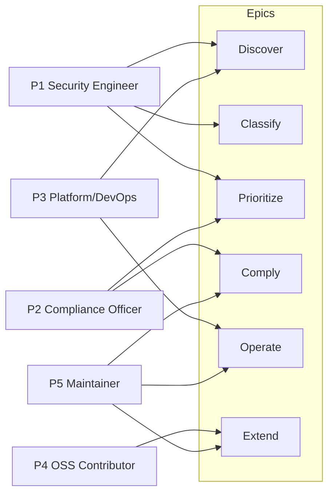
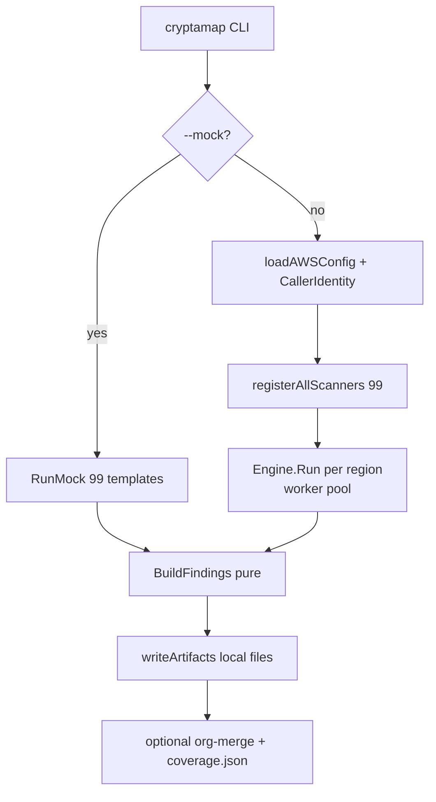
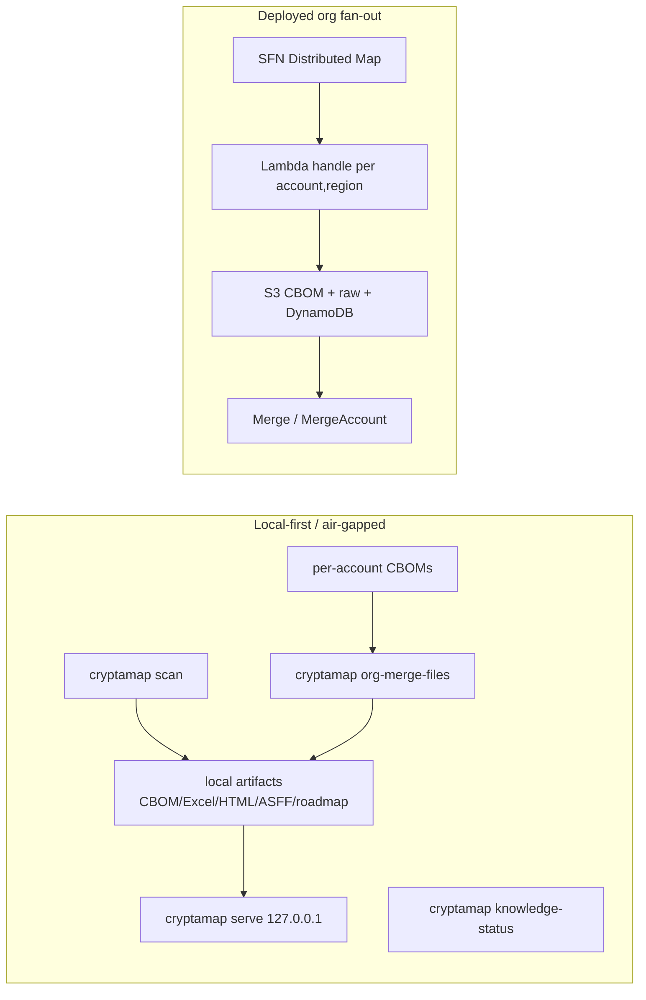

# CryptaMap — User Stories

> **Audience & purpose:** Product, engineering, and compliance stakeholders. This document derives the personas CryptaMap serves and the user stories ("As a `<persona>`, I want `<capability>`, so that `<value>`") that the *built* system satisfies, grouped by epic (Discover · Classify · Prioritize · Comply · Operate · Extend). Every story is grounded in the implementing feature/command with a `file:line` citation, and each story is marked **Built** / **Partial** / **Backlog** against the actual code and the two coverage registers. It is descriptive of what exists today, not aspirational.

Sibling SDLC docs: [01-REQUIREMENTS.md](./01-REQUIREMENTS.md) · [03-USER-JOURNEYS.md](./03-USER-JOURNEYS.md) · [04-HIGH-LEVEL-DESIGN.md](./04-HIGH-LEVEL-DESIGN.md) · [05-LOW-LEVEL-DESIGN.md](./05-LOW-LEVEL-DESIGN.md) · [06-DATA-FLOW.md](./06-DATA-FLOW.md) · [07-API-FLOW.md](./07-API-FLOW.md) · [08-TECH-STACK.md](./08-TECH-STACK.md) · [09-TEST-COVERAGE.md](./09-TEST-COVERAGE.md) · [10-SECURITY-AND-DATA-LOCALIZATION.md](./10-SECURITY-AND-DATA-LOCALIZATION.md).
Cross-cut register: [`../COVERAGE-AND-GAPS.md`](../COVERAGE-AND-GAPS.md). Backlog now lives in GitHub Issues.

---

## Table of Contents

1. [Personas](#1-personas)
2. [Epic map & status legend](#2-epic-map--status-legend)
3. [Epic: Discover](#3-epic-discover)
4. [Epic: Classify](#4-epic-classify)
5. [Epic: Prioritize](#5-epic-prioritize)
6. [Epic: Comply](#6-epic-comply)
7. [Epic: Operate](#7-epic-operate)
8. [Epic: Extend](#8-epic-extend)
9. [Persona → epic coverage matrix](#9-persona--epic-coverage-matrix)
10. [Story status rollup](#10-story-status-rollup)

---

## 1. Personas

CryptaMap is a read-only AWS post-quantum-cryptography (PQC) readiness scanner whose
first-class customer is the Indian BFSI sector (banks, NBFCs, insurers) facing
SEBI/RBI/IRDAI quantum-migration mandates. The personas below are derived from that
audience plus the open-source delivery model (the binary ships as `aws-samples` Go
source — see the module path `github.com/aws-samples/cryptamap` referenced throughout
`internal/services/common.go`).

| ID | Persona | Goal in one line | Primary epics |
|---|---|---|---|
| **P1** | **BFSI Security Engineer** | Find every cryptographic asset across our AWS estate and know which ones are quantum-exposed. | Discover, Classify, Prioritize |
| **P2** | **Compliance / Audit Officer** | Produce regulator-ready evidence (CBOM + framework mappings + dated report) for SEBI/RBI/IRDAI and global frameworks. | Comply, Prioritize |
| **P3** | **Platform / DevOps Engineer** | Run the scan safely and repeatably (CI, org fan-out, air-gapped) without leaking data or destabilizing AWS APIs. | Operate, Discover |
| **P4** | **OSS Contributor** | Add a new service scanner or framework mapping with a small, well-bounded contract and clear conventions. | Extend |
| **P5** | **Maintainer / Release Engineer** | Keep classification correct, knowledge fresh-and-provenanced, and counts honest across releases. | Operate, Extend, Comply |

---

## 2. Epic map & status legend

| Epic | What it delivers | Lead persona |
|---|---|---|
| **Discover** | Enumerate cryptographic assets across AWS services / regions / accounts. | P1, P3 |
| **Classify** | Assign each asset a quantum posture and attach algorithm/cert/protocol evidence. | P1 |
| **Prioritize** | Score migration urgency (Mosca), rank severities, emit a remediation roadmap. | P1, P2 |
| **Comply** | Map findings to regulatory frameworks; emit regulator-facing artifacts (CBOM, PQCC Excel, ASFF, HTML). | P2, P5 |
| **Operate** | Run safely: rate-limit/retry discipline, org fan-out, local-first/air-gapped, offline dashboard, knowledge freshness. | P3, P5 |
| **Extend** | Add scanners / frameworks / output formats under stable contracts. | P4, P5 |

**Status legend** (cross-referenced to [`../COVERAGE-AND-GAPS.md`](../COVERAGE-AND-GAPS.md) and GitHub Issues):

- ✅ **Built** — fully implemented and reachable through a shipping command/flag.
- 🟡 **Partial** — implemented for the common path but with documented gaps/caveats (shallow coverage, dead config knob, opt-in not wired, or a CLI-vs-deployment boundary).
- ⛳ **Backlog** — designed/deferred or a known honest gap; not in the current build.

---

## 3. Epic: Discover

> "Show me every cryptographic asset in my AWS estate."

### D-1 — Scan a single account/region for crypto assets · ✅ Built
> **As a** BFSI Security Engineer (P1), **I want** to run one command and inventory cryptographic assets across one account and one or more regions, **so that** I get a complete starting picture without writing per-service queries.

- **Satisfied by:** `cryptamap` root command → `runScan` (`cmd/cryptamap/main.go:91-214`); region resolution defaults to the caller's configured region or `us-east-1` (`cmd/cryptamap/main.go:152-158`); registry wires **99 scanners** via `registerAllScanners` (`cmd/cryptamap/register.go:16-56`).
- **CLI:** `cryptamap --regions ap-south-1,us-east-1`

### D-2 — Discover across many AWS service surfaces in one pass · ✅ Built (🟡 coverage caveat)
> **As a** Security Engineer (P1), **I want** broad service coverage (storage, databases, TLS front-doors, keys, certificates, runtime evidence), **so that** I do not have to integrate dozens of one-off tools.

- **Satisfied by:** 99 registered scanners spanning data-at-rest 49 (`cmd/cryptamap/register_datarest.go:9-48`), data-in-transit 27 (`cmd/cryptamap/register_transit.go:9-37`), key-management 9 + certificate 10 + sdk 3 + runtime 1 (`cmd/cryptamap/register.go:25-56`); the `ServiceScanner` contract (`internal/scanner/types.go:14-18`).
- **Coverage caveat (🟡):** This is ~73% of crypto-bearing service-surfaces, **not** "all AWS services," and the project deliberately never claims 100% — see [`../COVERAGE-AND-GAPS.md`](../COVERAGE-AND-GAPS.md) §1–§4. **Note:** the **shipping binary's user-facing `--help` text** no longer hardcodes a count — `cmd/cryptamap/main.go:73-77` now derives it from the live registry via `registeredScannerCount()` (`main.go:58-62`), so `cryptamap --help` reports the true 99 instead of the old stale "63 AWS services." A `count_guard_test.go` test asserts the banner tracks `registry.Len()`. (The in-code **comment** at `register.go:13-15` was also brought in sync on 2026-06-15 and now reads "Wires 99 scanners covering data-at-rest (49), data-in-transit (27), certificate management (10), key management (9), SDK/library PQC (3), and runtime evidence (1)" — see X-6.) (Note that `main.go:77`'s help text also says the Mosca defaults are "calibrated for X=7y/Y=2y/Z=3y," whereas the per-service defaults in `internal/risk/defaults.go:14-85` are richer — see R-1.)

### D-3 — Get a deterministic, dedup-stable asset identity · ✅ Built
> **As a** Security Engineer (P1), **I want** the same physical resource to map to one stable identity even across overlapping scans, **so that** my org-wide totals are not inflated by double-counting.

- **Satisfied by:** `BomRefForARN` deterministic FNV-64a bom-ref (`pkg/models/asset.go:14`), the single dedup key shared by live and mock paths; S3 uses a region-less ARN (`arn:aws:s3:::name`) so a bucket dedups once org-wide (`internal/services/datarest/s3.go` via `NewAssetWithARN`, `internal/services/common.go:86`).

### D-4 — Scan many accounts across an organization · 🟡 Partial (CLI single-account; org via deployed stack)
> **As a** Platform/DevOps Engineer (P3), **I want** to fan out the scan across every account in my AWS Organization, **so that** I cover the whole estate in one orchestration.

- **Satisfied by (deployment path):** the build-tagged Lambda handler (`cmd/cryptamap/lambda.go:56-186`) invoked per `(account,region)` by a Step Functions Distributed Map; it `org.AssumeRole`s into each member account and **eagerly verifies** the assumed identity before scanning (`cmd/cryptamap/lambda.go:100-118`).
- **Partial boundary (🟡):** the **CLI** scan path is single-account only and **explicitly warns** that `--org`/`--accounts` are not honored (`cmd/cryptamap/main.go:173-177`). Org-wide scanning requires the deployed SFN/Lambda stack, not the local binary.

### D-5 — Synthesize a realistic scan without touching AWS · ✅ Built
> **As a** Platform/DevOps Engineer (P3) or OSS Contributor (P4), **I want** a mock scan with no AWS credentials, **so that** I can demo, test the pipeline, and develop offline.

- **Satisfied by:** `--mock` branch (`cmd/cryptamap/main.go:122-145`) → `RunMock` (`internal/scanner/mock_engine.go:16-49`) → `mock.Generator.GenerateAssets` (`internal/mock/generator.go:199-300`) with posture distributions across all **99** templates (`internal/mock/templates.go`).
- **Caveat (🟡):** mock postures are synthetic distributions, not real-resource state — so `--mock` exercises the full pipeline and every service, but does not validate any account's actual crypto. As of 2026-06-16 mock template coverage matches the live scanner set 1:1, enforced by `internal/mock/coverage_test.go:TestMockCoverageNoDrift`.
- **CLI:** `cryptamap --mock --mock-scale 5`

### D-6 — See whether discovery missed/failed an account or region (no silent gaps) · ✅ Built
> **As a** Security Engineer (P1) and Audit Officer (P2), **I want** errored or unreachable accounts surfaced rather than silently treated as clean, **so that** an auth failure never masquerades as "no findings."

- **Satisfied by:** per-scanner errors are **always** printed to stderr (not gated on `--verbose`) (`internal/scanner/engine.go:129-145`); org-merge emits a `coverage.json` flagging each shard's `Errored` state (`internal/merge/merge.go:47-55,281`; `cmd/cryptamap/main.go:381-388`).

---

## 4. Epic: Classify

> "Tell me which assets are quantum-exposed — and don't lie to me when you're unsure."

### C-1 — Get a quantum posture for every discovered asset · ✅ Built
> **As a** Security Engineer (P1), **I want** each asset labeled with a clear quantum posture, **so that** I can separate "fine for now" from "harvest-now-decrypt-later exposed."

- **Satisfied by:** the 7-value `CryptoPosture` enum (no-encryption, legacy-tls, non-pqc-classical, symmetric-only, pqc-hybrid, pqc-ready, unknown) (`pkg/models/finding.go:35-43`); posture is stamped into `Properties["posture"]` by each scanner via `PostureProperty` (`internal/services/common.go:420`) and read back by the single finding path (`internal/scanner/findings.go:33-38`).

### C-2 — Trust that "encrypted" claims are evidence-backed, not fabricated · ✅ Built
> **As a** Security Engineer (P1) and Audit Officer (P2), **I want** classifications grounded in either a live API observation or an AWS-documented fact (with provenance), **so that** an auditor can trace why an asset was called safe.

- **Satisfied by:** provenance stampers `StampObserved` (source=observed) and `StampDocFactKeyed`/`StampDocFact` (source=aws-doc, keyed into `internal/pqc` knowledge) (`internal/services/common.go:205,251`); the `Source` provenance field on `ProtocolProperties` (`pkg/models/asset.go:104-124`).

### C-3 — Never receive a false all-clear when the truth is unknown · ✅ Built
> **As an** Audit Officer (P2), **I want** undetermined states reported as `unknown` rather than guessed-safe, **so that** the tool errs toward admitting a gap instead of a dangerous false negative.

- **Satisfied by:** conservative mappers throughout — unknown KMS key spec → `Unknown` not `SymmetricOnly` (`internal/services/keymgmt/kms_spec.go:36`); cert PEM parse failure → `PostureUnknown` not fabricated classical (`parseCertPEM` at `internal/services/certmgmt/certparse.go:41`, which seeds `Posture: PostureUnknown` at :42 and never overwrites it on decode/parse failure); S3 absent-rule → `PostureUnknown` with a not-retroactive note (`internal/services/datarest/s3.go:158`); SQS unreadable attrs → `Unknown` vs confirmed-off → `NoEncryption` (`internal/services/datarest/sqs.go:58`); default posture when a scanner forgets to set one is `Unknown` → MEDIUM, never a silent pass (`internal/scanner/findings.go:33-38`).

### C-4 — Distinguish quantum-safe symmetric from quantum-vulnerable asymmetric · ✅ Built
> **As a** Security Engineer (P1), **I want** AES-at-rest treated as quantum-resistant (`symmetric-only`) while RSA/ECDHE-without-ML-KEM is flagged `non-pqc-classical`, **so that** I focus migration effort on the genuinely exposed assets.

- **Satisfied by:** at-rest blocks `AESAtRest`/`AESXTSAtRest` map to `SymmetricOnly` (`internal/services/common.go:110,138`); key/cert mappers route RSA/ECC/ECDSA → `NonPQCClassical` (`internal/services/keymgmt/kms_spec.go:36`, `internal/services/certmgmt/acm.go:35`); Direct Connect MACsec is the lone transit `SymmetricOnly` (`internal/services/transit/directconnect.go:52`); TDES is kept `SymmetricOnly` but annotated `weakCipher` and excluded from the PQC denominator (`internal/services/keymgmt/payments.go:79`).

### C-5 — Recognize observed PQC-hybrid TLS and pure-PQC signatures · ✅ Built
> **As a** Security Engineer (P1), **I want** assets that already negotiate X25519+ML-KEM or use ML-DSA recognized as ahead-of-the-curve, **so that** I don't waste effort re-migrating what's already protected.

- **Satisfied by:** `PosturePQCHybrid`/`PosturePQCReady` (`pkg/models/finding.go:40-41`); ELBv2 SSL-policy PQ detection by cipher tokens *and* policy-name (`internal/services/transit/ssl_policy.go:21,41,118-136`); CloudTrail-observed ML-KEM key exchange → `PQCHybrid` (`internal/services/runtime/cloudtrail_evidence.go:196`); ML-DSA key spec → `PQCReady` (`internal/services/keymgmt/kms_spec.go:36`).

### C-6 — See per-asset crypto detail (TLS floor, KEX group, cert algorithm) where it's truly known · 🟡 Partial
> **As a** Security Engineer (P1), **I want** the negotiated/served TLS detail (min version floor, key-exchange group, cert signature) shown when it can be read, **so that** I can verify posture claims at the protocol level.

- **Satisfied by:** detailed protocol block builder (`internal/services/common.go:373`); live ACM cert enrichment (`internal/services/transit/acm_cert.go:109`); ELB cipher/floor classification (`internal/services/transit/ssl_policy.go:106`). `TLSMinVersion` is documented as a descriptive **floor**, explicitly not a posture/tier and quantum-irrelevant (`pkg/models/asset.go:104-124`).
- **Partial caveat (🟡):** many fields are an *honest blank* by design where no API exposes them (e.g., RDS/Aurora negotiated TLS version left unknown rather than fabricated — `internal/services/transit/rds_transit.go:20`); shallow sub-feature gaps are catalogued in [`../COVERAGE-AND-GAPS.md`](../COVERAGE-AND-GAPS.md) §5.

---

## 5. Epic: Prioritize

> "Tell me what to fix first and in what order."

### R-1 — Score migration urgency with Mosca's Theorem · ✅ Built
> **As a** Security Engineer (P1), **I want** each finding scored by `X + Y − Z` (data shelf-life + migration time − CRQC horizon), **so that** I have a defensible, time-aware urgency signal rather than a gut feeling.

- **Satisfied by:** `Calculate`/`CalculateForService` (`internal/risk/mosca.go:12-32`); the `MoscaScore` record (`pkg/models/finding.go:56-62`); per-service Indian-BFSI defaults (e.g. RDS/Aurora/DynamoDB X=10/Y=2/Z=3) with a 5/1/3 baseline fallback (`internal/risk/defaults.go:14-85`).

### R-2 — Get a single severity that reflects the worse of risk signals — but only for genuinely-vulnerable postures · ✅ Built
> **As a** Security Engineer (P1), **I want** severity to take the worse of the posture-derived and Mosca-derived signals **for assets that are actually quantum-exposed**, while quantum-SAFE assets stay informational regardless of data shelf-life, **so that** a vulnerable long-lived store is flagged by its harvest window without my report being flooded by false-CRITICAL AES-256 stores.

- **Satisfied by:** `SeverityFromPosture(posture)` as the base, with the Mosca/HNDL bump (`HighestSeverity(..., SeverityFromMosca)`) applied **only when `!risk.IsQuantumSafePosture(posture)`** (`internal/scanner/findings.go:39-50`; `internal/risk/severity.go:7-57`, `IsQuantumSafePosture` at `:42-49`); `NormalizedSeverity` ASFF mapping (`pkg/models/finding.go:16-29`).
- **Note:** severity used to be an **unconditional** `HighestSeverity(SeverityFromPosture, SeverityFromMosca)`, which let the posture-blind Mosca score raise a quantum-SAFE asset to CRITICAL — e.g. a `symmetric-only` (AES-256) RDS/DynamoDB store scored CRITICAL on Mosca grounds (10+2−3=9) even though Shor's algorithm does not threaten AES. Now `IsQuantumSafePosture` (true for `symmetric-only` / `pqc-hybrid` / `pqc-ready`) suppresses the Mosca bump, so that same AES-256 store is **INFORMATIONAL** (the asset still appears — it is not dropped, only re-graded). Genuinely vulnerable postures (`no-encryption` / `legacy-tls` / `non-pqc-classical` / `unknown`) keep the worse-of behavior unchanged — e.g. a `non-pqc-classical` RDS asset is still raised by its Mosca score. On a real mock scan this took quantum-safe-stamped CRITICAL/HIGH findings from 38 → 0 with total asset count unchanged. See C-4 (symmetric-is-quantum-safe framing) and the `engine.go:261-275` `recommendation()` `PostureSymmetricOnly` case.

### R-3 — Get an actionable remediation per finding · ✅ Built
> **As a** Security Engineer (P1), **I want** each finding to carry a concrete recommendation and a docs link, **so that** I know the next step without research.

- **Satisfied by:** posture-based package-level funcs `recommendation()` (`internal/scanner/engine.go:261-275`, including the dedicated `PostureSymmetricOnly` case at `:269-270` that names AES-256-at-rest quantum-safe) and `docsURL()` (`internal/scanner/engine.go:277-279`), called bare by `BuildFindings` and attached to the `Finding` (`internal/scanner/findings.go:55-74`, specifically `Recommendation`/`DocsURL` at findings.go:70-71; `pkg/models/finding.go:66-85`).

### R-4 — Produce a prioritized PQC migration roadmap · ✅ Built
> **As a** Security Engineer (P1) and Audit Officer (P2), **I want** the findings rolled up into a ranked migration roadmap (JSON + Markdown), **so that** I can drive and report a remediation program.

- **Satisfied by:** roadmap writers `WriteRoadmapJSON`/`WriteRoadmapMarkdown` (`internal/output/roadmap_writer.go:20,29`); emitted per scan (`cmd/cryptamap/main.go:308-313,318-346`) and org-wide on merge (`cmd/cryptamap/main.go:374-379`).
- **CLI:** roadmap is on by default in `OutputFormats` (`internal/config/loader.go:14-98`); org-wide via `cryptamap --org-merge` or `cryptamap org-merge-files`.

---

## 6. Epic: Comply

> "Give me regulator-ready evidence mapped to the frameworks that bind me."

### M-1 — Map every finding to the regulatory frameworks that apply · ✅ Built
> **As a** Compliance/Audit Officer (P2), **I want** findings mapped to SEBI, RBI, IRDAI and global PQC frameworks, **so that** I can answer "are we compliant?" per control.

- **Satisfied by:** `compliance.Registry.MapAll` (`internal/compliance/mapper.go:71-77`) over 9 mappers — SEBI, RBI, IRDAI, CISA, MITRE PQCC, CNSA 2.0, EU NIS2/DORA, Canada, Europol (`internal/compliance/mapper.go:42-68`); posture→status defaulting (`internal/compliance/mapper.go:79-91`); `ComplianceMapping` record with control ID, status, remediation, deadline (`pkg/models/finding.go:46-53`).
- **Config:** the 9 frameworks are enabled by default (`internal/config/loader.go:14-98`) and selectable via `compliance.frameworks` in YAML.

### M-2 — Emit a CycloneDX 1.7 CBOM as the canonical evidence artifact · ✅ Built
> **As a** Compliance Officer (P2), **I want** a standards-based cryptographic bill of materials, **so that** my evidence is portable, machine-readable, and aligns with the CERT-In/QBOM expectation.

- **Satisfied by:** `WriteCBOM` (`internal/output/cyclonedx.go`) emitted per scan (`cmd/cryptamap/main.go:220-235`); the CycloneDX-aligned data model (`pkg/models/asset.go:142-168`).
- **CLI:** on by default; `cryptamap` writes `*.cbom.json`.

### M-3 — Produce the MITRE PQCC Excel workbook with owner metadata · ✅ Built
> **As a** Compliance Officer (P2), **I want** the MITRE PQC Coalition Excel deliverable pre-filled with our org/owner/vendor contacts, **so that** I can submit the expected workbook without manual reformatting.

- **Satisfied by:** `WritePQCCExcel` with `PQCCOptions` sourced from `cfg.Owner` (`cmd/cryptamap/main.go:237-259`); `OwnerInfo` config (`internal/config/types.go`).
- **CLI:** on by default; `cryptamap` writes `*.pqcc.xlsx`.

### M-4 — Hand auditors a self-contained, offline evidence report · ✅ Built
> **As an** Audit Officer (P2), **I want** a single HTML report that opens from `file://` with no server, **so that** I can archive and share dated evidence in an air-gapped review.

- **Satisfied by:** `WriteHTMLReport` single-file report (`cmd/cryptamap/main.go:261-276`); also a Markdown/"PDF" summary (`cmd/cryptamap/main.go:299-306`).
- **CLI:** HTML on by default; `*.report.html`.

### M-5 — Emit findings as AWS Security Hub ASFF (local file) · ✅ Built
> **As a** Compliance Officer (P2) and Platform Engineer (P3), **I want** findings as ASFF JSON, **so that** PQC posture can be imported into our existing SOC workflow.

- **Satisfied by:** `WriteASFF` local file (`internal/output/securityhub.go:232`; `cmd/cryptamap/main.go`). CryptaMap is local-first/read-only and does NOT call `securityhub:BatchImportFindings` itself; operators import the emitted ASFF JSON via their own SOC pipeline. The `product_arn` (config `output.security_hub.product_arn`) is stamped into the local ASFF findings.
- **Note:** the ASFF `Resources[].Partition` and the `ProductARN` partition are now derived from the finding's region via `PartitionForRegion` (`internal/output/securityhub.go:59`, `:215`) — `us-gov-*`→`aws-us-gov`, `cn-*`→`aws-cn`, else `aws` — rather than the previous hardcoded `"aws"` that produced wrong ARNs in GovCloud/China; commercial regions (e.g. `ap-south-1`/`us-east-1`) are byte-for-byte identical, with `securityhub_partition_test.go` covering it.

### M-6 — Review the SEBI/RBI/IRDAI compliance dashboard views · 🟡 Partial (built, user-review pending)
> **As a** Compliance Officer (P2), **I want** dedicated SEBI/RBI/IRDAI views in the dashboard, **so that** I can present compliance status by regulator.

- **Satisfied by:** dashboard pages `dashboard/src/pages/{SEBIView,RBIView,IRDAIView}.tsx` + `components/ComplianceFramework.tsx`.
- **Partial (🟡):** built and deployed but **never walked through with the user** for accuracy/framing — a review item, no known bug.

---

## 7. Epic: Operate

> "Let me run this safely, repeatably, and without surprises."

### O-1 — Run without destabilizing AWS APIs (rate-limit + retry discipline) · ✅ Built
> **As a** Platform/DevOps Engineer (P3), **I want** the scan to respect AWS throttling and not amplify retries, **so that** a fleet scan doesn't trip rate limits or get my account throttled.

- **Satisfied by:** the worker pool with bounded concurrency (`internal/scanner/engine.go:72-163`); the **deliberate** rule that the engine does **not** retry throttle classes (the SDK adaptive retryer, max 8 attempts, owns them) (`internal/scanner/engine.go:198-210`; `cmd/cryptamap/main.go:406-422`); per-scanner asset caps (`internal/services/common.go:23,38`).

### O-2 — Run fully local / air-gapped, data never leaves the account · ✅ Built
> **As a** Platform Engineer (P3) at a data-localized BFSI, **I want** a local-first run that writes artifacts to disk and makes no public web surface, **so that** customer data stays in-account/in-region.

- **Satisfied by:** `writeArtifacts` writes all formats to a local directory (`cmd/cryptamap/main.go:216-316`); the decided default deployment model is local/artifact-first with no public web surface.
- **CLI:** `cryptamap --output-dir ./out`.

### O-3 — Review results in a dashboard without exposing them publicly · ✅ Built
> **As a** Security Engineer (P1) / Platform Engineer (P3), **I want** to browse the CBOM/roadmap in a local dashboard bound to loopback only, **so that** I get a UI with no internet-facing surface — local-first by design.

- **Satisfied by:** `cryptamap serve` binds **127.0.0.1 only** with no bind-all/`--host` option by design (`cmd/cryptamap/serve.go:38-104`); serves the embedded SPA + local CBOM/roadmap and makes no AWS/network calls (`cmd/cryptamap/serve.go:109-132`, `cmd/cryptamap/web_embed.go:18-19`).
- **Build-dependency caveat (🟡):** the `go:embed`-ed `cmd/cryptamap/webdist` is a **PLACEHOLDER index.html** in a vanilla checkout (`cmd/cryptamap/web_embed.go:8-13`); the real Vite bundle is only copied in by `make build-serve` (`Makefile:23-29`) *before* `go build`. A plain `make build-cli`/`go build` embeds just the placeholder, so `cryptamap serve` from that binary renders a stub shell — `serve.go:183` even errors "dashboard bundle missing index.html (run `make build-serve`)". The real dashboard ships only via `make build-serve`/release. The loopback-only and no-network properties hold for both.
- **CLI:** `cryptamap serve --dir ./out`.

### O-4 — Merge externally-produced per-account CBOMs offline into one org view · ✅ Built
> **As a** Platform Engineer (P3), **I want** to combine N per-account CBOM files into one org-wide CBOM + roadmap + coverage, with no AWS calls, **so that** air-gapped/segmented orgs still get a consolidated picture.

- **Satisfied by:** `cryptamap org-merge-files` (`cmd/cryptamap/org_merge_files.go:46-142`), regenerating findings via the same pure `BuildFindings` (`cmd/cryptamap/org_merge_files.go:97`) and emitting CBOM + roadmap + `coverage.json`; idempotent re-runs skip prior merge outputs (`cmd/cryptamap/org_merge_files.go:177-218`).
- **CLI:** `cryptamap org-merge-files --in ./cboms --output-dir ./org`.

### O-5 — Configure scan behavior via YAML + env + CLI overrides · ✅ Built (🟡 two dead knobs)
> **As a** Platform Engineer (P3), **I want** a config file with environment-variable expansion and CLI override precedence, **so that** I can templatize runs across environments.

- **Satisfied by:** `Default()` + `Load()` with `${VAR}` env expansion and YAML-over-defaults merge (`internal/config/loader.go:14-126`); `CLIOverrides.Apply` (`internal/config/loader.go:141-166`).
- **Partial caveats (🟡):** the engine's `PerServiceCap` is never populated by the CLI, and `Risk.Mosca.Overrides` never reaches `BuildFindings` via the CLI (the CLI builds `EngineOptions` without them — `cmd/cryptamap/main.go:113-120`); `CLIOverrides.Verbose` is set but `Apply` does not apply it (`internal/config/loader.go:141-166`). These are documented dead/ineffective config knobs. (The previously-dead `Concurrency.PerServiceLimits` knob was removed on 2026-06-16.)

### O-6 — Run as a repeatable CI/CD gate that re-emits a dated, signed CBOM · ⛳ Backlog
> **As a** Platform Engineer (P3), **I want** a reference CI pipeline that assumes a read-role, scans, emits a dated CBOM/ASFF, and fails the build on new CRITICALs, **so that** "continuous QBOM" is a turnkey CERT-In CIWP deliverable.

- **Status:** ⛳ deferred — tracked under "Product work to make the A/D default first-class" in GitHub Issues (CI/CD reference pipeline + prebuilt signed binaries for air-gap side-loading). The building blocks (ASFF, dated CBOM, severity gating signal) exist; the packaged pipeline does not.

### O-7 — Know how fresh and provenanced the PQC knowledge is · ✅ Built (🟡 auto-refresh backlog)
> **As a** Maintainer (P5) and Audit Officer (P2), **I want** to print the freshness/provenance of the baked-in PQC knowledge (source, version, oldest fact), **so that** I can attest the tool's facts to a regulator and spot drift.

- **Satisfied by:** `cryptamap knowledge-status` (`cmd/cryptamap/knowledge_status.go:29-53`), with `--json` for CI scripting (`cmd/cryptamap/knowledge_status.go:53`).
- **Partial (🟡):** the *self-updating* knowledge subsystem (knowledge-as-data + optional online refresh via the public AWS-docs MCP) is **design-complete, build-deferred** (see [`../SELF-UPDATING-KNOWLEDGE.md`](../SELF-UPDATING-KNOWLEDGE.md)). Current baked-in knowledge is verified-correct as of the last re-audit.

### O-8 — Detect in-use crypto from observed activity, not just static config · ✅ Built
> **As a** Security Engineer (P1), **I want** posture inferred from CloudTrail-observed KMS/TLS activity, **so that** I capture what is actually negotiated, not only what config permits.

- **Satisfied by:** `cloudtrail_evidence` scanner — KMS data-plane posture mining (`runtimePosture`, `internal/services/runtime/cloudtrail_evidence.go:101`) and `tlsDetails.keyExchange` mining (`tlsObservedPosture`, `cloudtrail_evidence.go:196`) over a bounded 90-day / 4-page window (`lookbackWindow` const `cloudtrail_evidence.go:44`, `maxPagesPerEvent` const `cloudtrail_evidence.go:48`); AWS-on-your-behalf events are skipped (`internal/services/runtime/cloudtrail_evidence.go:314`).
- **Related backlog:** active TLS probing stays **out** of the read-only scan (resolved-as-deferred — tracked in GitHub Issues).

---

## 8. Epic: Extend

> "Let me add coverage and mappings under a small, stable contract."

### X-1 — Add a new per-service scanner against a one-method contract · ✅ Built
> **As an** OSS Contributor (P4), **I want** to implement a tiny `ServiceScanner` interface and register it, **so that** adding service coverage is bounded and low-risk.

- **Satisfied by:** the 3-method `ServiceScanner` contract — `Name()`, `Category()`, `Scan(ctx, cfg)` (`internal/scanner/types.go:14-18`); a sorted, concurrency-safe `Registry` (`internal/scanner/registry.go:9-40`); register hooks per dimension (`cmd/cryptamap/register.go:16-56`).

### X-2 — Reuse shared classification + provenance helpers · ✅ Built
> **As an** OSS Contributor (P4), **I want** ready-made builders for at-rest/TLS/cert blocks, posture stamping, provenance, bounded fan-out, and truncation caps, **so that** a new scanner stays consistent and correct by default.

- **Satisfied by:** the `services` common package — `AESAtRest`/`NoEncryption`/`UnknownAtRest` (`internal/services/common.go:110,316,331`), `TLSProtocolProps*` (`internal/services/common.go:342-373`), `PostureProperty`/`StampObserved`/`StampDocFactKeyed` (`internal/services/common.go:205,251,420`), `MapConcurrent` bounded fan-out (`internal/services/common.go:272`), `TruncationCapReached`/`MaxAssetsPerScanner` (`internal/services/common.go:23,38`); SDK-free, unit-testable transit classifiers (`internal/services/transit/transit_classify.go:23-260`).

### X-3 — Add a regulatory framework mapping · ✅ Built
> **As an** OSS Contributor (P4) or Compliance Maintainer (P5), **I want** a `Mapper` interface I can implement for a new framework, **so that** adding a regulator does not touch the scan engine.

- **Satisfied by:** the `Mapper` set and `Registry` (`internal/compliance/mapper.go:42-77`); each framework is one file (`internal/compliance/{sebi,rbi,irdai,cisa,mitre,cnsa,nis2dora,canada,europol}.go`).

### X-4 — Add a new output format without rewiring the pipeline · ✅ Built
> **As an** OSS Contributor (P4), **I want** output writers gated by an `OutputFormats` flag set, **so that** I can add a format and toggle it via config.

- **Satisfied by:** the `OutputFormats` config (CycloneDX/PQCCExcel/PDF/ASFF/Roadmap/HTML) (`internal/config/types.go`), each driving an isolated writer in `writeArtifacts` (`cmd/cryptamap/main.go:216-316`).

### X-5 — Trust that findings regenerate with identical classification across live/mock/offline · ✅ Built
> **As a** Maintainer (P5), **I want** one pure `BuildFindings` path reused by the live engine, the mock engine, and the offline merge, **so that** the same asset always yields the same *classification* (posture, severity, Mosca score, compliance mappings) regardless of source.

- **Satisfied by:** the single pure `BuildFindings` (`internal/scanner/findings.go:29-77`), reused by the live engine (`internal/scanner/engine.go:235-237`), `RunMock` (`internal/scanner/mock_engine.go:34`), and `org-merge-files` (`cmd/cryptamap/org_merge_files.go:97`). CBOM is lossy for findings, so offline merge **must** regenerate them — the Lambda path instead uploads the raw `ScanResult` (`cmd/cryptamap/lambda.go:145-171`).
- **Determinism caveat:** the regenerated findings are **not byte-identical** run-to-run — `BuildFindings` stamps `ID: uuid.NewString()` (random v4, `internal/scanner/findings.go:56`) and `CreatedAt`/`UpdatedAt: time.Now().UTC()` (`findings.go:30,72-73`). What is identical is the *content that depends only on the input asset*: `Posture`, `Severity` (posture severity, with the Mosca/HNDL bump applied only to non-quantum-safe postures — see R-2), `Mosca` score, and `Compliance` mappings. Any byte-equality test must exclude the `ID` and the two timestamps.

### X-6 — Keep coverage counts honest and in sync across releases · 🟡 Partial (process, not automated)
> **As a** Maintainer (P5), **I want** scanner/coverage counts kept consistent between code, the coverage register, and the dashboard, **so that** the tool never drifts into a "100% comprehensive" or stale-count claim.

- **Satisfied by (process):** the maintenance contract in [`../COVERAGE-AND-GAPS.md`](../COVERAGE-AND-GAPS.md) §6 (bump counts here AND in `dashboard/src/lib/coverageData.ts`; never claim 100%).
- **Partial (🟡):** today this is a documented manual contract — there is no build-time assertion that forces the various in-source counts to agree, though the worst historical drift has since been corrected. **Note:** the drift no longer reaches the **shipping `--help` text** — `cmd/cryptamap/main.go:73-77` derives the count from the live registry (`registeredScannerCount()` → `reg.Len()`, `main.go:58-62`) instead of the old "63 AWS services" literal, and `count_guard_test.go` (now pinning `registeredScannerCount() == 99`) asserts the banner equals the registry length. The `register.go:13-15` comment was likewise brought in sync on 2026-06-15 (it now reads "Wires 99 scanners covering data-at-rest (49), data-in-transit (27), certificate management (10), key management (9), SDK/library PQC (3), and runtime evidence (1)"). The doc sides with the verified 99 (49 data-at-rest + 27 transit + 10 cert + 9 key + 3 sdk + 1 runtime = 99 `r.Register` calls across `register.go` / `register_datarest.go` / `register_transit.go`).

### X-7 — Add an active TLS prober as an opt-in verifier · ⛳ Backlog
> **As an** OSS Contributor (P4) / Maintainer (P5), **I want** an optional `verify-pq` prober (explicit allowlist, stamps pass/fail, distinct provenance), **so that** publicly-resolvable front-doors with no CloudTrail evidence can be validated.

- **Status:** ⛳ resolved-as-deferred — must never auto-probe inside the fan-out; revisit only with a quantified public-front-door slice (tracked in GitHub Issues).

---

## 9. Persona → epic coverage matrix

| Story | Persona(s) | Epic | Status |
|---|---|---|---|
| D-1 Single account/region scan | P1, P3 | Discover | ✅ Built |
| D-2 Broad service coverage | P1 | Discover | ✅ Built 🟡 |
| D-3 Deterministic dedup identity | P1 | Discover | ✅ Built |
| D-4 Org cross-account scan | P3 | Discover | 🟡 Partial |
| D-5 Mock scan (no AWS) | P3, P4 | Discover | ✅ Built |
| D-6 No-silent-gap coverage signal | P1, P2 | Discover | ✅ Built |
| C-1 Posture per asset | P1 | Classify | ✅ Built |
| C-2 Evidence-backed claims | P1, P2 | Classify | ✅ Built |
| C-3 No false all-clear | P2 | Classify | ✅ Built |
| C-4 Symmetric vs classical | P1 | Classify | ✅ Built |
| C-5 PQC-hybrid / pure-PQC | P1 | Classify | ✅ Built |
| C-6 Per-asset protocol detail | P1 | Classify | 🟡 Partial |
| R-1 Mosca scoring | P1 | Prioritize | ✅ Built |
| R-2 Worse-of severity (conditional: not for quantum-safe) | P1 | Prioritize | ✅ Built |
| R-3 Per-finding remediation | P1 | Prioritize | ✅ Built |
| R-4 Migration roadmap | P1, P2 | Prioritize | ✅ Built |
| M-1 Framework mapping (9) | P2 | Comply | ✅ Built |
| M-2 CycloneDX CBOM | P2 | Comply | ✅ Built |
| M-3 MITRE PQCC Excel | P2 | Comply | ✅ Built |
| M-4 Offline HTML report | P2 | Comply | ✅ Built |
| M-5 ASFF / Security Hub | P2, P3 | Comply | ✅ Built |
| M-6 SEBI/RBI/IRDAI views | P2 | Comply | 🟡 Partial |
| O-1 Rate-limit/retry discipline | P3 | Operate | ✅ Built |
| O-2 Local/air-gapped run | P3 | Operate | ✅ Built |
| O-3 Loopback-only dashboard | P1, P3 | Operate | ✅ Built |
| O-4 Offline org-merge-files | P3 | Operate | ✅ Built |
| O-5 YAML+env+CLI config | P3 | Operate | ✅ Built 🟡 |
| O-6 CI/CD QBOM gate | P3 | Operate | ⛳ Backlog |
| O-7 Knowledge freshness | P5, P2 | Operate | ✅ Built 🟡 |
| O-8 CloudTrail runtime evidence | P1 | Operate | ✅ Built |
| X-1 Add a scanner | P4 | Extend | ✅ Built |
| X-2 Reuse shared helpers | P4 | Extend | ✅ Built |
| X-3 Add a framework mapper | P4, P5 | Extend | ✅ Built |
| X-4 Add an output format | P4 | Extend | ✅ Built |
| X-5 Pure cross-source classification | P5 | Extend | ✅ Built |
| X-6 Honest, in-sync counts | P5 | Extend | 🟡 Partial |
| X-7 Active TLS prober | P4, P5 | Extend | ⛳ Backlog |

---

## 10. Story status rollup

| Status | Count | Stories |
|---|---|---|
| ✅ **Built** | 28 | D-1, D-2*, D-3, D-5, D-6, C-1, C-2, C-3, C-4, C-5, R-1, R-2, R-3, R-4, M-1, M-2, M-3, M-4, M-5, O-1, O-2, O-3, O-4, O-5*, O-7*, O-8, X-1, X-2, X-3, X-4, X-5 |
| 🟡 **Partial** | 7 | D-4 (CLI single-account vs deployed org), C-6 (honest blanks / shallow), M-6 (review pending), O-5 (dead config knobs), O-7 (auto-refresh deferred), X-6 (manual count contract), D-2 (coverage ~73%) |
| ⛳ **Backlog** | 2 | O-6 (CI/CD QBOM gate), X-7 (active TLS prober) |

\* Stories marked with both ✅ and 🟡 are fully built on the common path but carry a documented caveat; they are counted once in "Built" and once in the relevant "Partial" row above.

**Honest-by-design posture (recurring theme across epics):** unknown is reported as `unknown`, not guessed-safe (C-3); coverage is stated as ~73% of crypto-bearing surfaces, never "100% comprehensive" (D-2, [`../COVERAGE-AND-GAPS.md`](../COVERAGE-AND-GAPS.md) §1); there is no public dashboard surface at all — the only viewer is the loopback-only local `cryptamap serve` (O-3). These constraints are first-class user value for the regulator-facing personas (P2, P5), not limitations to hide.
