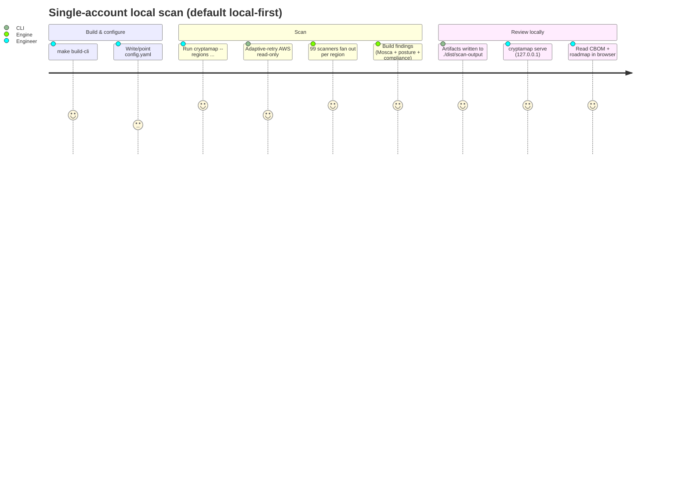
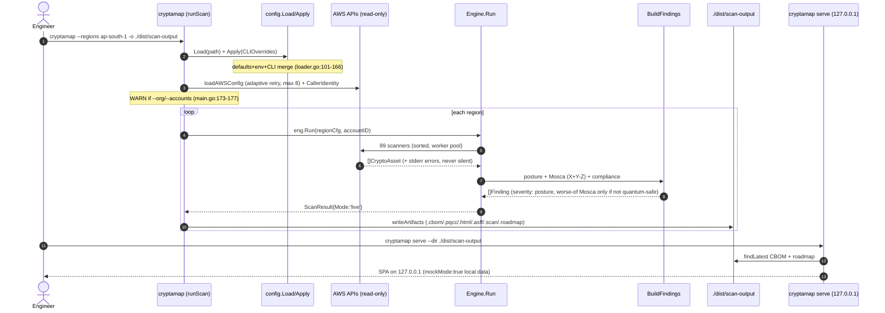
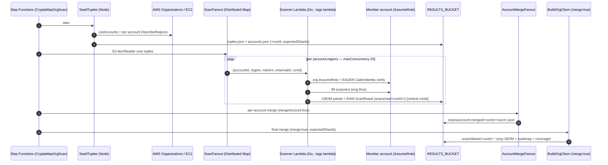
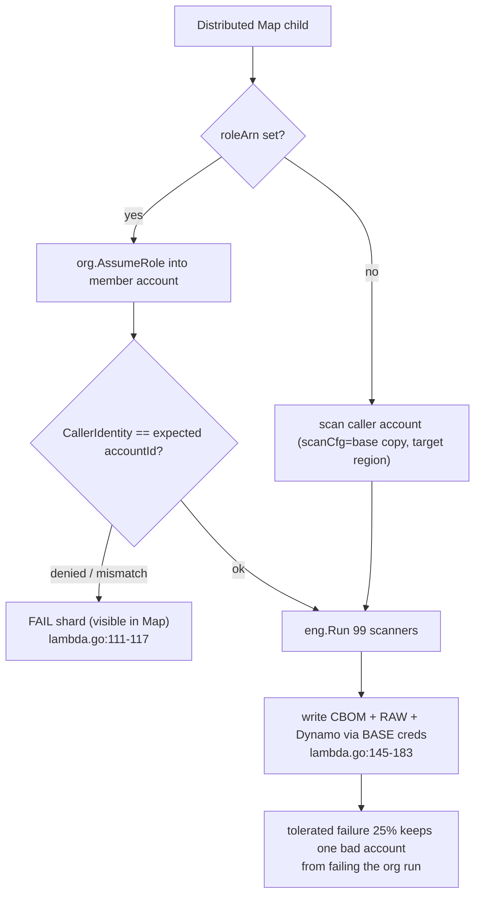
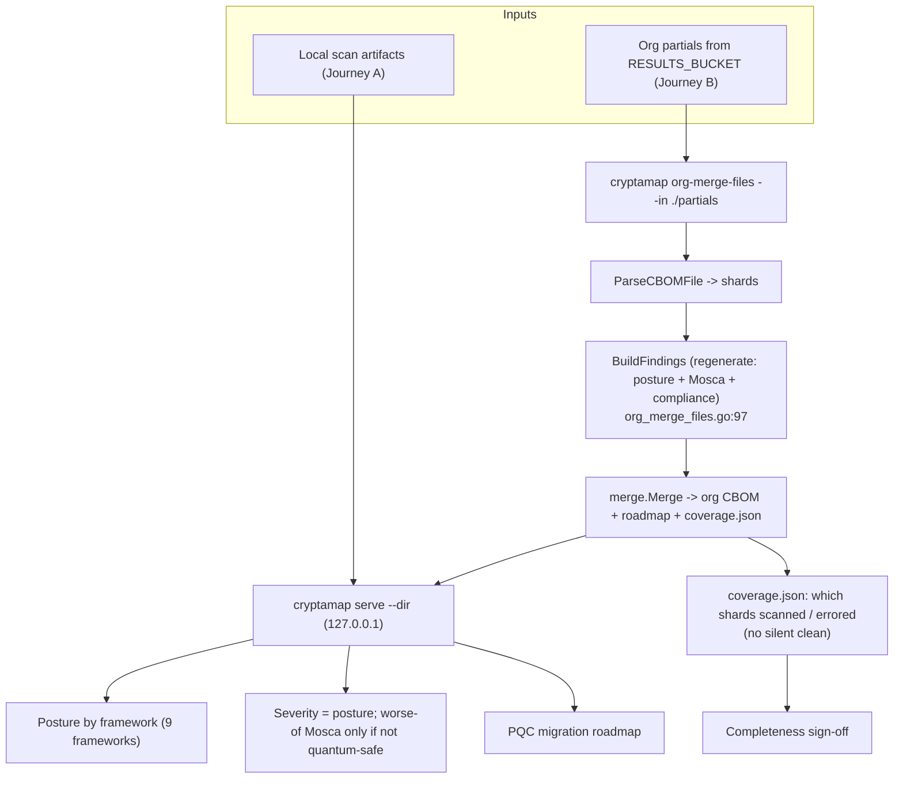
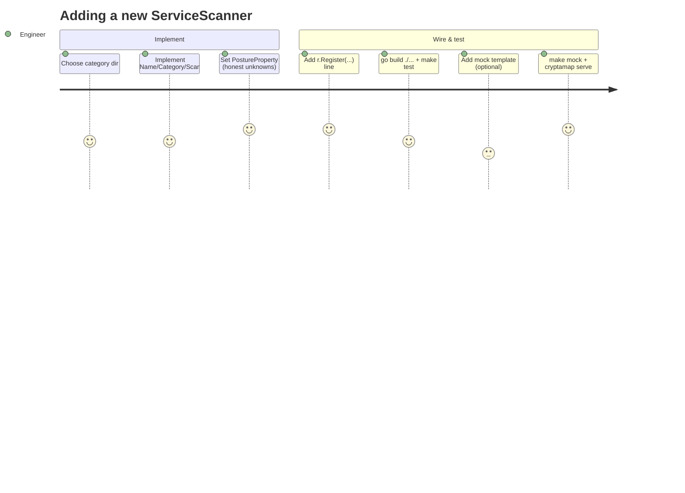
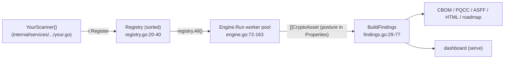
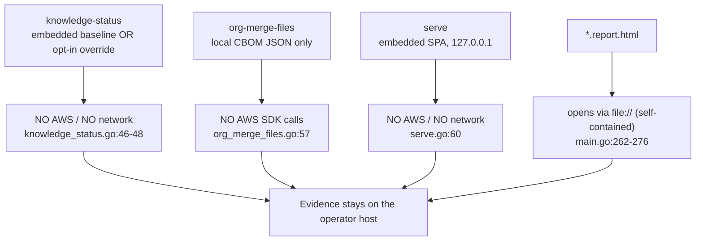

# 03 · User Journeys

> **Audience & purpose:** Engineers, auditors, and operators who need to understand *how a human actually drives CryptaMap end-to-end* — the commands they type, the files they touch, and the exact code paths each step exercises. Every step is grounded in real CLI flags / source with `file:line` citations.

CryptaMap is a Go CLI (`cmd/cryptamap`) plus a `//go:build lambda` org-fan-out path, a static React dashboard embedded into the binary, and a set of offline subcommands. The **default posture is local-first**: a scan reads AWS read-only, writes artifacts to a local directory, and you review them on `127.0.0.1`. Cross-account / org-wide work is an explicit, separately-deployed Step Functions stack — the CLI scan path deliberately refuses to fan out across accounts (`cmd/cryptamap/main.go:173-177`).

---

## Table of contents

1. [Cast of characters & shared vocabulary](#1-cast-of-characters--shared-vocabulary)
2. [Journey A — Single-account local scan → CBOM + dashboard (the default)](#2-journey-a--single-account-local-scan--cbom--dashboard-the-default)
3. [Journey B — Org-wide deployed fan-out scan](#3-journey-b--org-wide-deployed-fan-out-scan)
4. [Journey C — Auditor reviewing compliance + coverage](#4-journey-c--auditor-reviewing-compliance--coverage)
5. [Journey D — Engineer adding a new scanner](#5-journey-d--engineer-adding-a-new-scanner)
6. [Journey E — Air-gapped operator: side-load a signed binary + offline HTML report](#6-journey-e--air-gapped-operator-side-load-a-signed-binary--offline-html-report)
7. [Cross-cutting invariants every journey relies on](#7-cross-cutting-invariants-every-journey-relies-on)

**Sibling SDLC docs** (relative links): [`01-REQUIREMENTS.md`](./01-REQUIREMENTS.md) · [`02-USER-STORIES.md`](./02-USER-STORIES.md) · [`04-HIGH-LEVEL-DESIGN.md`](./04-HIGH-LEVEL-DESIGN.md) · [`05-LOW-LEVEL-DESIGN.md`](./05-LOW-LEVEL-DESIGN.md) · [`06-DATA-FLOW.md`](./06-DATA-FLOW.md) · [`08-TECH-STACK.md`](./08-TECH-STACK.md)
**Related design docs:** [`../SCALING.md`](../SCALING.md) · [`../SELF-UPDATING-KNOWLEDGE.md`](../SELF-UPDATING-KNOWLEDGE.md) · [`../COVERAGE-AND-GAPS.md`](../COVERAGE-AND-GAPS.md)

---

## 1. Cast of characters & shared vocabulary

| Term | What it is | Code anchor |
|---|---|---|
| **Scanner** | A per-service `ServiceScanner` (`Name()` / `Category()` / `Scan()`). 99 are wired today (count the `r.Register` calls across all three files). | `internal/scanner/types.go:14-18`; `cmd/cryptamap/register.go:16-56`, `register_datarest.go`, `register_transit.go` |
| **Engine** | Goroutine-pool orchestrator running all scanners for one `(account, region)`. | `internal/scanner/engine.go:72-163` |
| **Asset** | A discovered `CryptoAsset` with a posture in `Properties["posture"]`. | `pkg/models/asset.go:153-168` |
| **Finding** | A regulator-facing record derived from an asset (severity + Mosca + compliance). | `pkg/models/finding.go:66-85` |
| **CBOM** | CycloneDX-1.7 JSON; carries **assets, not findings** (lossy for findings). | `cmd/cryptamap/main.go:221-235` |
| **Posture** | One of `no-encryption` / `legacy-tls` / `non-pqc-classical` / `symmetric-only` / `pqc-hybrid` / `pqc-ready` / `unknown`. | `pkg/models/finding.go:35-43` |
| **bom-ref** | FNV-64a hash of the ARN; the single dedup key shared by live + mock. | `pkg/models/asset.go:14` |

> **Two binaries, one source tree.** A *plain* `go build` (`make build-cli`, `Makefile:9-11`) compiles the CLI; `runLambda()` is a fail-fast stub (`cmd/cryptamap/lambda_stub.go:12-15`). A *lambda-tagged* cross-compile (`make build-lambda`, `Makefile:13-15`) swaps in the real org-fan-out handler (`cmd/cryptamap/lambda.go:1` `//go:build lambda`).

---

## 2. Journey A — Single-account local scan → CBOM + dashboard (the default)

**Who:** A security engineer in one AWS account who wants a CBOM + posture report without deploying anything.
**One-liner:** `cryptamap --regions ap-south-1 --output-dir ./dist/scan-output --verbose` then `cryptamap serve --dir ./dist/scan-output`.

### Steps

1. **Build the CLI.** `make build-cli` → `go build -o ./dist/cryptamap ./cmd/cryptamap` (`Makefile:9-11`).
2. **Run a scan.** `main()` sees `CRYPTAMAP_MODE != lambda`, builds the Cobra root, and dispatches `runScan` (`cmd/cryptamap/main.go:29-39`, `:55-89`, `:91`).
3. **Resolve config.** `config.Load(path)` (empty path ⇒ `Default()`) then `cfg.Apply(CLIOverrides{...})` layers `--regions/--output-dir/--profile/...` over the YAML+defaults (`cmd/cryptamap/main.go:92-106`; `internal/config/loader.go:101-115`, `:141-166`). The output dir is created up front (`main.go:108-110`).
4. **Load AWS read-only creds.** `loadAWSConfig` uses **adaptive retry, max 8 attempts**, default region `us-east-1` (`main.go:147`, `:406-422`). Then `org.CallerIdentity` resolves the single caller account (`main.go:160`).
5. **Refuse to fan out.** If `--org` or `--accounts` was passed, the CLI prints a **loud WARNING** that it scans *only* the caller account and points you at the SFN stack / `org-merge-files` (`main.go:173-177`). This is the boundary between Journey A and Journey B.
6. **Register & run.** `NewRegistry()` + `registerAllScanners` wires **99 scanners** (`main.go:179-180`; the `registerAllScanners` dispatcher is `register.go:16-23`, but the registrations are split across three files: cert 10 + key 9 + sdk 3 + runtime 1 = 23 in `register.go:25-56`, at-rest 49 in `register_datarest.go`, transit 27 in `register_transit.go` = 99). `NewEngine` applies defaults (`MaxGoroutines=50`, etc., `engine.go:39-56`). For each region a region-pinned `awsCfg.Copy()` runs `eng.Run` (`main.go:188-192`).
7. **Inside the engine.** `registry.All()` returns scanners in sorted order (`registry.go:27-40`); a worker pool of `min(MaxGoroutines, #scanners)` goroutines calls each `Scan` via `runWithRetries` (`engine.go:72-163`). Per-scanner errors **always** hit stderr so a silent auth failure can't masquerade as an empty account (`engine.go:129-145`). Throttles are **not** re-tried by the engine — the SDK adaptive retryer owns them (`engine.go:198-210`).
8. **Build findings (shared pure path).** `buildFindings → BuildFindings` reads `posture` from `Properties` (default `unknown→MEDIUM`), computes Mosca `X+Y-Z`, and sets severity from the posture — applying the **worse-of** Mosca/HNDL bump **only for non-quantum-safe postures** (the AES-256/PQC quantum-safe postures stay informational; see §7 and Journey C step 5), then attaches compliance mappings (`engine.go:235-237`; `findings.go:29-77`, `:39-50`; `risk/mosca.go:12-32`; `risk/severity.go:42-57`).
9. **Write artifacts.** `writeArtifacts` emits, per region, files prefixed `cryptamap-scan-<acct>-<region>-<ts>`: `.cbom.json`, `.pqcc.xlsx`, `.report.html`, `.asff.json`, `.scan.json` (raw), `.roadmap.json/.md` (and `.report.md` if PDF) (`main.go:216-316`). Without `--org-merge`, the heavy `Assets`/`Findings` slices are dropped after write to keep memory flat across many regions (`main.go:201-204`).
10. **(Optional) `--org-merge`.** Merge all scanned regions of *this* account into one CBOM + roadmap + `coverage.json` via `merge.Merge` (`main.go:207-211`, `:351-390`).
11. **Print summary** (`main.go:212`, `:392-404`).
12. **Serve the dashboard locally.** `cryptamap serve --dir ./dist/scan-output` binds **127.0.0.1 only** (no bind-all flag by design), resolves the latest CBOM + roadmap, synthesizes `/config.json` as `{"apiBase":"","mockMode":true}`, serves the two `/mock/*.json` artifacts, and serves the embedded SPA with index.html deep-link fallback (`serve.go:38-104`, `:109-132`, `:147-175`; `web_embed.go:18-19`). **Build caveat:** the committed `go:embed`-ed `webdist/` is a PLACEHOLDER `index.html` only (`web_embed.go:8-13`); the *real* Vite dashboard is staged into `cmd/cryptamap/webdist` by `make build-serve` (`Makefile:23-29`) before `go build`. A plain `make build-cli` / `go build` therefore serves the placeholder shell, not the real dashboard — and `serveIndex` even errors `run \`make build-serve\`` if the bundle is missing (`serve.go:183`). The dashboard's `mockMode:true` branch fetches `/mock/org-cbom.json` + `/mock/roadmap.json` locally — no API (`dashboard/src/services/api.ts:9-10,39,165`).

> **Mock variant (zero AWS):** `cryptamap --mock --mock-scale 10` (or `make mock`) runs `scanner.RunMock`, which generates synthetic assets from all **99 templates** (one per live scanner) and reuses the *same* `buildFindings/buildSummary` path, returning `Mode='mock'` (`main.go:122-145`; `mock_engine.go:16-49`; `mock/templates.go`). As of 2026-06-16 mock template coverage matches the live scanner set 1:1, enforced by `internal/mock/coverage_test.go:TestMockCoverageNoDrift`.

### Diagram A.1 — the operator's path (journey style)



### Diagram A.2 — the scan lifecycle (sequence)



---

## 3. Journey B — Org-wide deployed fan-out scan

**Who:** A platform/security team that deploys CryptaMap once in an Audit hub account and scans every active member account × enabled region.
**Key fact:** this is the **only** path that crosses account boundaries. The CLI scan path will not (`main.go:173-177`); the fan-out lives in the lambda-tagged binary + a Step Functions Standard state machine.

### Steps

1. **Build & deploy.** `make build-lambda` cross-compiles the `bootstrap` (linux/arm64, `-tags lambda`, `Makefile:13-15`); `make deploy` synths + deploys the CDK stacks (`Makefile:69-70`). Member accounts must carry the `CryptaMapScannerRole` (assumed with an `ExternalId` confused-deputy guard, `org-fanout-stack.ts:18-21,55-57`).
2. **Seed the run.** The state machine starts at `SeedTuples` (Node Lambda): `organizations:ListAccounts` → active accounts; for each it assumes the member role and calls `ec2:DescribeRegions` to keep only **enabled** regions (failures fall back to the static list — never silently drop an account); it writes the `tuples.json` + `accounts.json` arrays to S3 and emits a `runId` plus `expectedShards` (post-filter count) (`org-fanout-stack.ts:80-219`, especially `:143-195`).
3. **Fan out (Distributed Map, Standard).** `ScanFanout` reads the tuples via an **S3 ItemReader** (removes the 256KB SFN payload cap), `maxConcurrency:20`, `toleratedFailurePercentage:25`, and invokes the Go scanner Lambda once per `(account, region)` (`org-fanout-stack.ts:300-361`). See [`../SCALING.md`](../SCALING.md) §4.2/§4.4 for the payload-cap and completion-barrier rationale.
4. **Scan one shard (Go handler).** `handle()` loads `baseCfg` with the **orchestrator's own central creds** (adaptive retry, max 8 — single throttle owner) and keeps `baseCfg.Region` central (`lambda.go:56-79`). It copies to `scanCfg`, repoints it to the **target** region, and — when `roleArn` is set — calls `org.AssumeRole` into the member account and **eagerly verifies** the assumed identity via `CallerIdentity`, failing the shard on a denied role or account mismatch (so a permission failure doesn't masquerade as an empty account) (`lambda.go:98-118`).
5. **Run the engine + write partials.** `registerAllScanners` + `eng.Run` produce the shard's `ScanResult`; the handler writes the **CBOM partial** and the **full RAW ScanResult JSON** (assets *and* findings, verbatim) to `RESULTS_BUCKET` under `scans/` and `scans/raw/<runId>/`, plus a `SCANS_TABLE` row — all with the **base/central** creds so artifacts land centrally (`lambda.go:120-183`; raw key contract `lambda_event.go:107-125`). The raw upload exists precisely because the CBOM is lossy for findings.
6. **Counts rollup.** `MergeResults` (Node) reads the Distributed Map manifest and writes a lightweight `scans/latest/<runId>.json` per-account totals summary (`org-fanout-stack.ts:222-289`, `:366-375`).
7. **Hierarchical merge (tier 1).** `AccountMergeFanout` invokes the *same* scanner Lambda with `mergeAccount:true` per distinct account; each child streams that account's `scans/raw/<runId>/<accountId>-*` shards into one per-account merged object under `scans/account-merged/<runId>/` (`lambda.go:85-89`; `lambda_event.go:69-73,131-148`; `org-fanout-stack.ts:377-433`). One account per child = no single-merge OOM cliff ([`../SCALING.md`](../SCALING.md) §4.1).
8. **Final merge (tier 2).** `BuildOrgCbom` invokes the scanner with `merge:true` + `expectedShards`; it streams the per-account merged objects (falling back to raw shards), reconciles the **completion barrier** (observed vs expected shards), and emits the org CBOM + roadmap + coverage under `scans/latest/<runId>.*` (`lambda.go:90-92`; `lambda_event.go:59-79`; `org-fanout-stack.ts:435-467`).

> **Same merge math, two entry points.** Both the Lambda merge and the offline `org-merge-files` (Journey C) reuse `merge.Merge` + `scanner.BuildFindings`, so findings regenerate with **identical classification** (posture / severity / Mosca / compliance) whether merged centrally or on a laptop (`org_merge_files.go:97-110`). The *records* are not byte-identical: `BuildFindings` stamps a fresh `ID: uuid.NewString()` and `CreatedAt/UpdatedAt: time.Now().UTC()` on every call (`findings.go:30,56,72-73`), so only the input-derived classification fields are reproducible — IDs and timestamps differ per run.

### Diagram B.1 — org fan-out topology (sequence)



### Diagram B.2 — the throttle / safety guardrails (flow)



---

## 4. Journey C — Auditor reviewing compliance + coverage

**Who:** A compliance/audit reviewer (e.g. Indian BFSI — SEBI / RBI / IRDAI) who needs to see posture by framework *and* confirm nothing was silently skipped.
**Inputs:** either local artifacts from Journey A, or the per-account CBOM partials from Journey B downloaded from `RESULTS_BUCKET`.

### Steps

1. **(If reviewing an org run) merge the partials offline.** Download the per-account CBOMs and run `cryptamap org-merge-files --in ./partials -o ./dist/org-merge` (no AWS calls). It expands dirs/globs to sorted unique `*.json` (skipping its own `cryptamap-org-*` / `*.roadmap.json` / `*.coverage.json` outputs for idempotent re-runs), parses each CBOM into shards via `output.ParseCBOMFile`, **regenerates findings** with the same `scanner.BuildFindings`, recomputes per-shard summaries, then `merge.Merge` → CBOM + roadmap + `coverage.json` (`org_merge_files.go:46-142`, `:177-218`).
2. **Why the merge regenerates findings.** The CBOM carries assets, not findings, so findings *must* be re-derived to populate the roadmap — and because `BuildFindings` is pure and dependency-light, the offline merge produces **identical classification** (posture / severity / Mosca / compliance) to a live scan from the same assets (`org_merge_files.go:88-99`; `findings.go:29-77`). The findings are *not* byte-identical: each call mints a new `ID: uuid.NewString()` and sets `CreatedAt/UpdatedAt: time.Now().UTC()` (`findings.go:30,56,72-73`), so purity tests must compare classification content and exclude the UUID and the two timestamps.
3. **Open the coverage matrix.** `coverage.json` records *which* `(account, region)` shards were scanned and whether each errored — so a missing or errored account is never treated as clean (`main.go:381-388`; `org_merge_files.go:131-135`). For an org run, the completion barrier additionally flags shards that vanished vs `expectedShards` ([`../SCALING.md`](../SCALING.md) §4.4).
4. **Review compliance mappings.** Each finding carries `Compliance[]` (framework + controlID + status + remediation + deadline), attached by `compliance.MapAll` over the configured frameworks; the default set is the 9 frameworks `SEBI_CSCRF, RBI_BANK_IN, IRDAI_ICSG, CISA_M2302, MITRE_PQCC, CNSA_2_0, EU_NIS2_DORA, CANADA_PQC, EUROPOL_QSFF` (`pkg/models/finding.go:46-53`; `findings.go:45-48`; `internal/config/loader.go:14-98`). The `--frameworks` flag narrows this set for the merge (`org_merge_files.go:62,82-86`).
5. **Read severity honestly.** Severity starts from the posture, and the **worse-of** Mosca/HNDL bump is applied **only when the posture is not already quantum-safe** (`findings.go:39-50`; `risk.IsQuantumSafePosture` at `risk/severity.go:42-49`). So a long-lived RDS asset that is `non-pqc-classical` scores CRITICAL on Mosca (`X+Y-Z = 10+2-3 = 9`, `risk/defaults.go:14-85`) — Mosca dominates for vulnerable long-shelf-life stores — but a `symmetric-only` (AES-256) RDS asset is **INFORMATIONAL**, because Shor's algorithm does not threaten AES no matter how long-lived the data. **Note:** prior to this, severity was an unconditional worse-of, so AES-256 stores were wrongly stamped CRITICAL by their Mosca score (a real mock scan had 38 such quantum-safe CRITICAL/HIGH findings; now 0, with the assets still listed for inventory completeness — see [`02-USER-STORIES.md`](./02-USER-STORIES.md) R-2/C-4). Auditors should therefore expect Mosca to dominate only for the genuinely quantum-exposed stores.
6. **Cross-read the formats.** The same scan is available as CycloneDX CBOM (machine), MITRE PQCC `.xlsx` (regulator submission, owner metadata from config `Owner*`), ASFF JSON (Security Hub), and the self-contained `.report.html` evidence file that opens via `file://` (`main.go:216-316`).
7. **Browse it.** Point `cryptamap serve --dir ./dist/org-merge` (or `./dist/scan-output`) at the merged output and review per-account, per-framework, and roadmap views in the loopback dashboard (`serve.go:70-104`).

### Diagram C.1 — auditor review flow



---

## 5. Journey D — Engineer adding a new scanner

**Who:** A developer adding coverage for a new AWS service (or deepening an existing one).
**Contract:** implement the three-method `ServiceScanner` interface and register it. The engine, findings, severity, compliance, dashboard, and all output formats then work automatically.

### Steps

1. **Pick a category & package.** Put the file under the matching dir: `internal/services/datarest/` (at-rest), `transit/` (in-transit), `keymgmt/`, `certmgmt/`, `sdkpqc/`, or `runtime/`. The directory is a convention only — `Category()` is what actually classifies (and can diverge from the dir, e.g. `sdkpqc/container_images.go` reports `data-at-rest`).
2. **Implement the interface.** `Name()` (the registry key / canonical id), `Category()`, and `Scan(ctx, cfg)` (one call = one `(account, region)`) (`internal/scanner/types.go:14-18`). Use the shared helpers: `services.NewAsset(...)` (region-embedding ARN) or `services.NewAssetWithARN(...)` (region-less, S3-style dedup), the at-rest blocks (`AESAtRest()`, `NoEncryption()`, `UnknownAtRest()`), and **always** call `services.PostureProperty(&a, posture)` (`common.go:70-101,110,316,331,420`). EFS is the canonical minimal example — boolean `Encrypted` → `SymmetricOnly`/`AESAtRest()` else `NoEncryption()`/`NoEncryption()`, then `PostureProperty` (`internal/services/datarest/efs.go:24-64`).
3. **Honour the anti-false-safe rules.** Set posture from observed state; when state is undetermined emit `PostureUnknown`, **never** a clean `SymmetricOnly` (see at-rest archetypes A/B/C and Type-B not-retroactive handling in [`05-LOW-LEVEL-DESIGN.md`](./05-LOW-LEVEL-DESIGN.md)). If a posture comes from AWS docs rather than a live read, stamp provenance (`StampDocFactKeyed` / `StampObserved`, `common.go:205,251`). Respect the scale cap: slice each page to the remaining `MaxAssetsPerScanner` budget (25000) before fanning out, and `TruncationCapReached` checks in the loop (`common.go:23,38`).
4. **Register it.** Add one `r.Register(yourpkg.YourScanner{})` line to the matching `register*` function (`register.go:25-56`, `register_datarest.go:9-48`, `register_transit.go:9-37`). `registerAllScanners` already calls them all (`register.go:16-23`). Registration is a sorted map, so ordering is deterministic and duplicate names overwrite (`registry.go:20-40`).
5. **Mock parity (optional but recommended).** Add a template in `internal/mock/templates.go` so `--mock` covers your service too (`mock/templates.go:29-138`). Without it, your scanner only appears in live scans.
6. **Build & test.** `go build ./...` (the plain build must stay green — lambda code is build-tagged), `make test` runs `go test ./internal/... ./pkg/... ./cmd/...` (`Makefile:47-48`). `make check-types` guards the Go→TS model sync, and `make check-knowledge` guards embedded PQC-knowledge staleness (`Makefile:37-45`).
7. **Verify end-to-end with mock.** `make mock` runs a synthetic scan and writes artifacts; `cryptamap serve` renders them (`Makefile:56-58`).

> **What you get for free.** Once registered, your assets flow through `Engine.Run` → `BuildFindings` (posture→severity, Mosca, compliance) → every output writer and the dashboard, with zero changes to those layers. The interface is the only surface you implement (`engine.go:72-163`; `findings.go:29-77`).

### Diagram D.1 — add-a-scanner journey



### Diagram D.2 — where a new scanner plugs in (flow)



---

## 6. Journey E — Air-gapped operator: side-load a signed binary + offline HTML report

**Who:** An operator in an isolated / regulated environment with no outbound network, who must scan an account and hand off evidence as files only.
**Premise:** CryptaMap is **local-first** and the offline subcommands make **no AWS and no network calls** (`org-merge-files`, `knowledge-status`, `serve` all advertise this — `org_merge_files.go:57`; `knowledge_status.go:46-48`; `serve.go:60`). The "no live oracle" property is **test-enforced, not just convention**: `TestPurityScanBinaryHasNoDocOracleDeps` (`cmd/cryptamap/purity_test.go:38-58`) shells out to `go list -deps` and fails the build if the scan binary's transitive dependency set contains any `aws-documentation-mcp` / `awslabs` / `mcp-server` marker (`purity_test.go:21-28`), so a future knowledge-refresh MCP client cannot leak into the customer scan binary that an air-gapped operator side-loads. The scan binary classifies crypto from baked-in baseline data only.

### Steps

1. **Receive a signed release binary.** `make release` cross-compiles signed-ready air-gap binaries into `dist/release` (`Makefile:31-32`, `scripts/release-build.sh`). The operator verifies the signature out-of-band per local policy, then side-loads the binary onto the isolated host.
2. **Check knowledge freshness before trusting output.** `cryptamap knowledge-status` prints the active PQC knowledge **source** (embedded air-gap baseline vs a validated on-disk override), version, digest, fact count, and the conservative `minAsOf` "oldest fact" headline — fully offline (`knowledge_status.go:29-89`). The embedded baseline is the air-gap floor; an opt-in override is only honored via explicit `$CRYPTAMAP_KNOWLEDGE_FILE` / `$CRYPTAMAP_KNOWLEDGE_DIR` (no implicit filesystem scan), and a rejected override leaves the embedded baseline standing and says so (`knowledge_status.go:80-87`; `internal/pqc/knowledge.go:287-298`). See [`../SELF-UPDATING-KNOWLEDGE.md`](../SELF-UPDATING-KNOWLEDGE.md).
3. **Scan in-region.** Run `cryptamap --regions <r> --output-dir ./out` against the local account's read-only role. Identical engine path to Journey A; the scan itself only needs the AWS control-plane the account already exposes — no internet egress.
4. **Hand off the offline HTML report.** Each scan emits a **self-contained** `*.report.html` that opens via `file://` with no server (`main.go:262-276`). For a multi-region or aggregated picture, run `cryptamap org-merge-files --in ./out` (or `--org-merge` on the scan) to produce a merged CBOM + roadmap + coverage, all local files.
5. **(Optional) review in the embedded dashboard.** `cryptamap serve --dir ./out` runs the dashboard from the **embedded SPA** with zero network dependency at serve time (the bundle is `go:embed`-ed; loopback-only bind) (`serve.go:38-104`; `web_embed.go:5-19`). Note the real SPA only ships when the binary was produced by `make build-serve` / `make release` (which stages `dashboard/dist` into `cmd/cryptamap/webdist` before `go build`, `Makefile:23-29`); a plain `go build` embeds only the committed placeholder `index.html` (`web_embed.go:8-13`), so air-gap operators should side-load a `make release` binary, not a vanilla build. Reaching it from another host is an explicit out-of-band choice (e.g. `ssh -L`), never a flag — loopback-only binding is exactly what prevents a network-exposed dashboard from serving the inventory (`serve.go:31-37`).
6. **Export evidence.** The artifacts (CBOM JSON, PQCC `.xlsx`, ASFF JSON, `*.report.html`, roadmap, `coverage.json`) are the deliverables; copy them out through the approved transfer path.

### Diagram E.1 — air-gapped operator (sequence)

```mermaid
sequenceDiagram
    autonumber
    actor Op as Air-gapped Operator
    participant Rel as Signed release binary (make release)
    participant KS as cryptamap knowledge-status
    participant CLI as cryptamap (scan)
    participant FS as ./out (local files only)
    participant Srv as cryptamap serve (127.0.0.1, embedded SPA)

    Op->>Rel: verify signature out-of-band, side-load
    Op->>KS: knowledge-status  (no AWS, no network)
    KS-->>Op: source=embedded, version, minAsOf, digest
    Op->>CLI: cryptamap --regions <r> -o ./out
    CLI->>FS: *.cbom.json + *.report.html (self-contained) + roadmap + coverage
    Op->>CLI: org-merge-files --in ./out (offline aggregate)
    CLI->>FS: merged org CBOM + roadmap + coverage.json
    Op->>Srv: serve --dir ./out (optional, loopback only)
    Srv-->>Op: dashboard from embedded bundle (zero network; real SPA only via make build-serve/release)
    Op->>Op: export *.report.html / *.xlsx via approved transfer
```

### Diagram E.2 — offline guarantee (flow)



---

## 7. Cross-cutting invariants every journey relies on

These hold across all five journeys and are worth internalizing:

- **One finding path, three callers.** `scanner.BuildFindings` is the single, pure source of findings, reused by live scans (`engine.go:235-237`), `--mock` (`mock_engine.go:34`), and offline `org-merge-files` (`org_merge_files.go:97`) — guaranteeing **identical classification** (posture / severity / Mosca / compliance) across all of them. It is *not* byte-identical: every call stamps a random `ID: uuid.NewString()` and `CreatedAt/UpdatedAt: time.Now().UTC()` (`findings.go:30,56,72-73`), so only the input-derived classification is reproducible — the `engine.go:231-234` comment's "byte-identical behavior" wording is overstated for the serialized record.
- **Posture lives in `Properties["posture"]`, not a typed field.** A scanner that forgets to call `PostureProperty` silently yields `unknown → MEDIUM`, not an error (`findings.go:32-38`; `common.go:420`).
- **Severity = posture severity, with a worse-of Mosca/HNDL bump applied only to genuinely-vulnerable postures.** The bump is skipped for quantum-safe postures (`symmetric-only` / `pqc-hybrid` / `pqc-ready`) so AES-256 stores are not false-CRITICAL (`findings.go:39-50`; `risk.IsQuantumSafePosture` at `risk/severity.go:42-49`; corrected — was previously an unconditional worse-of).
- **Throttles have a single owner.** The SDK adaptive retryer (max 8 attempts) owns throttle retries; the engine only re-runs a whole `Scan` on coarse transient errors (`engine.go:198-210`; `main.go:406-422`; `lambda.go:62-69`).
- **No silent clean.** Per-scanner errors always hit stderr (`engine.go:129-145`); assume-role failures fail the shard rather than report 0 assets (`lambda.go:111-117`); `coverage.json` + the completion barrier surface skipped/errored shards (`main.go:381-388`; [`../SCALING.md`](../SCALING.md) §4.4).
- **The dashboard never binds beyond 127.0.0.1** — no `--host` flag exists by design (`serve.go:31-37,55-58`).
- **The CBOM is lossy for findings.** Anything that consumes a CBOM (the offline merge) regenerates findings; the Lambda merge sidesteps this by uploading the RAW `ScanResult` JSON (`lambda.go:155-171`; `org_merge_files.go:88-99`).
- **`bom-ref` (FNV-64a over the ARN) is the dedup key** shared by live + mock; S3 uses a region-less ARN so the same bucket seen from N regions dedups to one row (`asset.go:14`; `common.go:79-101`).

> **Authoritative count — count the `r.Register` calls:** the registry wires **99** scanners (10 cert + 9 key + 3 sdk + 49 at-rest + 27 transit + 1 runtime). The `register.go` doc-comment is current ("Wires 99 scanners covering data-at-rest (49), data-in-transit (27), certificate management (10), key management (9), SDK/library PQC (3), and runtime evidence (1)", `register.go:13-15`). **Note:** the user-facing `--help` banner derives the count from the live registry — `cmd/cryptamap/main.go:73-77` calls `registeredScannerCount()` → `reg.Len()` (`main.go:58-62`), so `cryptamap --help` prints the true count, and `count_guard_test.go` asserts banner == registry (now pinned to 99). **Updated 2026-06-15 (coverage-expansion): 86 → 99 scanners** (the skipped-services audit promoted 13 to v1: 11 at-rest + 2 cert). **Updated 2026-06-16:** the mock generator now has **99** templates (one per scanner), kept in lock-step with the live registry by `internal/mock/coverage_test.go:TestMockCoverageNoDrift`.
