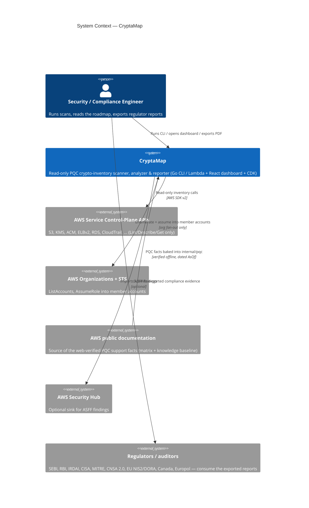
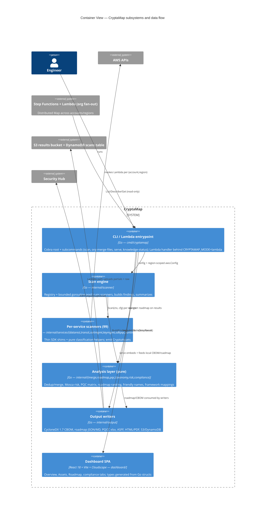
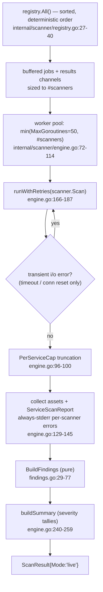
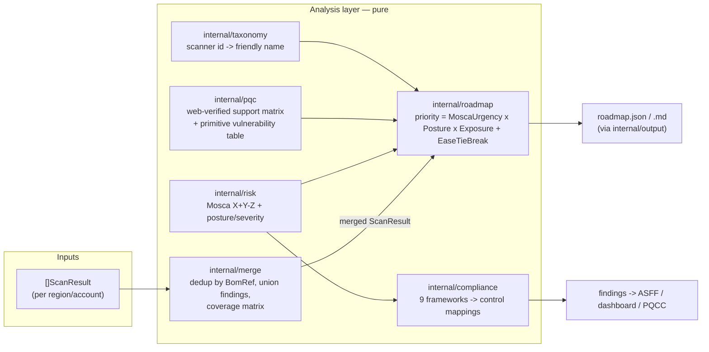
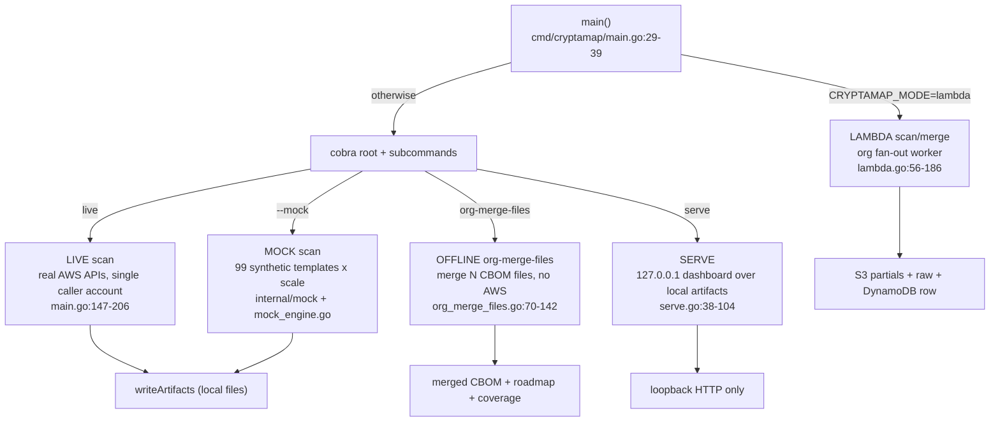
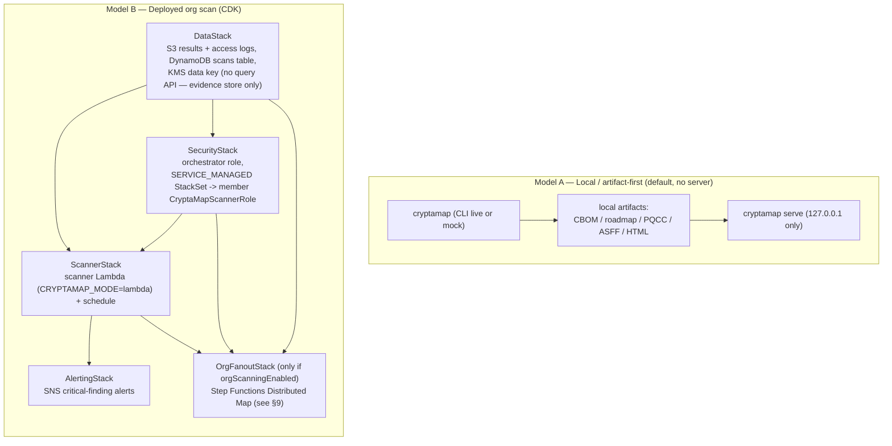

# 04 — High-Level Design

**Audience:** engineers new to CryptaMap, reviewers, and architects who need the whole-system mental model before diving into code. **Purpose:** show the major subsystems, how data flows between them, and how the system deploys — at a higher altitude and broader than [`ARCHITECTURE.md`](../../ARCHITECTURE.md), which it references rather than duplicates.

> Scope note: this is a *design* document grounded in the current code. The
> repository-root [`ARCHITECTURE.md`](../../ARCHITECTURE.md) had drifted from the
> code (its "64 scanners" count and a stale "org Lambda role-assumption is an
> unimplemented TODO"); the count string in `ARCHITECTURE.md`/`DEPLOYMENT.md` was
> corrected during the 2026-06-15 coverage-expansion,
> and this document follows the **code**, which
> registers **99 scanners** (`cmd/cryptamap/register.go:16-56`) and has the
> assume-role path **implemented, verified, and trust-hardened**: the member-account
> StackSet role and the management-account `LocalScannerRole` are both assumed by the
> orchestrator `ArnPrincipal` gated on `aws:PrincipalOrgID` + `sts:ExternalId`
> (`cmd/cryptamap/lambda.go:100-118`; `cdk/lib/security-stack.ts:121-138`, conditions
> at `:126-131` — see §9).

---

## Table of contents

1. [What CryptaMap is](#1-what-cryptamap-is)
2. [System context](#2-system-context)
3. [Container view (the major subsystems)](#3-container-view-the-major-subsystems)
4. [The five crypto dimensions](#4-the-five-crypto-dimensions)
5. [The scan engine](#5-the-scan-engine)
6. [The analysis layer](#6-the-analysis-layer-pqc--risk--roadmap--compliance)
7. [Output writers](#7-output-writers)
8. [Three run modes](#8-three-run-modes-one-engine)
9. [Org fan-out (StackSet + Step Functions Distributed Map)](#9-org-fan-out-stackset--step-functions-distributed-map)
10. [Dashboard](#10-dashboard)
11. [Deployment topology](#11-deployment-topology)
12. [Cross-cutting invariants](#12-cross-cutting-invariants)
13. [Related documents](#13-related-documents)

---

## 1. What CryptaMap is

CryptaMap inventories the cryptography in use across an AWS organization and
produces a **post-quantum-cryptography (PQC) readiness picture**: a CycloneDX-1.7
Cryptographic Bill of Materials (CBOM), a prioritized migration roadmap, and
regulator-facing compliance findings. It exists to answer two questions for a
security or compliance team:

- *Where is quantum-vulnerable cryptography (RSA, ECDSA, ECDHE, legacy TLS) in my
  estate, and how exposed is it to "harvest now, decrypt later" (HNDL) attacks?*
- *For each weak spot, what is the exact, citable AWS action to move it toward PQC,
  and in what order should I do them?*

The product is read-only by construction: every scanner calls `List*`/`Describe*`
/`Get*` AWS APIs and never mutates anything. The analysis cores (`merge`, `roadmap`,
`pqc`, `taxonomy`) are pure functions over data structures — no I/O, no SDK — which
is what makes the system testable and the offline/air-gapped paths possible.

---

## 2. System context

Who and what CryptaMap talks to.



Key context facts grounded in code:

- The PQC facts CryptaMap reasons over are **baked in** (a web-verified support
  matrix plus an embedded knowledge baseline), not fetched live: `internal/pqc/matrix.go`
  carries a package-level verification date `const AsOf = "2026-06-03"`
  (`internal/pqc/matrix.go:23`) and `internal/pqc/embed.go` `go:embed`s
  `data/pqc-knowledge.json` with per-fact `AsOf` dates (`internal/pqc/embed.go:10`).
  This is deliberate: scans stay deterministic and air-gap-capable.
- Organizations/STS is used **only** on the org fan-out path. The CLI scan path is
  single-account and loudly warns that `--org`/`--accounts` are not honored by it
  (`cmd/cryptamap/main.go:173-177`).

---

## 3. Container view (the major subsystems)

The system is one Go binary that runs in three modes (CLI, Lambda, local dashboard
server), a React SPA, and a set of CDK stacks. Internally the Go code is split into
a **scan engine**, the **per-service scanners** (organized by the five crypto
dimensions), a **pure analysis layer**, and **output writers**.



The two import-discipline boundaries worth internalizing:

1. **Scanners depend on the engine's contract, not vice versa.** Every scanner
   implements the `ServiceScanner` interface — `Name()`, `Category()`,
   `Scan(ctx, cfg)` — defined in `internal/scanner/types.go:14-18`. The engine only
   ever sees that interface.
2. **The analysis cores never import the scanner or the SDK.** `internal/merge`,
   `internal/roadmap`, `internal/pqc`, and `internal/taxonomy` are pure and
   stdlib-light by design (`internal/merge/merge.go:1-18`,
   `internal/roadmap/roadmap.go:1-25`), so they are unit-testable and free of
   import-cycle risk. This is what lets the *offline* `org-merge-files` path and the
   Lambda merge regenerate identical findings without any AWS calls.

---

## 4. The five crypto dimensions

CryptaMap classifies every discovered crypto asset into one of five **categories**
(the "dimensions"), defined as `models.Category` constants
(`pkg/models/asset.go:23-29`). Each scanner declares its primary category via
`Category()`, and the scanner source tree is organized to match:

| Dimension (Category) | Source dir | Count | What it answers |
|---|---|---|---|
| `data-at-rest` | `internal/services/datarest/` | 49 | Is stored data encrypted, and with what key/algorithm? |
| `data-in-transit` | `internal/services/transit/` | 27 | What TLS/SSH/IPsec/MACsec protects connections, and is any PQC (ML-KEM hybrid) present? |
| `certificate` | `internal/services/certmgmt/` | 10 | What signature/public-key algorithm backs each cert/CA/signing key? |
| `key-management` | `internal/services/keymgmt/` | 9 | What is each key's own algorithm spec (symmetric / classical / ML-DSA)? |
| `sdk-library` | `internal/services/sdkpqc/` | 3 | Runtime/SDK PQC capability (mostly honest "unknown") |
| *(runtime evidence)* | `internal/services/runtime/` | 1 | In-use crypto inferred from CloudTrail activity |

Totals: **99 registered scanners** — 23 wired directly in
`cmd/cryptamap/register.go:16-56` (cert 10, key 9, sdk 3, runtime 1), plus 49
data-at-rest in `register_datarest.go:9-48` and 27 transit in
`register_transit.go:9-37`, for `10+9+3+49+27+1 = 99` `r.Register` calls. (Updated
2026-06-15 (coverage-expansion): the skipped-services audit promoted 13 scanners to v1,
86 → 99 — data-at-rest 38 → 49 (+11) and certificates 8 → 10 (+2). The in-code
**comment** at `register.go:13-15` is now correct — it reads "Wires 99 scanners covering
data-at-rest (49), data-in-transit (27), certificate management (10), key management
(9), SDK/library PQC (3), and runtime evidence (1)". **Note:**
the user-facing `--help` banner that used to hardcode an old count now derives it
from the live registry — `cmd/cryptamap/main.go:73-77` calls `registeredScannerCount()`
→ `reg.Len()` (`main.go:58-62`), guarded by `count_guard_test.go`, so end users see the
true 99.) The crosswalk between a scanner and its PQC posture
is the heart of correctness; see [PQC-READINESS-CROSSWALK.md](../PQC-READINESS-CROSSWALK.md).

Every scanner reduces its findings to one of seven **postures** —
`models.CryptoPosture` (`pkg/models/finding.go:35-43`): `no-encryption`,
`legacy-tls`, `non-pqc-classical`, `symmetric-only`, `pqc-hybrid`, `pqc-ready`,
`unknown`. The posture is written into the free-form `asset.Properties["posture"]`
by the shared `PostureProperty` helper (`internal/services/common.go:420`); it is
**not** a typed field on the asset. The downstream finding generator reads it from
there, defaulting a missing value to `unknown -> MEDIUM` rather than erroring
(`internal/scanner/findings.go:33-38`).

> Two PQC-specific framing rules the dimensions encode (see
> [encryption-model memory and crosswalk]): `symmetric-only` (AES-256) is
> **quantum-resistant** and intentionally informational, not an alarm; and
> `pqc-hybrid` is reserved exclusively for an *observed* X25519+ML-KEM TLS key
> exchange (`internal/services/runtime/cloudtrail_evidence.go:196` and the ELB SSL
> policy resolver `internal/services/transit/ssl_policy.go:118-136`). No KMS/ACM key
> spec ever yields `pqc-hybrid`; PQC keys can only surface as ML-DSA (`pqc-ready`).

---

## 5. The scan engine

The engine (`internal/scanner/engine.go`) is the orchestrator that turns a set of
registered scanners into one `models.ScanResult` per (account, region).



Design points a newcomer should know:

- **Deterministic ordering.** The registry returns scanners sorted by name
  (`internal/scanner/registry.go:27-40`) so scans are reproducible.
- **The engine does *not* retry throttles.** `shouldRetry` deliberately refuses to
  retry `Throttling`/`TooManyRequests`/`RequestLimitExceeded`/503
  (`internal/scanner/engine.go:198-210`) because the AWS SDK adaptive retryer (max 8
  attempts, configured in `cmd/cryptamap/main.go:406-422` and `lambda.go`) already
  owns those. This avoids 3–6× attempt amplification. Only coarse transient errors
  (`i/o timeout`, `connection reset`) trigger an engine-level whole-`Scan` re-run.
- **Errors are never silent.** Per-scanner failures are always written to stderr
  (not gated on `--verbose`), so an auth failure cannot masquerade as an empty,
  "clean" account (`internal/scanner/engine.go:129-137`).
- **Scale guards.** Each scanner caps itself at `MaxAssetsPerScanner = 25000`
  (`internal/services/common.go:23`) via `TruncationCapReached`, which logs loudly.
  The engine's `PerServiceCap` is an additional optional ceiling.

The single source of truth for findings is the **pure** `BuildFindings`
(`internal/scanner/findings.go:29-77`): it reads posture from `Properties`, computes
the Mosca score per service, sets severity from the posture and then takes the worse
of the posture- and Mosca-derived severities **only for postures that are not already
quantum-resistant**, and attaches compliance mappings. **Note:**
this worse-of bump used to be unconditional, which let the posture-blind Mosca score
raise a quantum-resistant AES-256 store to CRITICAL; now `risk.IsQuantumResistantPosture`
(`internal/risk/severity.go:42-49`, true for `symmetric-only` / `pqc-hybrid` /
`pqc-ready`) gates it, so quantum-resistant assets stay INFORMATIONAL (still listed,
just not alarmed) while genuinely-vulnerable postures keep the worse-of behavior
(`findings.go:39-50`). Because it is pure, the live engine, the `--mock` path
(`internal/scanner/mock_engine.go:34` calls `e.buildFindings`), and the offline
`org-merge-files` path (`cmd/cryptamap/org_merge_files.go:97`) all call it and get
**identical classification** for the same input asset — same posture, severity, Mosca
score, and compliance mappings. (It is *not* byte-identical: every `Finding` also gets
a fresh random `ID: uuid.NewString()` and `CreatedAt`/`UpdatedAt = time.Now().UTC()` —
`findings.go:56,72-73` — so purity tests must compare the classification fields and
exclude the UUID and timestamps.)

---

## 6. The analysis layer (pqc / risk / roadmap / compliance)

After scanning, four pure packages turn raw assets/findings into a prioritized,
auditable, regulator-aligned picture. None of them import the SDK or the scanner.



- **`internal/risk` — Mosca's Theorem.** `Calculate(X,Y,Z) = X + Y − Z`
  (`internal/risk/mosca.go:12-23`); a positive score means HNDL exposure is active
  now. Per-service X/Y/Z defaults are tuned for Indian BFSI long-lived data (e.g.
  RDS/Aurora/DynamoDB 10/2/3) in `internal/risk/defaults.go:14-85`, falling back to
  5/1/3. Severity is the posture severity, with the **worse-of** Mosca/HNDL bump
  applied **only to non-quantum-resistant postures** (`internal/risk/severity.go:7-57`;
  gate `IsQuantumResistantPosture` at `:42-49`), so a long-lived `non-pqc-classical` RDS
  asset can be CRITICAL on Mosca grounds, while a `symmetric-only` (AES-256) asset
  stays INFORMATIONAL no matter its shelf-life (corrected — was
  an unconditional worse-of that wrongly raised AES-256 to CRITICAL).
- **`internal/pqc` — verified support matrix.** `matrix.go` encodes web-verified AWS
  PQC rows; `lookup.go` resolves a scanner name to its row and computes the
  *effective* PQC status given the primitive and posture
  (`internal/pqc/lookup.go:30,85,102`). Every fact carries `SourceURL`, `Confidence`,
  and the package `AsOf` date so the roadmap is auditable. See
  [SELF-UPDATING-KNOWLEDGE.md](../SELF-UPDATING-KNOWLEDGE.md) for how this baseline is
  kept fresh.
- **`internal/taxonomy` — friendly names.** Maps each scanner `Name()` (e.g.
  `kms_spec`, `rds_transit`) to a display `Entry` (`internal/taxonomy/taxonomy.go:17-23`)
  so internal IDs never leak to CBOM or UI.
- **`internal/roadmap` — the ranker.** `Build(ScanResult)` produces one ranked
  `RoadmapItem` per finding plus by-service/by-account roll-ups
  (`internal/roadmap/roadmap.go:31-86`). The score formula and its "AES/PQC sink
  clamp" (already-resistant material can never outrank a vulnerable RSA/ECDSA asset)
  are documented in [`ARCHITECTURE.md`](../../ARCHITECTURE.md#internalroadmap--pqc-migration-ranker)
  and are load-bearing for correctness.
- **`internal/merge` — org-wide dedup.** `Merge([]ScanResult, orchestratorAccountID)`
  collapses N shards into one merged `ScanResult` envelope plus a `[]Coverage`
  matrix and a provenance `MultiScanResult` (`internal/merge/merge.go:67-70`). Assets
  dedup on `BomRef` (`models.BomRefForARN`, an FNV-64a short hash —
  `pkg/models/asset.go:14`), the single dedup key shared by every path. For very large
  orgs there is a streaming `Merger` (`internal/merge/streaming.go:28-204`) that folds
  shards one at a time to bound memory; see [SCALING.md](../SCALING.md).
- **`internal/compliance` — framework mappings.** `MapAll` attaches control mappings
  for nine frameworks (SEBI, RBI, IRDAI, CISA, MITRE PQCC, CNSA 2.0, EU NIS2/DORA,
  Canada, Europol).

---

## 7. Output writers

Every writer in `internal/output` takes an `io.Writer` plus a single
`models.ScanResult` (either a per-region shard or the merged org envelope), so the
merged path reuses each writer unchanged. The CLI's `writeArtifacts`
(`cmd/cryptamap/main.go:216-316`) emits, per result, files keyed by
`cryptamap-scan-<acct>-<region>-<ts>`:

| Writer | Output | Function |
|---|---|---|
| CycloneDX 1.7 CBOM | `*.cbom.json` | `WriteCBOM` (`internal/output/cyclonedx.go:63`) |
| Roadmap | `*.roadmap.json` / `.md` | `WriteRoadmapJSON` / `WriteRoadmapMarkdown[TopN]` (`internal/output/roadmap_writer.go:20-39`) |
| PQCC Excel | `*.pqcc.xlsx` | `WritePQCCExcel` (`internal/output/pqcc_excel.go:65`) |
| ASFF (Security Hub) | `*.asff.json` | `WriteASFF` (`internal/output/securityhub.go:232`); each finding's ASFF `Resources[].Partition` + the `ProductARN` partition now follow `Finding.Region` via `PartitionForRegion` (`securityhub.go:59`, corrected — was previously hardcoded `"aws"`, so GovCloud/China output was wrong) |
| HTML report | `*.report.html` | `WriteHTMLReport` (`internal/output/html_report.go:43`) |
| PDF summary | `*.report.md` (PDF flag) | `WritePDFSummary` (`internal/output/pdf_writer.go:16`) |
| Raw scan | `*.scan.json` | direct JSON of `ScanResult` |

The CBOM is **lossy for findings** — it carries assets, not findings — so any path
that starts from a CBOM (the offline `org-merge-files` subcommand) must *regenerate*
findings via `BuildFindings` (`cmd/cryptamap/org_merge_files.go:97`). The Lambda
merge sidesteps this by also uploading the **raw** `ScanResult` JSON so findings
survive the merge (`cmd/cryptamap/lambda.go:145-171`). S3 and DynamoDB writers
(`internal/output/s3_writer.go`, `dynamodb_writer.go`) are used on the Lambda path.

---

## 8. Three run modes (one engine)

The same Go binary and the same `BuildFindings`/`buildSummary` core back three
modes; only the *source of assets* differs.



Notes that catch newcomers:

- **The CLI live scan is single-account.** It resolves the caller account via
  `org.CallerIdentity` and explicitly warns that `--org`/`--accounts` are not honored
  by the CLI (`cmd/cryptamap/main.go:160,173-177`). Cross-account scanning is the
  Lambda + Step Functions stack only.
- **Mock covers the full live set (1:1).** As of 2026-06-16 the mock generator has
  all **99** templates (`internal/mock/templates.go`) — one per live scanner, enforced
  by `internal/mock/coverage_test.go:TestMockCoverageNoDrift` — with the same
  `BomRefForARN` dedup key and posture-distribution faithfulness so the dashboard can
  be demoed offline. (Mock postures are synthetic, not real-resource state.)
- **`serve` binds `127.0.0.1` only**, with no bind-all flag, by design — a hard
  invariant of the local-first design
  (`cmd/cryptamap/serve.go:38-68`; see [deployment-model memory] and §11).

---

## 9. Org fan-out (StackSet + Step Functions Distributed Map)

Scanning a whole AWS Organization is the deployed, cross-account path. It has two
halves: a **StackSet** that plants a read-only role in every member account, and a
**Step Functions Standard state machine** in the orchestrator (Audit) account that
fans the scan out and merges the results hierarchically.

```mermaid
flowchart TD
    subgraph mgmt["Management / Orchestrator (Audit) account"]
      SS["SERVICE_MANAGED StackSet 'CryptaMapScannerRole'<br/>(your org root, e.g. r-exam)<br/>security-stack.ts:167"]
      SM["Step Functions 'CryptaMapOrgScan' (Standard)<br/>org-fanout-stack.ts:474"]
      SEED["1. SeedTuples (Node Lambda)<br/>ListAccounts x enabled regions<br/>-> tuples.json / accounts.json in S3"]
      FAN["2. ScanFanout (Distributed Map, maxConcurrency 20)<br/>S3 ItemReader; tolerated failure 25%"]
      SUM["3. MergeResults (Node Lambda)<br/>run summary -> scans/latest/&lt;runId&gt;.json"]
      AMF["4. AccountMergeFanout (Distributed Map)<br/>one child per distinct account (tier-1 merge)"]
      ORG["5. BuildOrgCbom (scanner Lambda, merge:true)<br/>streams per-account objects -> org CBOM+roadmap (tier-2)"]
      SCN["Scanner Lambda (Go, CRYPTAMAP_MODE=lambda)<br/>scanner-stack.ts:39"]
      S3B["Results S3 bucket + DynamoDB scans table<br/>data-stack.ts"]
    end

    subgraph members["Member accounts (1..N)"]
      ROLE["CryptaMapScannerRole (read-only)<br/>ExternalId guard"]
      MAPI["AWS APIs in member account"]
    end

    SS -.deploys.-> ROLE
    SM --> SEED --> FAN --> SUM --> AMF --> ORG
    FAN -->|InvokeScanner per (account,region)| SCN
    SCN -->|sts:AssumeRole + eager CallerIdentity verify| ROLE
    SCN -->|read-only List/Describe| MAPI
    SCN -->|CBOM partial + RAW ScanResult + Dynamo row, BASE creds| S3B
    AMF -->|mergeAccount:true per account| SCN
    ORG --> S3B
```

How it works, grounded in code:

1. **StackSet plants the role.** `SecurityStack` provisions a `SERVICE_MANAGED`
   `CfnStackSet` named `CryptaMapScannerRole` targeting the org root, deploying a
   read-only `CryptaMapScannerRole` into each member account, plus an `orchestrator`
   role the scanner Lambda runs as (`cdk/lib/security-stack.ts:42,121,167-189`). The
   trust contract is uniform across the member StackSet role and the
   management-account `LocalScannerRole`: each is assumed by the orchestrator
   `ArnPrincipal` **only** when `aws:PrincipalOrgID == organizationId` **and**
   `sts:ExternalId == externalId` (`cdk/lib/security-stack.ts:126-131`).
   **Note:** the `LocalScannerRole` was previously a **bare
   `ArnPrincipal` with no conditions** — H5 added the `withConditions({StringEquals:{
   aws:PrincipalOrgID, sts:ExternalId}})` guard so the management-account role matches
   the member trust. Two complementary `cdk/bin/app.ts` deploy-time guards now also
   refuse an org-scan synth that would weaken or fictionalize that trust: it **throws**
   if `scannerExternalId` is still the public default `'cryptamap-scanner'`
   (`cdk/bin/app.ts:56-60`) and **throws** on the placeholder org identifiers
   (`orgRootId 'r-exam'` / `organizationId 'o-exampleorgid'`) (`cdk/bin/app.ts:144-156`).
2. **Seed.** A Node Lambda lists active org accounts, and for each account assumes
   its scanner role to discover **enabled** regions (so dead opt-in-region shards are
   skipped), then writes `tuples.json` and `accounts.json` to S3. It returns
   `expectedShards` for a completion barrier (`org-fanout-stack.ts:143-195`). Tuples
   are passed by S3 ItemReader, not inline, to escape the 256 KB SFN payload cap
   ([SCALING.md](../SCALING.md) §4.2).
3. **ScanFanout.** A Distributed Map (`maxConcurrency: 20`, `toleratedFailurePercentage: 25`)
   invokes the Go scanner Lambda once per `(account, region)` tuple
   (`org-fanout-stack.ts:300-361`). The Go handler reads `roleArn`/`externalId`/`runId`,
   assumes the member role, **eagerly verifies** the assumed identity with
   `CallerIdentity` (failing the shard on denial or wrong account —
   `cmd/cryptamap/lambda.go:100-118`), runs the engine, and writes the CBOM partial +
   **raw** `ScanResult` + a DynamoDB row using **base/central** creds so partials land
   centrally (`cmd/cryptamap/lambda.go:130,145-183`).
4. **Hierarchical merge.** A lightweight summary Lambda rolls up counts; then a
   second Distributed Map (`AccountMergeFanout`) invokes the scanner Lambda with
   `mergeAccount:true` once per distinct account to produce per-account merged
   objects (tier-1), and finally `BuildOrgCbom` (`merge:true`) streams those into the
   org-wide CBOM + roadmap (tier-2), reconciling observed vs. `expectedShards`
   (`org-fanout-stack.ts:388-467`; merge core in `cmd/cryptamap/lambda_merge.go` /
   `lambda_merge_core.go`). The two-tier streaming design removes the
   single-merge OOM cliff at hundreds of accounts ([SCALING.md](../SCALING.md) §4.1).

For the architecture-decision rationale (why StackSet roles + SFN Distributed Map +
Audit hub) see the [CryptaMap architecture decision memory] and
[`ARCHITECTURE.md`](../../ARCHITECTURE.md#org-fan-out-topology-deployed-multi-account-path).

---

## 10. Dashboard

The dashboard is a React 18 + Vite SPA using **AWS Cloudscape** components
(`dashboard/`), not Tailwind/ECharts. Pages live in `dashboard/src/pages/`:
`Overview`, `AssetsView`, `RoadmapView`, the compliance tabs `SEBIView` / `RBIView`
/ `IRDAIView`, plus `LearnView` and `SettingsView`. It reads its data through one
client (`dashboard/src/services/api.ts`) and renders from TypeScript wire types in
`dashboard/src/types/generated.ts`.

Two design constraints make the dashboard trustworthy:

- **Generated, drift-checked types.** `cmd/gen-ts` reflects the Go wire structs
  (`pkg/models`, `internal/output`, `internal/roadmap`) into
  `dashboard/src/types/generated.ts`; `make check-types` fails CI on drift
  ([`ARCHITECTURE.md`](../../ARCHITECTURE.md#cmdgen-ts--generated-typescript-types)).
- **Local-data path for offline use.** `cryptamap serve` resolves the latest local
  CBOM + roadmap from `--dir`, synthesizes `/config.json` as `{apiBase:'', mockMode:true}`,
  serves the artifacts at `/mock/org-cbom.json` and `/mock/roadmap.json`, and serves
  the embedded SPA bundle (`go:embed all:webdist`, `cmd/cryptamap/web_embed.go:18-19`)
  with an `index.html` fallback for deep links — over **loopback only**
  (`cmd/cryptamap/serve.go:109-175`). This is the artifact-first viewing model that
  needs no server and no AWS access.
- **The committed `webdist/` is only a placeholder.** The checked-in `go:embed`
  target is a stub `index.html` (`cmd/cryptamap/web_embed.go:8-13`); the real Vite
  bundle lives in `dashboard/dist` (outside `cmd/cryptamap`, which `go:embed` cannot
  reach across). `make build-serve` builds the SPA and copies it into
  `cmd/cryptamap/webdist` **before** `go build`, so only a `make build-serve` /
  release binary embeds the real dashboard. A plain `go build`/`make build-cli`
  binary still compiles and serves, but `cryptamap serve` from it renders the
  placeholder shell, not the real UI.

---

## 11. Deployment topology

CryptaMap is **secure-by-default**: the supported model is local/artifact-first
(view the map via the loopback-only `cryptamap serve` or the signed HTML report).
CryptaMap ships **no internet-facing dashboard or query API** — an operator who
wants a shared viewer must self-host one against their own backend; the tool
provisions none.



CDK wiring (`cdk/bin/app.ts:103-181`) provisions **four** stacks unconditionally —
**DataStack** (`app.ts:103`), **SecurityStack** (`app.ts:105`), **ScannerStack**
(`app.ts:117`), and **AlertingStack** (`app.ts:181`). One more is conditional:
**OrgFanoutStack** is built only when `orgScanningEnabled` context is set
(`app.ts:143-174`). There is **no DashboardStack and no query API**: the former
public CloudFront dashboard + DynamoDB query API were removed in the local-first
redesign, so a deployment stands up no internet-facing surface at all (design
comment `cdk/bin/app.ts:25-31,134-136`). The crypto inventory is viewed only via
the loopback-only local `cryptamap serve` (see [DEPLOYMENT.md](../../DEPLOYMENT.md)).

Default fan-out regions are `us-east-1,ap-south-1` (Indian BFSI primary plus the
global-endpoint region) (`cdk/bin/app.ts:55`).

---

## 12. Cross-cutting invariants

These hold across the whole system and should not be broken without matching test
updates:

1. **Read-only.** No scanner calls a mutating API; the system is an inventory tool.
2. **Pure analysis cores.** `merge`, `roadmap`, `pqc`, `taxonomy` import no SDK and
   no `internal/scanner` — keep them that way (`internal/merge/merge.go:5-11`,
   `internal/roadmap/roadmap.go:7-12`).
3. **One findings path.** Live, mock, and offline-merge all generate findings through
   the same pure `BuildFindings` (`internal/scanner/findings.go:29-77`), guaranteeing
   identical **classification** (posture, severity, Mosca score, compliance mappings)
   regardless of how assets were sourced — *not* byte-identical records, since each
   `Finding` carries a random `ID` and `time.Now()` timestamps (`findings.go:56,72-73`).
4. **One dedup key.** `models.BomRefForARN` (FNV-64a) is the single org-wide dedup
   identity for live and mock (`pkg/models/asset.go:14`).
5. **Throttle ownership is the SDK's, not the engine's** — never add engine-level
   retry for throttle classes (`internal/scanner/engine.go:198-210`).
6. **Honest unknowns over false-safe.** Unparseable certs, unreadable encryption
   state, and unknown key specs resolve to `unknown`, never to a clean all-clear.
7. **Secure-by-default deployment.** No public web surface unless explicitly,
   authentically opted in; `serve` is loopback-only (`cdk/bin/app.ts:35-44`,
   `cmd/cryptamap/serve.go:38-68`).
8. **PQC facts are dated and citable.** Every PQC support row carries `SourceURL` /
   `Confidence` / `AsOf` (`internal/pqc/matrix.go:23`, `internal/pqc/embed.go`).

> Known doc-vs-code drift to be aware of: the CLI's `EngineOptions` is built without
> wiring `Risk.Mosca.Overrides` into `MoscaOverrides` (`cmd/cryptamap/main.go:113-120`),
> so that config key is effectively inert on the CLI path today. The repository-root
> [`ARCHITECTURE.md`](../../ARCHITECTURE.md)'s scanner-count string was corrected
> during the 2026-06-15 coverage-expansion and the Lambda role-assumption is implemented + verified
> (no longer a TODO); the in-code `register.go:13-15` **comment** was also refreshed in
> the 2026-06-15 coverage-expansion and now correctly reads 99 scanners. The code
> (99 scanners; implemented, trust-hardened
> assume-role) is authoritative.

---

## 13. Related documents

- [`ARCHITECTURE.md`](../../ARCHITECTURE.md) — component-level architecture and the roadmap scoring formula (referenced, not duplicated here).
- [`DEPLOYMENT.md`](../../DEPLOYMENT.md) — templated deployment snapshot.
- [`docs/SCALING.md`](../SCALING.md) — large-org bottlenecks and the streaming/hierarchical-merge design.
- [`docs/SELF-UPDATING-KNOWLEDGE.md`](../SELF-UPDATING-KNOWLEDGE.md) — how the PQC baseline stays fresh.
- [`docs/PQC-READINESS-CROSSWALK.md`](../PQC-READINESS-CROSSWALK.md) — service-to-PQC-readiness crosswalk.

Sibling SDLC documents in [`docs/sdlc/`](.):

- [`01-REQUIREMENTS.md`](01-REQUIREMENTS.md) — functional / non-functional requirements.
- [`02-USER-STORIES.md`](02-USER-STORIES.md) — user stories grounded in code.
- [`03-USER-JOURNEYS.md`](03-USER-JOURNEYS.md) — end-to-end run journeys.
- this `04-HIGH-LEVEL-DESIGN.md` — whole-system mental model.
- [`05-LOW-LEVEL-DESIGN.md`](05-LOW-LEVEL-DESIGN.md) — module-level / per-function detail.
- [`06-DATA-FLOW.md`](06-DATA-FLOW.md) — how assets/findings move through the system.
- [`07-API-FLOW.md`](07-API-FLOW.md) — the read-only AWS API calls and how the local-first dashboard loads its data.
- [`08-TECH-STACK.md`](08-TECH-STACK.md) — languages, SDKs, and dependencies.
- [`09-TEST-COVERAGE.md`](09-TEST-COVERAGE.md) — test strategy and coverage.
- [`10-SECURITY-AND-DATA-LOCALIZATION.md`](10-SECURITY-AND-DATA-LOCALIZATION.md) — security posture and data-localization.
