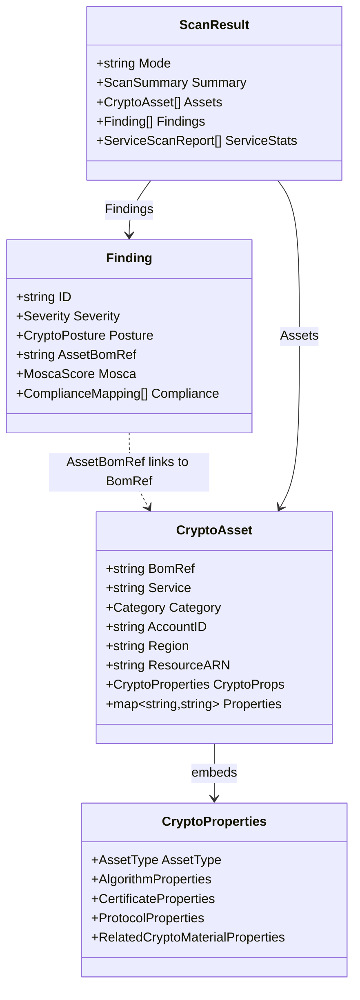
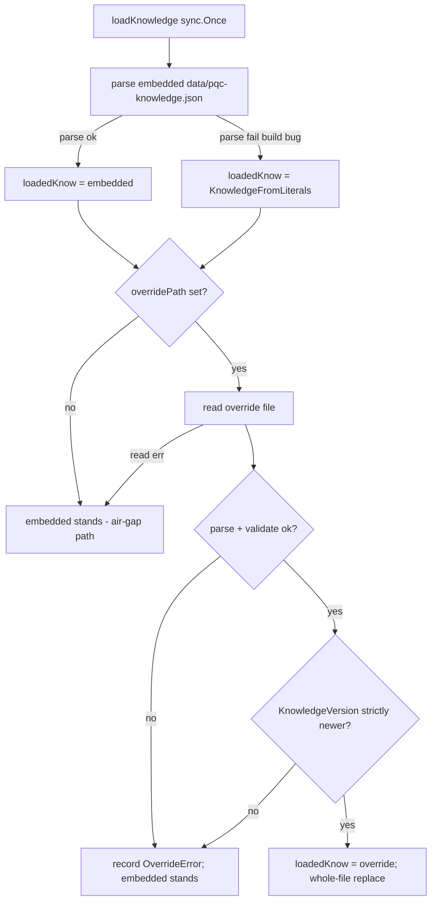
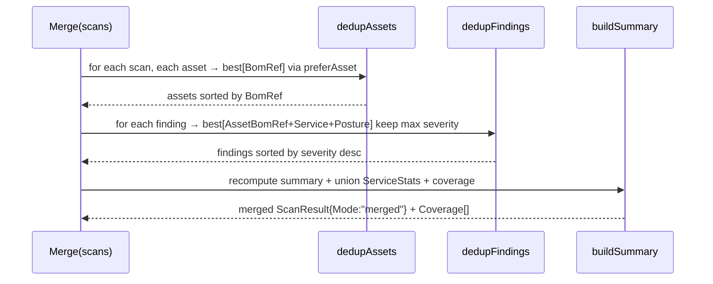
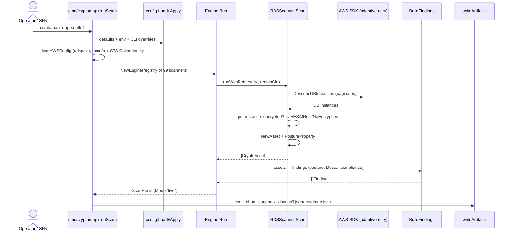
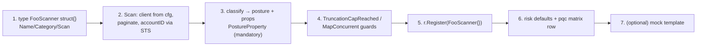

# 05 — Low-Level Design (LLD)

> **Audience & purpose:** the deep technical reference for an engineer about to read, debug, or extend CryptaMap's Go core. Every factual claim below is grounded in a `file:line` citation against the checked-in code. Read it alongside the [High-Level Design](04-HIGH-LEVEL-DESIGN.md) (which explains *why* the architecture looks like this) — this doc explains *exactly how* the scan engine, scanners, classification, knowledge loader, merge, and roadmap ranker work.

---

## Table of contents

1. [The one-paragraph mental model](#1-the-one-paragraph-mental-model)
2. [Package map (`internal/` + `pkg/`)](#2-package-map-internal--pkg)
3. [Core data model (`pkg/models`)](#3-core-data-model-pkgmodels)
4. [The `ServiceScanner` contract](#4-the-servicescanner-contract)
5. [Registry: deterministic scanner map](#5-registry-deterministic-scanner-map)
6. [Scan engine: goroutine pool, rate-limiting, truncation, retry](#6-scan-engine-goroutine-pool-rate-limiting-truncation-retry)
7. [`MapConcurrent`: bounded inner fan-out inside one scanner](#7-mapconcurrent-bounded-inner-fan-out-inside-one-scanner)
8. [Posture classification & finding generation](#8-posture-classification--finding-generation)
9. [The risk engine: Mosca's Theorem + severity](#9-the-risk-engine-moscas-theorem--severity)
10. [PQC knowledge loader: embed → override](#10-pqc-knowledge-loader-embed--override)
11. [Merge: dedup-by-bom-ref algorithm](#11-merge-dedup-by-bom-ref-algorithm)
12. [Roadmap ranker formula](#12-roadmap-ranker-formula)
13. [A scanner's full lifecycle (sequence diagram)](#13-a-scanners-full-lifecycle-sequence-diagram)
14. [How to add a new scanner (step-by-step, grounded in `rds.go`)](#14-how-to-add-a-new-scanner-step-by-step-grounded-in-rdsgo)
15. [Gotchas & invariants you must not break](#15-gotchas--invariants-you-must-not-break)

Related SDLC docs: [01 — Requirements](01-REQUIREMENTS.md) · [04 — High-Level Design](04-HIGH-LEVEL-DESIGN.md) · [06 — Data Flow](06-DATA-FLOW.md) · [09 — Test Coverage](09-TEST-COVERAGE.md). Deep-dive companions live one level up: [`../SCALING.md`](../SCALING.md), [`../SELF-UPDATING-KNOWLEDGE.md`](../SELF-UPDATING-KNOWLEDGE.md), [`../COVERAGE-AND-GAPS.md`](../COVERAGE-AND-GAPS.md).

---

## 1. The one-paragraph mental model

CryptaMap discovers cryptographic assets across an AWS account/region, classifies each one's **post-quantum posture**, derives **findings** (severity + compliance + migration urgency), and emits a CycloneDX **CBOM** plus a ranked migration **roadmap**. The unit of work is a **scanner** — one Go type per AWS service that implements a 3-method interface. A **registry** holds all scanners; the **engine** runs them in parallel against one `(account, region)` and folds the discovered assets into a `ScanResult`. The exact same pure finding-generation function (`BuildFindings`) is reused by the live engine, the `--mock` path, and the offline org-merge path, so the **classification** of a finding (posture, severity, Mosca score, compliance mappings) is identical regardless of how the assets arrived. Note this is *not* byte-identical at the record level: `BuildFindings` stamps a random `ID = uuid.NewString()` (`internal/scanner/findings.go:56`) and `CreatedAt`/`UpdatedAt = time.Now().UTC()` (`internal/scanner/findings.go:30,72-73`) on every call, so purity tests must exclude those three volatile fields.

---

## 2. Package map (`internal/` + `pkg/`)

| Package | Responsibility | Entry symbols |
|---|---|---|
| `pkg/models` | The CycloneDX-1.7-aligned data model: `CryptoAsset`, `Finding`, `ScanResult`, posture/severity enums, the `BomRefForARN` dedup key. | `pkg/models/asset.go`, `pkg/models/finding.go`, `pkg/models/scan.go` |
| `internal/scanner` | The orchestration core: `ServiceScanner` contract, `Registry`, `Engine`, the pure `BuildFindings`, the mock engine. | `internal/scanner/types.go`, `registry.go`, `engine.go`, `findings.go`, `mock_engine.go` |
| `internal/services` | Shared scanner helpers: asset/property builders, provenance stampers, `MapConcurrent`, the truncation cap. | `internal/services/common.go` |
| `internal/services/{datarest,transit,certmgmt,keymgmt,sdkpqc,runtime}` | The ~99 concrete per-service scanners. | one file per scanner |
| `internal/risk` | Mosca's Theorem (`X+Y-Z`), posture→severity and score→severity mapping. | `internal/risk/mosca.go`, `severity.go`, `defaults.go` |
| `internal/pqc` | The PQC knowledge-as-data layer (service matrix, primitive table, cipher profiles, scanner doc-facts) + the embed→override loader. | `internal/pqc/knowledge.go`, `lookup.go`, `matrix.go` |
| `internal/merge` | Pure, deterministic org-wide dedup/merge of N `ScanResult` shards into one envelope. | `internal/merge/merge.go` |
| `internal/roadmap` | Pure migration-priority ranker over `Finding`s. | `internal/roadmap/roadmap.go` |
| `internal/config` | YAML config schema + defaults + env-expansion + CLI overrides. | `internal/config/types.go`, `loader.go` |
| `cmd/cryptamap` | The Cobra CLI, scanner registration, artifact writers, the Lambda fan-out handler, the local `serve` dashboard. | `cmd/cryptamap/main.go`, `register*.go`, `lambda.go`, `serve.go` |

---

## 3. Core data model (`pkg/models`)

Everything downstream is shaped by three structs.

### `CryptoAsset` — one discovered cryptographic asset

`CryptoAsset` (`pkg/models/asset.go:153`) carries identity (`BomRef`, `Service`, `AccountID`, `Region`, `ResourceID`, `ResourceARN`, `ResourceType`), the CycloneDX `CryptoProps` union, and a **free-form `Properties map[string]string`** (`pkg/models/asset.go:167`). That `Properties` map is where the all-important `"posture"` string lives — there is **no typed posture field on the asset**. The classification a scanner reaches is stamped via `services.PostureProperty` (`internal/services/common.go:420`).

The bom-ref is the single dedup key. `BomRefForARN(arn)` (`pkg/models/asset.go:14`) is a deterministic FNV-64a short hash → `"crypto-" + 16-hex`. Both the live scanner path and the mock generator route through this one function, so re-scanning the same resource always yields the same ref.

`CryptoProperties` (`pkg/models/asset.go:142`) is a union of four optional CycloneDX blocks (algorithm / certificate / protocol / related-crypto-material). Of note: `ProtocolProperties.TLSMinVersion` (`pkg/models/asset.go:115-123`) is documented in-code as the negotiation **floor** — the lowest TLS version a policy permits — and is explicitly *not* a posture/tier and quantum-irrelevant. Do not treat it as a posture signal.

### `Finding` — the regulator-facing record

`Finding` (`pkg/models/finding.go:66`) links back to its asset via `AssetBomRef` and bundles `Severity`, `Posture`, `Mosca`, and `Compliance[]`. Severity is one of four values (`pkg/models/finding.go:8-13`) and normalizes to ASFF scores `90/70/40/0` via `NormalizedSeverity` (`pkg/models/finding.go:16-29`). The seven `CryptoPosture` values (`pkg/models/finding.go:35-43`) are the spine of the whole tool: `no-encryption`, `legacy-tls`, `non-pqc-classical`, `symmetric-only`, `pqc-hybrid`, `pqc-ready`, `unknown`.

### `ScanResult` — the per-shard output

`ScanResult` (`pkg/models/scan.go:25`) is the per-`(account, region)` output: identity, `Mode` (`"live"`/`"mock"`/`"merged"`), a `Summary`, `Assets[]`, `Findings[]`, and `ServiceStats[]` (per-service `AssetCount`/`Errors`/`DurationMS` for observability). All three `Mode` values genuinely occur at runtime — `"merged"` is set by the merge layer via `MergedMode = "merged"` (`internal/merge/merge.go:43`). (Note the inline struct comment at `pkg/models/scan.go:31` is **stale**: it reads only `// live | mock` and omits `merged`.) `MultiScanResult` (`pkg/models/scan.go:40`) bundles many shards for an org scan.



---

## 4. The `ServiceScanner` contract

Every per-service scanner implements one tiny interface (`internal/scanner/types.go:14-18`):

```go
type ServiceScanner interface {
    Name() string              // canonical id, e.g. "s3", "alb"
    Category() models.Category // primary category for severity defaults
    Scan(ctx context.Context, cfg aws.Config) ([]models.CryptoAsset, error)
}
```

Contract rules a newcomer must internalize:

- **One `Scan` = one service in one `(account, region)`.** The region lives on `cfg.Region`; the engine hands each scanner a region-scoped `aws.Config`.
- **`Name()` is the registry key** and is also used to look up Mosca defaults and the PQC support matrix. It often differs in punctuation from the AWS service name — e.g. `"emr_serverless"`, `"documentdb_elastic"`, `"paymentcryptography"`, `"cloudfront_certs"`, `"ec2_ssm"`, `"cloudtrail_evidence"`.
- **`Category()` is a *declared* default, not a guarantee about emitted assets.** `sdkpqc.ContainerImagesScanner` declares `CategoryDataAtRest` (`internal/services/sdkpqc/container_images.go:27`) while siblings declare `CategorySDKLibrary`; `runtime.CloudTrailEvidenceScanner` declares `CategoryKeyManagement` (`internal/services/runtime/cloudtrail_evidence.go:40`) yet constructs some assets with `CategoryDataInTransit` directly (`internal/services/runtime/cloudtrail_evidence.go:350`). The asset's own `Category` field is authoritative for that asset.
- **Errors are surfaced, never swallowed.** Returning `(nil, err)` lands the message on stderr (see §6); a graceful "this service isn't in this region" should return `(assets, nil)` so the shard isn't marked errored.
- **Scanners are value types** (e.g. `type RDSScanner struct{}`) registered as instances.

---

## 5. Registry: deterministic scanner map

`Registry` (`internal/scanner/registry.go:9-12`) is a `sync.RWMutex`-guarded `map[string]ServiceScanner` keyed by `Name()`.

- `Register(s)` (`internal/scanner/registry.go:20-24`) inserts; **duplicate names overwrite silently** — registering two scanners with the same `Name()` keeps only the last.
- `All()` (`internal/scanner/registry.go:27-40`) returns scanners in `sort.Strings`-sorted-name order. This is what gives a scan its **stable, deterministic ordering** regardless of registration order.
- `Names()` / `Len()` round out the read API.

All ~99 scanners are wired in `cmd/cryptamap/register*.go`. `registerAllScanners(r)` (`cmd/cryptamap/register.go:16-23`) fans out to `registerCertMgmt` (10), `registerKeyMgmt` (9), `registerSDKPQC` (3), `registerDataAtRest` (49, via `register_datarest.go`), `registerTransit` (27, via `register_transit.go`), and `registerRuntimeEvidence` (1). The `register_pending.go` shims (`registerDataAtRest`/`registerTransit`) exist only as an indirection layer that survived the original parallel build-out.

> **Count source-of-truth.** The doc comment in `register.go:13-15` is current as of 2026-06-15 and reads "Wires 99 scanners covering data-at-rest (49), data-in-transit (27), certificate management (10), key management (9), SDK/library PQC (3), and runtime evidence (1)" — matching the live registry's **99** `r.Register(...)` calls. **As of 2026-06-16 the mock generator carries all 99 templates** (one per registered scanner), enforced by `internal/mock/coverage_test.go:TestMockCoverageNoDrift`, which fails the build if any scanner lacks a template; the earlier "~60 templates, smaller set" gap is closed. Trust `r.Register(...)` call counts. See [Gotchas](#15-gotchas--invariants-you-must-not-break).

---

## 6. Scan engine: goroutine pool, rate-limiting, truncation, retry

`Engine` (`internal/scanner/engine.go:32-36`) holds the `Registry`, a `*compliance.Registry`, and `EngineOptions` (`internal/scanner/engine.go:20-29`). `NewEngine` applies defaults (`internal/scanner/engine.go:39-56`): `MaxGoroutines=50`, `MaxRetries=5`, `BaseDelayMs=100`, `MaxDelayMs=30000`, `ToolVersion="1.0.0"`.

### `Engine.Run` — the worker pool

`Run(ctx, cfg, accountID)` (`internal/scanner/engine.go:72-163`) is the heart of a scan:

1. **Snapshot** the registry via `All()` (sorted order) (`internal/scanner/engine.go:74`).
2. Create buffered `jobs` and `results` channels each sized to the number of scanners (`internal/scanner/engine.go:75-76`).
3. Spawn a worker pool of `concurrency = min(MaxGoroutines, #scanners)` goroutines coordinated by a `sync.WaitGroup` (`internal/scanner/engine.go:78-109`).
4. Each worker pulls a `scanJob`, times it, and calls `runWithRetries` (`internal/scanner/engine.go:88-90`).
5. **Per-service cap.** If `EngineOptions.PerServiceCap[name]` is set and exceeded, the assets are truncated to the cap with a loud stderr line (`internal/scanner/engine.go:96-100`).
6. Feed all jobs, `close(jobs)`, `wg.Wait()`, `close(results)` (`internal/scanner/engine.go:111-116`).
7. Drain results into `allAssets` + `ServiceScanReport` stats; **always** print per-scanner errors to stderr (not gated on `Verbose`) so a silent auth failure can't masquerade as an empty account, and print an aggregate line if any scanner errored (`internal/scanner/engine.go:123-145`).
8. `buildFindings(allAssets)` → `buildSummary(...)` → return `ScanResult{Mode:"live"}` (`internal/scanner/engine.go:147-162`).

```mermaid
sequenceDiagram
    participant Run as Engine.Run
    participant Reg as Registry.All()
    participant Jobs as jobs chan
    participant W as worker pool (min(50,#scanners))
    participant S as ServiceScanner.Scan
    participant Res as results chan
    Run->>Reg: All() (sorted order)
    Reg-->>Run: []ServiceScanner
    Run->>Jobs: push one scanJob per scanner, close
    loop each worker
        Jobs->>W: pull scanJob
        W->>S: runWithRetries(ctx, cfg, scanner)
        S-->>W: ([]CryptoAsset, err)
        W->>W: apply PerServiceCap if set
        W->>Res: scanOutput{assets, err, duration}
    end
    Run->>Res: drain; stderr per-scanner errors
    Run->>Run: BuildFindings + buildSummary
    Run-->>Run: ScanResult{Mode:"live"}
```

### Two layers of rate-limiting / retry (and why)

There are **two** retry layers, and they are split on purpose to avoid attack amplification:

- **SDK layer (owns throttles).** The CLI and Lambda build the `aws.Config` with adaptive retry mode, max 8 attempts (`cmd/cryptamap/main.go:406-422`, `cmd/cryptamap/lambda.go`). This client-side rate limiter owns `Throttling`/`TooManyRequests`/`RequestLimitExceeded`/`503`.
- **Engine layer (owns coarse transient).** `runWithRetries` (`internal/scanner/engine.go:166-187`) re-runs a whole `Scan` with exponential backoff + jitter — but `shouldRetry` (`internal/scanner/engine.go:198-210`) **deliberately refuses** to retry throttle classes, returning `false` for them. It only re-runs on `"i/o timeout"` / `"connection reset"`, i.e. a connection that died partway through pagination, where a fresh `Scan` is the cleaner recovery. Retrying throttles here too would 3–6× the attempt count.

`backoff(attempt, baseMs, maxMs)` (`internal/scanner/engine.go:221-229`) computes `base * 2^attempt` capped at `maxMs`, plus up to `baseMs` of jitter.

### The 25,000-asset truncation cap (a different cap)

Independent of the optional `PerServiceCap`, every scanner is expected to self-guard with `services.TruncationCapReached(count, name, region)` (`internal/services/common.go:38`), which fires at `MaxAssetsPerScanner = 25000` (`internal/services/common.go:23`) with a **loud** stderr warning — because silent truncation = under-reported assets = a false "all clear". (Several older `keymgmt`/`sdkpqc`/`certmgmt` scanners still use a local `maxItems=1000` constant instead of the shared 25000 cap — see [Gotchas](#15-gotchas--invariants-you-must-not-break).)

### The mock path reuses the same engine logic

`RunMock` (`internal/scanner/mock_engine.go:16-49`) bypasses all AWS calls: it builds a `mock.Generator`, calls `GenerateAssets()`, then runs the **same** `buildFindings` + `buildSummary` over the synthetic assets (`internal/scanner/mock_engine.go:34-35`) and returns `ScanResult{Mode:"mock"}`. This is why a mock scan exercises the real classification/finding pipeline.

---

## 7. `MapConcurrent`: bounded inner fan-out inside one scanner

The engine parallelizes *across scanners*. A dense service (millions of one resource type) also needs *intra-scanner* parallelism without blowing the 15-minute Lambda shard budget. That's `services.MapConcurrent[In,Out]` (`internal/services/common.go:272`):

- At most `workers` goroutines in flight (`DefaultInnerConcurrency = 12`, `internal/services/common.go:313`).
- **Order-preserving**: results are written to an index-addressed slice — no shared-slice race, no hot-path mutex (`internal/services/common.go:282-307`).
- `fn` returns `(result, keep)`; `keep=false` drops the item (mirrors a per-item `continue` after a logged error).
- **No retry** of its own — each `fn` call is a single SDK op whose adaptive retryer handles throttling; the engine's outer `runWithRetries` still wraps the whole `Scan`.
- First `ctx` cancellation stops dispatch (`internal/services/common.go:287-289`).

Scanners that fan out per-resource Describe calls (S3 `GetBucketEncryption`, DynamoDB `DescribeTable`, KMS `DescribeKey`, ACM, Signer, Payment Cryptography) use this; the rest are serial Describe loops.

---

## 8. Posture classification & finding generation

### Where posture is decided

Each scanner decides a posture and stamps it onto `asset.Properties["posture"]` (`internal/services/common.go:420`). The classification helpers fall into archetypes:

- **At-rest scanners** build a `CryptoProperties` block with `AESAtRest()`/`AESXTSAtRest()` (`internal/services/common.go:110,138`), `NoEncryption()` (`internal/services/common.go:316`), or `UnknownAtRest()` (`internal/services/common.go:331`). **These builders return only `models.CryptoProperties` — they do not set or return a posture.** The matching posture (`symmetric-only` / `no-encryption` / `unknown`) is a *separate* decision the scanner stamps via `services.PostureProperty` (`internal/services/common.go:420`), as the §14 `rds.go` walkthrough shows (`rds.go:45` sets the posture, `rds.go:46` sets the props). Severity is then derived in `BuildFindings` by reading `Properties["posture"]`, not from the props block.
- **Key/cert scanners** route a key spec or cert algorithm through a posture mapper (e.g. `kmsSpecPosture` in `internal/services/keymgmt/kms_spec.go:36`, `acmPosture` in `internal/services/certmgmt/acm.go:35`, `parseCertPEM` in `internal/services/certmgmt/certparse.go:41`).
- **Transit scanners** classify a real SSL policy / TLS floor / cipher list (`internal/services/transit/ssl_policy.go:106`, `transit_classify.go`).

A standing classification rule from the re-audit: an **unknown** key spec or cert algorithm maps to `unknown`, never to `symmetric-only` — the system never fabricates an all-clear. `PostureUnknown` is the safe default.

### Key-tier / custody derivation (the AWS-managed-key-as-ARN pitfall)

For always-encrypted at-rest services the *posture* is settled (`symmetric-only` AES-256 KMS envelope), so the load-bearing decision is the **key custody tier**: is the encrypting key a **customer CMK** (custody with the customer) or the **AWS-managed default key** (no customer key custody)? For a BFSI/regulated reader that distinction is the whole point, and it is recorded on the asset as `Properties["keyTier"]` (plus a `note` when the tier is anything other than a clear customer CMK). The 2026-06-17 live-validation pass (Layer 4 of the test strategy — an internal-only, operator-supervised pass; see [`../VALIDATION.md`](../VALIDATION.md) and [`CHANGELOG.md`](../../CHANGELOG.md)) surfaced and fixed **two genuine custody bugs**, both the same class — a *false key-custody positive*: labeling the AWS-managed default key as a customer CMK. The root cause in both: AWS does **not** return the default key as the bare alias you compare against; it returns it as a **fully-qualified ARN**.

- **`codebuild`.** CodeBuild always encrypts build output artifacts with a KMS envelope and the project's `EncryptionKey` only selects *which* key; an unset key means the AWS-managed `aws/s3` default. The bug: AWS returns that default as `arn:aws:kms:<region>:<acct>:alias/aws/s3`, but the scanner matched only the bare alias `alias/aws/s3`, so the live ARN form was misread as a customer CMK. The fix is `isAWSManagedS3Key()` (`internal/services/datarest/codebuild.go:50-53`), which matches the alias as a case-insensitive, partition-agnostic **ARN suffix** (`== "alias/aws/s3"` *or* `HasSuffix(k, ":alias/aws/s3")`). The pure classifier `classifyCodeBuildProject` (`internal/services/datarest/codebuild.go:73-107`) then maps a populated non-default key → `customer-cmk`, and absent/`alias/aws/s3` → `aws-managed-default` (+ note). A live-form ARN regression case guards it.

- **`backup`.** Previously the scanner recorded the raw `EncryptionKeyArn` with **no** custody tier. `DescribeBackupVault` returns the AWS-managed `aws/backup` default key as an opaque **key-id ARN** (`...:key/<id>`) that is **indistinguishable from a customer CMK by string alone** — so string heuristics cannot honestly assert custody. The design splits this in two: `backupKeyTierByString()` (`internal/services/datarest/backup.go:42-57`) resolves the cases it *can* (empty / `aws/backup` alias → `aws-managed-default`; a named non-default `alias/…` → `customer-cmk`) and returns **`kms-key-custody-undetermined`** for an opaque `:key/` ARN; then `resolveBackupKeyTier()` (`internal/services/datarest/backup.go:65-85`) calls **`kms:DescribeKey`** on that opaque ARN and maps `KeyMetadata.KeyManager`: `AWS` → `aws-managed-default`, `CUSTOMER` → `customer-cmk`. On a `DescribeKey` failure (denied / cross-account / nil metadata) it **stays `kms-key-custody-undetermined`** — it never guesses — and the asset carries an honest note saying so. `kms:DescribeKey` was already in the scanner IAM policy. Resolution is exercised by `TestBackupKeyTierResolution` (`internal/services/datarest/backup_test.go:247`).

This `kms:DescribeKey` → `KeyManager` resolution mirrors the key-spec path's origin/tier resolution in `internal/services/keymgmt`. The custody distinction itself was **proven live** by the `kms_byok` leg of the internal Layer-4 pass (recorded in [`../VALIDATION.md`](../VALIDATION.md)): a customer symmetric CMK and an RSA-3072 CMK classified `keyManager=CUSTOMER` (origin `AWS_KMS`, RSA flagged `non-pqc-classical` / quantum-vulnerable), contrasted against AWS-managed keys (`keyManager=AWS`) in the same scan; the `EXTERNAL` (imported BYOK) and `AWS_CLOUDHSM` origins remain unit-only via `TestKMSSpecKeyTierAndOrigin` (`internal/services/keymgmt/kms_spec_test.go:179`).

### `BuildFindings` — the single pure source of truth

`BuildFindings(assets, comp, overrides)` (`internal/scanner/findings.go:29-77`) is the *only* place assets become findings, and it is intentionally pure (stdlib + `uuid` + `internal/risk` + `internal/compliance` + `pkg/models`). For each asset:

1. **Read posture** from `Properties["posture"]`, defaulting to `PostureUnknown` when absent (`internal/scanner/findings.go:33-38`). A scanner that forgets to stamp posture silently gets `unknown` → `MEDIUM`, not an error.
2. **Compute Mosca** via `risk.CalculateForService(a.Service, overrides)` (`internal/scanner/findings.go:46`).
3. **Severity = posture severity, with a *gated* Mosca/HNDL bump** (`internal/scanner/findings.go:47-50`). The base is `sev = SeverityFromPosture(posture)` (`findings.go:47`). Then — **only when the posture is *not* quantum-resistant** (`!risk.IsQuantumResistantPosture(posture)`, `findings.go:48`) — the worse-of-the-two bump applies: `sev = HighestSeverity(sev, SeverityFromMosca(moscaScore.Score))` (`findings.go:49`). `IsQuantumResistantPosture` (`internal/risk/severity.go:42-49`) is true for `symmetric-only` / `pqc-hybrid` / `pqc-ready`. So a quantum-resistant AES-256 `rds`/`dynamodb` asset now stays **INFORMATIONAL** — its posture severity — and the Mosca `10+2-3=9` does **not** raise it; only genuinely vulnerable/at-risk postures (`no-encryption` / `legacy-tls` / `non-pqc-classical` / `unknown`) still take the worse-of-two so HNDL urgency rightly applies. **Note:** before this commit severity was an *unconditional* `HighestSeverity(SeverityFromPosture, SeverityFromMosca)`, which over-alarmed every quantum-resistant high-Mosca store as CRITICAL/HIGH (e.g. a symmetric-only `rds` asset was CRITICAL purely from Mosca 9). The fix dropped 38 quantum-resistant-stamped CRITICAL/HIGH findings to 0 on a real mock scan while leaving total asset count unchanged (the assets are still inventoried, just at INFORMATIONAL).
4. **Attach compliance** via `comp.MapAll(asset, posture)` when `comp != nil` (`internal/scanner/findings.go:51-54`).
5. Build the `Finding` (`internal/scanner/findings.go:55-74`) with a random `ID = uuid.NewString()` (`findings.go:56`), `Sprintf`-formatted title/description (`findings.go:57-58`), `Recommendation`/`DocsURL` (`findings.go:70-71`), and `CreatedAt`/`UpdatedAt` timestamps (`findings.go:72-73`). The `Recommendation`/`DocsURL` strings come from the package-level helper funcs `recommendation(posture, service)` (`internal/scanner/engine.go:261-275`) and `docsURL(service)` (`internal/scanner/engine.go:277-279`) — these are plain functions (no `Engine` receiver) that `BuildFindings` calls directly; nothing at `engine.go:261-279` constructs a `Finding`. As part of this fix, `recommendation()` gained a dedicated `PostureSymmetricOnly` case (`engine.go:269-270`) that states AES-256/already-PQC at rest is quantum-resistant and needs no migration, so the new INFORMATIONAL findings carry an honest "listed for inventory completeness" recommendation rather than a migration nag.

Because it is pure, the **identical** function is reused by the live engine (`internal/scanner/engine.go:236`), the mock engine (`internal/scanner/mock_engine.go:34`), and the offline `org-merge-files` adapter (`cmd/cryptamap/org_merge_files.go:97`). That is the guarantee that lets the offline merge regenerate findings with **identical classification** (posture, severity, Mosca score, compliance mappings) from CBOM-derived assets (a CBOM carries assets, not findings). It is *not* byte-identical at the record level: as noted in §1, every `BuildFindings` call stamps a fresh random `ID = uuid.NewString()` (`findings.go:56`) and `CreatedAt`/`UpdatedAt = time.Now().UTC()` (`findings.go:72-73`), so those three fields differ run-to-run. (The wrapper's own code comment at `internal/scanner/engine.go:231-234` still says "byte-identical behavior" — that comment is **stale**; only the classification content is identical.)

---

## 9. The risk engine: Mosca's Theorem + severity

### Mosca's Theorem

`Calculate(p)` (`internal/risk/mosca.go:12-23`) implements **Score = X + Y − Z**:

- `X` = data shelf-life (years the data must stay confidential)
- `Y` = migration time (years to move to PQC)
- `Z` = CRQC threat horizon (years until a quantum computer can break it)

A **positive** score means the asset outlives the quantum threat horizon while still in service — harvest-now-decrypt-later (HNDL) exposure is active.

`CalculateForService(service, overrides)` (`internal/risk/mosca.go:26-32`) starts from `DefaultParams(service)` and applies a per-service override if present. `IndianBFSIDefaults` (`internal/risk/defaults.go:14-76`) is the per-service `X/Y/Z` table: long-lived financial stores like `rds`/`aurora`/`dynamodb` are `10/2/3`; PII stores like `s3` are `7/2/3`; session/ephemeral services like `elasticache`/`sqs` are `1/1/3`; certs `5/1/3`; TLS in-transit `7/1/3`. Unknown services fall back to `5/1/3` (`internal/risk/defaults.go:80-85`).

### Severity mapping

- `SeverityFromPosture` (`internal/risk/severity.go:7-20`): `no-encryption`→CRITICAL, `legacy-tls`→HIGH, `non-pqc-classical`→MEDIUM, `symmetric-only`/`pqc-hybrid`/`pqc-ready`→INFORMATIONAL, default→MEDIUM.
- `SeverityFromMosca` (`internal/risk/severity.go:24-35`): `≥7`→CRITICAL, `≥4`→HIGH, `≥1`→MEDIUM, `≤0`→INFORMATIONAL.
- `IsQuantumResistantPosture` (`internal/risk/severity.go:42-49`): true for `symmetric-only`/`pqc-hybrid`/`pqc-ready` — the postures whose cryptography is already quantum-resistant and therefore need no PQC migration.
- `HighestSeverity` (`internal/risk/severity.go:52-57`): returns the worse of two severities via `NormalizedSeverity`.

**How `BuildFindings` combines these (current behavior):** severity is **not** an unconditional worse-of. The base is `SeverityFromPosture`; the `SeverityFromMosca` bump via `HighestSeverity` is applied **only when `!IsQuantumResistantPosture(posture)`** (`internal/scanner/findings.go:47-50`). For quantum-resistant postures the Mosca/HNDL score is deliberately ignored — data shelf-life is irrelevant once the cryptography is quantum-resistant — so a benign AES-256 store stays INFORMATIONAL. Only the vulnerable postures (`no-encryption`/`legacy-tls`/`non-pqc-classical`/`unknown`) still get the high-Mosca escalation. (See §8 for the worked `rds` example and the correction history.)

---

## 10. PQC knowledge loader: embed → override

CryptaMap's PQC knowledge (service support matrix, primitive vulnerability table, cipher profiles, scanner doc-facts) is authored as Go literals in `matrix.go`/`primitives.go`/`policy_ciphers.go` — those literals are the maintainer-edited source of truth. At runtime, the same facts are read as **data**.

### Load order (`internal/pqc/knowledge.go`)

`loadKnowledge()` (`internal/pqc/knowledge.go:247-285`), guarded by `sync.Once`:

1. **Parse the embedded default** `data/pqc-knowledge.json` (`internal/pqc/knowledge.go:249`). This is the air-gap floor — always present, generated from the literals (never hand-typed), and proven `== literals` by the golden test. If parsing somehow fails, it falls back to `KnowledgeFromLiterals()` (`internal/pqc/knowledge.go:254`) so the scanner never loses its knowledge.
2. **Attempt an override** at `overridePath()` — `$CRYPTAMAP_KNOWLEDGE_FILE`, else `$CRYPTAMAP_KNOWLEDGE_DIR/pqc-knowledge.json`, else none (`internal/pqc/knowledge.go:290-298`). The override is **opt-in**; absence is the normal air-gap path.
3. The override is accepted **only if** it parses, passes `validate()` (`internal/pqc/knowledge.go:179-208`: understood schema, non-empty version/matrix/primitives, every service alias resolving to a real row), and its `KnowledgeVersion` is **strictly newer** than the embedded one (`internal/pqc/knowledge.go:278`). Otherwise the embedded default stands and the rejection reason is recorded in `OverrideError`.
4. It is a **whole-file replace, never a field-merge** (`internal/pqc/knowledge.go:282`).



`computeDigest()` (`internal/pqc/knowledge.go:146-170`) is a sha256 over the canonicalized fact sections (excluding generation metadata), giving tamper-evidence and change-detection. `KnowledgeProvenanceInfo()` (`internal/pqc/knowledge.go:366-369`) exposes the freshness snapshot (source, version, `minAsOf`/`maxAsOf` across every dated fact) behind the `knowledge-status` command. See [`../SELF-UPDATING-KNOWLEDGE.md`](../SELF-UPDATING-KNOWLEDGE.md) for the refresh design.

Scanners attach provenance keyed into this knowledge via `StampDocFactKeyed(asset, key)` (`internal/services/common.go:205`), which writes `source=aws-doc` + the fact key and resolves confidence/url/asOf from the loaded knowledge by key — failing safe (key stamped, no fabricated date) when the key is unknown (`internal/services/common.go:211-224`). `StampObserved` (`internal/services/common.go:251`) marks a live-API-derived classification as the strongest basis.

---

## 11. Merge: dedup-by-bom-ref algorithm

`internal/merge` collapses N per-shard `ScanResult`s into one envelope so every existing writer (CBOM/PQCC/ASFF/roadmap) can render the org as if it were one scan. It imports only stdlib + `pkg/models` — no I/O, no AWS, no `internal/scanner` (`internal/merge/merge.go:1-18`).

### Asset dedup

`dedupAssets(scans)` (`internal/merge/merge.go:121-141`) keys on `a.BomRef` (the FNV hash of the ARN). On a collision it keeps the "best" candidate per `preferAsset` (`internal/merge/merge.go:144-156`), a strict precedence cascade:

1. **Higher `Source`** wins. `Source` (`internal/merge/merge.go:27-35`) is read from `Properties["source"]` (`active-probe > targeted-sdk > config > tagging`), falling back to a mode-derived baseline (`live`→config, `mock`→tagging) (`internal/merge/merge.go:87-108`). Today no scanner sets `Properties["source"]`, so every asset uses the mode baseline.
2. **Richer asset** (more `Properties` keys).
3. **Later `DiscoveredAt`.**
4. **Lexicographically smaller `ResourceARN`** (final deterministic tiebreak).

Output is sorted by `BomRef` for determinism. This is why region-less S3 ARNs matter: `NewAssetWithARN` (`internal/services/common.go:86`) gives an S3 bucket a region-independent `arn:aws:s3:::name` so the same bucket scanned from multiple region shards hashes to **one** bom-ref instead of N phantom duplicates.

### Finding dedup

`dedupFindings(scans)` (`internal/merge/merge.go:173-209`) unions findings keyed by `findingKey = AssetBomRef + Service + Posture` (falling back to `ResourceARN` when the bom-ref is empty, `internal/merge/merge.go:161-167`), keeping the highest-`NormalizedSeverity` finding (no field-level blending), sorted by `(severity desc, service asc, resourceID asc, …)`.



`Merge` itself (`internal/merge/merge.go:70-81`) is a thin wrapper over the streaming `Merger` (`keepShards=true`) so there is one dedup code path shared with the hierarchical/streaming merge. For the scalability rationale (OOM cliff, SFN 256KB limit, hierarchical tier-1 merge) read [`../SCALING.md`](../SCALING.md).

---

## 12. Roadmap ranker formula

`internal/roadmap` produces one ranked migration recommendation per finding. Like merge, it is pure (stdlib + `internal/pqc` + `internal/taxonomy` + `pkg/models`, no `internal/scanner`) and typically runs on `merge.Result.Merged` for an org-wide roadmap (`internal/roadmap/roadmap.go:1-25`).

### `Build`

`Build(scan)` (`internal/roadmap/roadmap.go:91-154`) indexes assets by bom-ref, then for each finding:

- Resolves the verified `pqc.SupportEntry` via `PQCSupportFor(f.Service)` (`internal/pqc/lookup.go:85`) for the recommended action + citation.
- Derives a representative `primitive` from the underlying asset (`primitiveFor`, `internal/roadmap/roadmap.go:300-324`) and computes the asset-aware `EffectivePQCStatus` (`internal/pqc/lookup.go:30-64`) so a quantum-resistant asset never carries the alarming "not-yet" badge.
- Scores it via `scoreItemWithPrimitive`.

### The formula

`scoreItemWithPrimitive(f, sup, primitive)` (`internal/roadmap/roadmap.go:174-183`):

```
PriorityScore = MoscaUrgency × PostureMultiplier × ExposureMultiplier + EaseTieBreak
```

- **`MoscaUrgency`** = `Mosca.Score + 1`, floored at `0.5` (`internal/roadmap/roadmap.go:189-195`). Monotonic in the score, never zero.
- **`PostureMultiplier`** (`internal/roadmap/roadmap.go:198-228`): `no-encryption`=3.0, `legacy-tls`=2.5, `non-pqc-classical`=2.0 (the prime migration target), `unknown`=1.5, `pqc-hybrid`=0.5, `symmetric-only`=0.25, `pqc-ready`=0.1.
- **Sink rule (primitive cross-check):** when the primitive is *positively* non-vulnerable (AES-256, SHA-2, ML-KEM, ML-DSA, …), the posture multiplier is clamped to `≤ symmetricOnlyMultiplier (0.25)` (`internal/roadmap/roadmap.go:176-180`) so already-quantum-resistant material can never outrank a vulnerable RSA/ECDSA asset. An unknown primitive is treated as vulnerable (no clamp) — the conservative default.
- **`ExposureMultiplier`** (`internal/roadmap/roadmap.go:233-238`): `1.5` when `Mosca.Score > 0` (HNDL active), else `1.0`.
- **`EaseTieBreak`** (`internal/roadmap/roadmap.go:255-271`): a small additive boost (one-flip `0.40` … none `0.00`) gated on `PQCStatus` — zero boost for `not-yet`/`not-applicable`/`not-encrypted`. It is intentionally smaller than the smallest multiplicative gap, so it only orders otherwise-equal items (quick-wins float up, dead-ends sink) and never reorders across urgency tiers.

`rankAndRoll` (`internal/roadmap/roadmap.go:329-357`) sorts by `(PriorityScore desc, EaseTieBreak desc, NormalizedSeverity desc, Service asc, ResourceID asc)`, assigns `Rank 1..N`, and builds per-service and per-account roll-ups.

---

## 13. A scanner's full lifecycle (sequence diagram)



The canonical CLI path: `runScan` (`cmd/cryptamap/main.go:91-214`) loads config, resolves the caller account via STS (`cmd/cryptamap/main.go:160`), **warns loudly that `--org`/`--accounts` are not honored by the CLI** (org fan-out is the SFN/Lambda stack, `cmd/cryptamap/main.go:173-177`), registers all scanners, runs per region, and writes artifacts (`cmd/cryptamap/main.go:216-316`). The Lambda handler (`cmd/cryptamap/lambda.go:56-186`) is the cross-account path: it assumes the member-account role, *eagerly verifies* the assumed credentials via `CallerIdentity` (`cmd/cryptamap/lambda.go:100-118`), runs the same engine, and uploads a CBOM partial + raw `ScanResult` JSON centrally.

---

## 14. How to add a new scanner (step-by-step, grounded in `rds.go`)

The cleanest reference scanner is `internal/services/datarest/rds.go` — a "boolean / opt-in" at-rest scanner in 61 lines. Follow it exactly.

### Step 1 — Create the scanner type and the three interface methods

```go
// internal/services/datarest/rds.go:15-21
type RDSScanner struct{}
func (RDSScanner) Name() string              { return "rds" }                 // registry key
func (RDSScanner) Category() models.Category { return models.CategoryDataAtRest }
```

`Name()` becomes the registry key, the Mosca-default lookup key (`internal/risk/defaults.go:16`), and the PQC-matrix lookup key. Pick it carefully and keep it stable.

### Step 2 — Implement `Scan`: resolve account/region, paginate, build assets

```go
// internal/services/datarest/rds.go:24-61
func (s RDSScanner) Scan(ctx context.Context, cfg aws.Config) ([]models.CryptoAsset, error) {
    client := rds.NewFromConfig(cfg)                 // region-scoped client from cfg
    accountID := services.AccountID(ctx, cfg)        // STS GetCallerIdentity helper
    region := cfg.Region
    assets := []models.CryptoAsset{}
    var marker *string
    for {
        out, err := client.DescribeDBInstances(ctx, &rds.DescribeDBInstancesInput{Marker: marker})
        if err != nil {
            return nil, fmt.Errorf("rds DescribeDBInstances: %w", err)   // surface errors, don't swallow
        }
        for _, db := range out.DBInstances {
            ...
        }
        if out.Marker == nil || *out.Marker == "" { break }
        marker = out.Marker
    }
    return assets, nil
}
```

Key conventions visible here:

- Build the client from the passed `cfg` (`internal/services/datarest/rds.go:25`) — never construct your own config; that's how region scoping works.
- Resolve `accountID` via `services.AccountID(ctx, cfg)` (`internal/services/common.go:61`).
- **Return the error** on a failed API call (`internal/services/datarest/rds.go:34`); the engine logs it and marks the shard partially errored.

### Step 3 — Classify each resource → posture + CryptoProperties

```go
// internal/services/datarest/rds.go:41-52
encrypted := db.StorageEncrypted != nil && *db.StorageEncrypted
posture := models.PostureNoEncryption
props := services.NoEncryption()
if encrypted {
    posture = models.PostureSymmetricOnly
    props = services.AESAtRest()
}
a := services.NewAsset("rds", models.CategoryDataAtRest, accountID, region, id, "AWS::RDS::DBInstance", props)
services.PostureProperty(&a, posture)         // <-- the load-bearing line
if db.KmsKeyId != nil { a.Properties["kmsKeyId"] = *db.KmsKeyId }
```

- Use the shared CryptoProperties builders (`services.AESAtRest()` / `NoEncryption()` / `UnknownAtRest()` / `TLSProtocolProps*` / `CertProps` / `KeyMaterialProps`) rather than hand-rolling the union.
- `services.NewAsset` (`internal/services/common.go:74`) embeds the scan region in the ARN — correct for regional resources. For region-less resources (S3 buckets) use `NewAssetWithARN` with the canonical region-less ARN.
- **`services.PostureProperty(&a, posture)` (`internal/services/common.go:420`) is mandatory.** Forgetting it means `BuildFindings` reads `unknown` → MEDIUM silently. There is no compile-time check for this.
- For classifications resting on an AWS-documented universal guarantee (not a per-resource observation), additionally call `services.StampDocFactKeyed(&a, "datarest/<service>/<fact-slug>")` (e.g. the "always-on" at-rest set does this); for live-observed classifications call `services.StampObserved(&a, "high")`.

### Step 4 — Add the truncation guard for dense services

If a service can have very many resources, add the loud cap inside the loop:

```go
if services.TruncationCapReached(len(assets), s.Name(), region) {
    return assets, nil
}
```

(`internal/services/common.go:38`.) For per-resource Describe fan-out, wrap the inner calls in `services.MapConcurrent` (§7) instead of a serial loop.

### Step 5 — Register it

Add one line to the matching `register*` function. A data-at-rest scanner goes in `registerDataAtRestImpl` (`cmd/cryptamap/register_datarest.go:9-48`); a transit scanner in `registerTransitImpl` (`cmd/cryptamap/register_transit.go:9-37`); cert/key/sdk/runtime in `register.go`. Example:

```go
r.Register(datarest.RDSScanner{})
```

Because `Registry.All()` sorts by name, no ordering work is needed.

### Step 6 — Wire the supporting knowledge (so it ranks correctly)

- Add a Mosca default row in `internal/risk/defaults.go` keyed by your `Name()` (else it falls back to `5/1/3`).
- Add a `pqc` service-matrix row (and any alias) so `PQCSupportFor` returns a real `SupportEntry` rather than the conservative `not-yet`/`none`/`low` fallback (`internal/pqc/lookup.go:85-96`).
- If you stamp a `docFact`, add the keyed fact to the knowledge literals so `StampDocFactKeyed` resolves it.

### Step 7 — Optionally add a mock template

Add a template in `internal/mock/templates.go` — this is **no longer optional**: `internal/mock/coverage_test.go:TestMockCoverageNoDrift` fails the build if a registered scanner has no mock template (the mock now mirrors the full live set 1:1 — see [Gotchas](#15-gotchas--invariants-you-must-not-break)). The mock generator routes through `BomRefForARN`, stamps posture, and stamps a `note` on no-encryption assets, so it shares the live finding pipeline automatically and satisfies the systemic honesty invariants ([09 — Test Coverage](09-TEST-COVERAGE.md) §2).



---

## 15. Gotchas & invariants you must not break

1. **Scanner counts (mock now == live).** The registry wires **99** (`cmd/cryptamap/register.go:16-23` + `register_datarest.go` + `register_transit.go`), and the `register.go:13-15` comment matches (49/27/10/9/3/1). **As of 2026-06-16 the mock generator also has 99 templates** (one per scanner), kept in lock-step by `internal/mock/coverage_test.go:TestMockCoverageNoDrift` (build fails if a scanner lacks a template) and `TestMockNoOrphanTemplates` (build fails on a template with no scanner). The old "mock covers a smaller set than live" footgun is gone — don't reintroduce a scanner without its mock template.
2. **Posture lives in `Properties`, not a typed field.** A scanner that forgets `PostureProperty` yields `unknown`→MEDIUM, not an error (`internal/scanner/findings.go:33-38`).
3. **Severity is posture-first, with a *gated* Mosca bump** (`internal/scanner/findings.go:47-50`). The worse-of-two `HighestSeverity(posture, Mosca)` escalation fires **only for non-quantum-resistant postures** (`!IsQuantumResistantPosture`); a quantum-resistant service (`symmetric-only`/`pqc-hybrid`/`pqc-ready`) keeps its posture severity (INFORMATIONAL) regardless of Mosca. **Note:** previously the worse-of was *unconditional*, so any high-Mosca service was CRITICAL even with benign quantum-resistant posture — over-alarming inventoried AES-256 stores. Don't reintroduce the unconditional `HighestSeverity` here.
4. **Double-retry hazard is deliberately avoided.** The engine refuses to retry throttle classes because the SDK adaptive retryer owns them (`internal/scanner/engine.go:198-210`). Don't "fix" `shouldRetry` to retry throttles.
5. **`PerServiceCap` is not wired from config in the CLI path.** It is enforced in `Engine.Run` (`internal/scanner/engine.go:96-100`) but the CLI builds `EngineOptions` without populating it. (The previously-dead `config.Concurrency.PerServiceLimits` knob — never mapped to it — was removed on 2026-06-16.) Likewise `MoscaOverrides` is never populated from `config.Risk.Mosca.Overrides` in the CLI, so config Mosca overrides do not reach `BuildFindings` via the CLI.
6. **`CLIOverrides.Verbose` is never applied** in `Config.Apply` (`internal/config/loader.go:141-166`); verbose is threaded separately.
7. **`--org`/`--accounts` are not honored by the CLI scan** (`cmd/cryptamap/main.go:173-177`) — cross-account is the Lambda/SFN stack only.
8. **CBOM is lossy for findings** (it carries assets, not findings), so `org-merge-files` must regenerate findings via `BuildFindings` (`cmd/cryptamap/org_merge_files.go:97`); the Lambda merge avoids this by also uploading the raw `ScanResult` JSON.
9. **`BomRefForARN` (FNV-64a) is the single dedup key** shared by live + mock (`pkg/models/asset.go:14`); S3 must use a region-less ARN (`internal/services/common.go:86`) or it self-duplicates across region shards.
10. **`serve` binds `127.0.0.1` only, by design** (no bind-all flag) — a hard invariant of the local-first model.
    - **The embedded SPA is a *placeholder* in a plain build.** The committed `cmd/cryptamap/webdist` is a stub `index.html` only (`cmd/cryptamap/web_embed.go:8-13`); `go:embed` cannot reach the real Vite output in `dashboard/dist` (a sibling directory). Only `make build-serve` (`Makefile:23-29`) copies `dashboard/dist/*` into `webdist/` *before* `go build`, so only that binary (and `release`) embeds the real dashboard. A vanilla `make build-cli`/`go build` binary runs `cryptamap serve` against the placeholder — `serve.go:183` even returns `"dashboard bundle missing index.html (run` `make build-serve` `)"`. The `127.0.0.1`-only / no-network / `go:embed` properties are all real; just don't expect the real UI from a plain build.
11. **`Category()` ≠ emitted asset category** for `container_images` (declares at-rest), `cloudtrail_evidence` (declares key-management, emits some transit assets at `cloudtrail_evidence.go:350`). The asset's own `Category` field wins.
12. **Two truncation mechanisms coexist.** The shared cap is `MaxAssetsPerScanner=25000` (`internal/services/common.go:23`), but several older scanners still use a local `maxItems=1000` constant. When raising scale limits, audit both.

---

*Generated for the CryptaMap SDLC documentation set. All `file:line` citations were verified against the working tree at authoring time; if a line drifts, re-`grep` the cited symbol name.*
