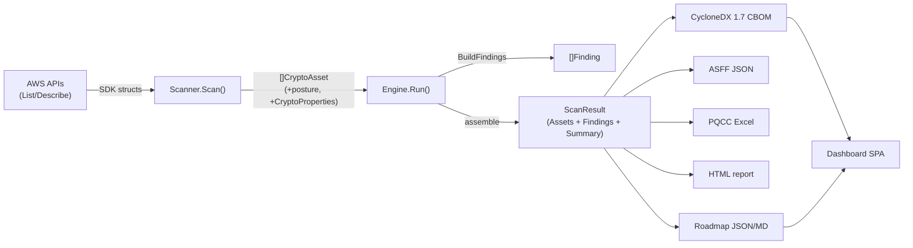
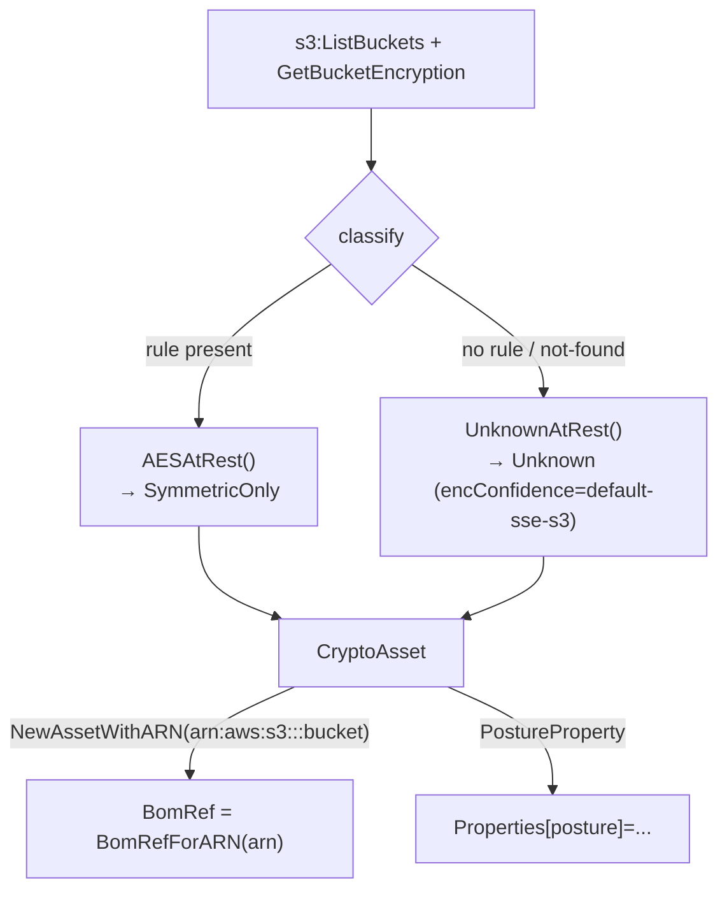
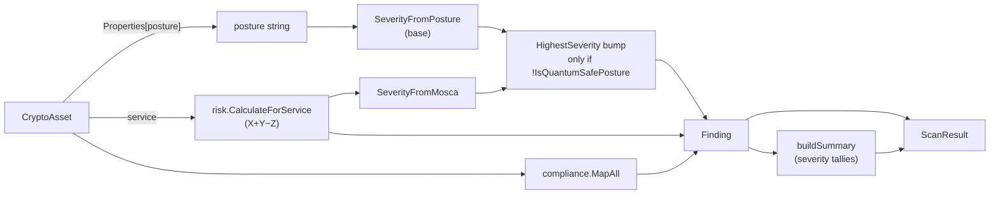
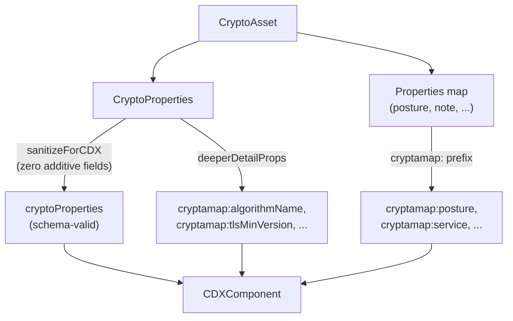
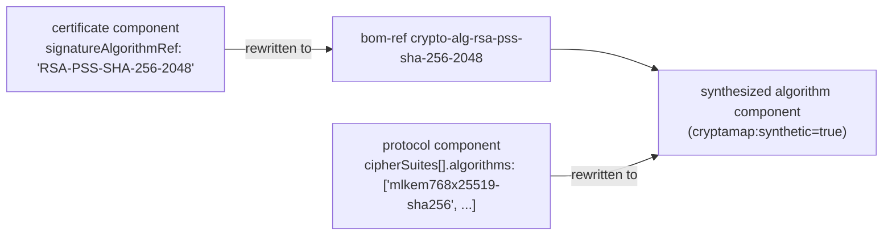
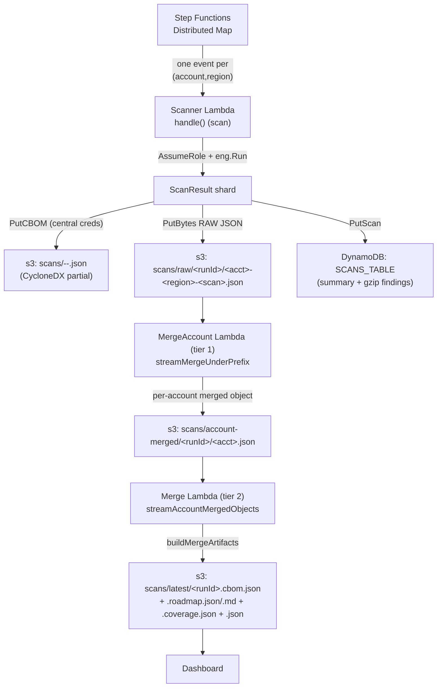
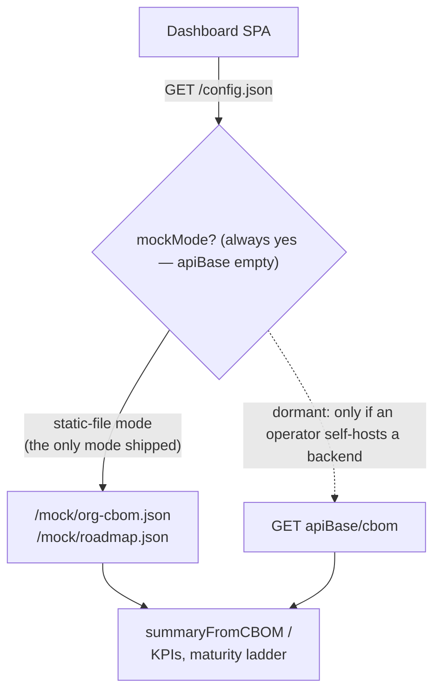
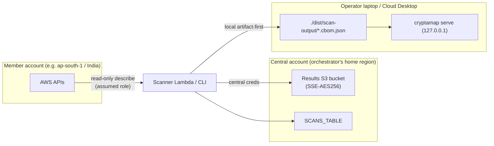

# 06 — Data Flow

> **Audience & purpose:** For engineers and reviewers who need to follow a single
> datum from an AWS API response all the way to a dashboard pixel — what shape it
> takes at each hop, where it transforms, and where it physically lives. Every
> claim below is grounded in a `file:line` citation.

## Table of contents

1. [The one-paragraph pipeline](#1-the-one-paragraph-pipeline)
2. [Stage 1 — AWS API response → `CryptoAsset`](#2-stage-1--aws-api-response--cryptoasset)
3. [Stage 2 — `CryptoAsset` → `CryptoProperties` classification + posture](#3-stage-2--cryptoasset--cryptoproperties-classification--posture)
4. [Stage 3 — `CryptoAsset` → `Finding` + posture rollup](#4-stage-3--cryptoasset--finding--posture-rollup)
5. [Stage 4 — `ScanResult` → output artifacts](#5-stage-4--scanresult--output-artifacts)
6. [The CBOM schema (CycloneDX 1.7) field mapping](#6-the-cbom-schema-cyclonedx-17-field-mapping)
7. [Org-merge data flow (shards → S3 → hierarchical merge → org CBOM)](#7-org-merge-data-flow-shards--s3--hierarchical-merge--org-cbom)
8. [Dashboard data flow](#8-dashboard-data-flow)
9. [Data localization — where data lives](#9-data-localization--where-data-lives)
10. [Transformation-point index](#10-transformation-point-index)

Sibling SDLC docs (relative links): high-level design / architecture
[`04-HIGH-LEVEL-DESIGN.md`](./04-HIGH-LEVEL-DESIGN.md), low-level design /
scanners & classification/posture [`05-LOW-LEVEL-DESIGN.md`](./05-LOW-LEVEL-DESIGN.md),
API & org fan-out flow [`07-API-FLOW.md`](./07-API-FLOW.md), tech stack
[`08-TECH-STACK.md`](./08-TECH-STACK.md), test coverage
[`09-TEST-COVERAGE.md`](./09-TEST-COVERAGE.md), security & data localization
[`10-SECURITY-AND-DATA-LOCALIZATION.md`](./10-SECURITY-AND-DATA-LOCALIZATION.md).
Deeper background lives in [`../SCALING.md`](../SCALING.md) and
[`../SELF-UPDATING-KNOWLEDGE.md`](../SELF-UPDATING-KNOWLEDGE.md).

---

## 1. The one-paragraph pipeline

A scanner calls an AWS `List/Describe` API, turns each resource into a
`models.CryptoAsset` (stamping a **posture** string into a free-form
`Properties` map and a structured `CryptoProperties` block), the engine collects
all assets and derives one `models.Finding` per asset (posture × Mosca → severity
+ compliance mappings), the whole thing is wrapped in a `models.ScanResult`, and
the writers render that single struct into CycloneDX CBOM / ASFF / Excel / HTML /
roadmap files. For an org, each `(account,region)` shard is produced
independently, written to S3, then folded by a memory-bounded streaming merge into
a single org-wide CBOM + roadmap + summary that the dashboard reads.



The two data-model files that everything pivots on are
`pkg/models/asset.go` (the asset/CBOM model) and `pkg/models/finding.go`
(the regulator-facing finding model). `pkg/models/scan.go` is the top-level
container.

---

## 2. Stage 1 — AWS API response → `CryptoAsset`

### 2.1 The contract

Every per-service scanner implements `ServiceScanner`
(`internal/scanner/types.go:14-18`):

```go
Name() string                 // canonical registry id, e.g. "s3", "kms_spec"
Category() models.Category    // primary category for severity defaults
Scan(ctx, cfg aws.Config) ([]models.CryptoAsset, error)
```

One `Scan` call = scanning one service in **one** `(account, region)` — the
`aws.Config` it receives is already region-scoped (`internal/scanner/types.go:14-18`).
A `Scan` returns a slice of `CryptoAsset`; it does **not** return findings — finding
generation is a separate, shared stage (§4).

### 2.2 The shape of a `CryptoAsset`

The asset is defined at `pkg/models/asset.go:153-168`. The load-bearing fields:

| Field | Source | Role downstream |
|---|---|---|
| `BomRef` | `models.BomRefForARN(arn)` — FNV-64a → `"crypto-"+16hex` (`pkg/models/asset.go:14`) | **The org-wide dedup key.** Shared by live + mock paths. |
| `Service` | scanner `Name()` | raw scanner id, kept for traceability |
| `Category` | one of `data-at-rest`, `data-in-transit`, `certificate`, `key-management`, `sdk-library` (`pkg/models/asset.go:23-29`) | severity defaults |
| `AccountID` / `Region` | scan context | provenance, dedup shard key |
| `ResourceARN` / `ResourceID` / `ResourceType` | scanner | identity; round-tripped via CBOM |
| `CryptoProps` | the structured `CryptoProperties` block (§3) | CBOM `cryptoProperties` |
| `Properties` | free-form `map[string]string` from the scanner | **where `posture` lives** + all detail k/v |
| `DiscoveredAt` | scan time | merge tie-break |

The shared builders that produce these live in `internal/services/common.go`:
`NewAsset` embeds the scan region in the ARN (`internal/services/common.go:74`),
while `NewAssetWithARN` takes a caller-supplied ARN and is used by **S3 only** to
emit a region-less `arn:aws:s3:::bucket` for org-wide dedup
(`internal/services/common.go:86`). `PostureProperty` stamps the classification
into `Properties["posture"]` (`internal/services/common.go:420`).



> **Why the BomRef matters here:** it is computed at asset-creation time from the
> ARN, so the *same* logical resource produces the *same* `BomRef` whether it was
> discovered by a live scan or fabricated by `--mock` (`internal/mock/generator.go`
> uses the identical `BomRefForARN`). That single key is the entire basis for
> cross-account/cross-region dedup in the merge (§7).

---

## 3. Stage 2 — `CryptoAsset` → `CryptoProperties` classification + posture

There are **two parallel data channels** attached to each asset, and it is
important not to conflate them:

1. **`CryptoProperties`** (`pkg/models/asset.go:142-149`) — the *structured,
   CycloneDX-aligned* crypto description: `AssetType` + up to four optional
   sub-blocks (`AlgorithmProperties`, `CertificateProperties`, `ProtocolProperties`,
   `RelatedCryptoMaterialProperties`) + an `OID`. This is what becomes the CBOM
   `cryptoProperties` object.
2. **`Properties["posture"]`** — a *flat string* such as `symmetric-only`,
   `non-pqc-classical`, `legacy-tls`, `no-encryption`, `pqc-hybrid`, `pqc-ready`,
   `unknown` (the enum is `pkg/models/finding.go:35-43`). **This string — not a
   typed field — is the single input the finding stage reads for posture** (§4).

### 3.1 How posture is decided

The per-service classifiers route observed values through a posture mapper and
then call `PostureProperty`:

- **At-rest scanners** pick one of `AESAtRest`/`AESXTSAtRest` (→ `symmetric-only`),
  `NoEncryption` (→ `no-encryption`), or `UnknownAtRest` (→ `unknown`)
  (`internal/services/common.go:110,138,316,331`).
- **Key/cert scanners** route the *real keyspec/cert algorithm* through a mapper:
  `kmsSpecPosture` (`internal/services/keymgmt/kms_spec.go:36`),
  `payAlgoPosture`, `acmPosture`, `acmpcaPosture`, `parseCertPEM`.
- **In-transit scanners** classify the real SSL policy / IKE / SSH KEX
  (`internal/services/transit/ssl_policy.go:106`,
  `internal/services/transit/transit_classify.go`).
- **Runtime evidence** infers posture from CloudTrail activity
  (`runtimePosture` / `tlsObservedPosture` in
  `internal/services/runtime/cloudtrail_evidence.go:101,196`).

> **Invariant — posture lives in `Properties`, not a typed field.** A scanner that
> forgets to set `Properties["posture"]` silently yields `unknown` → `MEDIUM`
> rather than an error (`internal/scanner/findings.go:33-38`). See
> [`05-LOW-LEVEL-DESIGN.md`](./05-LOW-LEVEL-DESIGN.md) for the full per-archetype rubric.

### 3.2 The deeper-detail fields are additive

`AlgorithmProperties` carries extra `AlgorithmName`/`KeySizeBits`/`KMSKeySpec`
(`pkg/models/asset.go:66-82`) and `ProtocolProperties` carries
`KeyExchangeGroup`/`PQCHybrid`/`CertSignatureAlgorithm`/`CertKeySizeBits`/`Source`/
`TLSMinVersion` (`pkg/models/asset.go:104-124`). These do **not** fit inside the
CBOM's schema-frozen sub-objects, so the writer relocates them to flat
component-level properties (§6.2). `TLSMinVersion` is documented as a descriptive
negotiation **floor**, explicitly *not* a posture/tier and quantum-irrelevant
(`pkg/models/asset.go:104-124`).

---

## 4. Stage 3 — `CryptoAsset` → `Finding` + posture rollup

### 4.1 The single pure finding generator

`internal/scanner/findings.go:29-71` (`BuildFindings`) is the **one** place assets
become findings. For each asset it:

1. reads posture from `asset.Properties["posture"]`, defaulting to
   `PostureUnknown` (`internal/scanner/findings.go:33-38`);
2. computes a Mosca score via `risk.CalculateForService(service, overrides)` —
   Mosca's Theorem `Score = X + Y − Z` (`internal/risk/mosca.go:12-32`), where X/Y/Z
   come from per-service Indian-BFSI defaults (`internal/risk/defaults.go:14-85`);
3. sets the base severity from the posture (`sev = SeverityFromPosture(posture)`,
   `internal/scanner/findings.go:47`) and applies the **worse-of** Mosca/HNDL bump
   (`sev = HighestSeverity(sev, SeverityFromMosca(...))`, `findings.go:49`) **only
   when the posture is not already quantum-safe** (`!risk.IsQuantumSafePosture(posture)`,
   `findings.go:48`; `IsQuantumSafePosture` true for `symmetric-only`/`pqc-hybrid`/
   `pqc-ready` at `internal/risk/severity.go:42-49`);
4. attaches `comp.MapAll(asset, posture)` compliance mappings when a registry is
   present (`internal/scanner/findings.go:51-53`).

> **Invariant — severity is posture-first, with a *gated* worse-of bump.** A
> genuinely vulnerable RDS asset (e.g. `non-pqc-classical`) has Mosca
> `10+2−3 = 9 → CRITICAL`, so the worse-of bump raises it to CRITICAL even though its
> posture alone might map lower — HNDL urgency rightly applies. But a quantum-SAFE
> `symmetric-only` (AES-256) RDS asset stays **INFORMATIONAL** (its posture severity);
> the posture-blind Mosca score does **not** raise it, because Shor's algorithm does
> not threaten AES no matter how long-lived the data
> (`internal/risk/severity.go:24-35` for the posture mapping, `:42-49` for the gate).
> **Note:** before this commit the worse-of was applied
> *unconditionally*, so this same AES-256 store was wrongly stamped CRITICAL purely
> from its Mosca score (a real mock scan had 38 such quantum-safe CRITICAL/HIGH
> findings; now 0, with the assets still inventoried — only re-graded). Genuinely
> vulnerable postures (`no-encryption`/`legacy-tls`/`non-pqc-classical`/`unknown`)
> keep the worse-of behavior unchanged.

`BuildFindings` is deliberately dependency-light (stdlib + uuid + `internal/risk`
+ `internal/compliance` + `pkg/models`) so that the **same function** produces
**identical *classification*** — posture, posture-first severity (worse-of Mosca
only for non-quantum-safe postures), Mosca score, and compliance mappings, all
derived purely from the input asset — in three contexts:
a live engine run (`internal/scanner/engine.go:235-237`), a `--mock` run
(`internal/scanner/mock_engine.go:34`), and the offline CBOM-replay path
(`cmd/cryptamap/org_merge_files.go:97`).

> **Caveat — findings are NOT byte-identical run-to-run.** `BuildFindings` stamps
> two volatile fields on every call: `ID: uuid.NewString()` (a fresh random v4 UUID,
> `internal/scanner/findings.go:56`) and `CreatedAt`/`UpdatedAt: time.Now().UTC()`
> (`internal/scanner/findings.go:30,72-73`). So serialized `Finding` records differ
> on `id` and the two timestamps every invocation; what is reproducible is the
> *classification content* (posture/severity/Mosca/compliance), which is a pure
> function of the asset. Any purity / reproducibility test must exclude `id`,
> `createdAt`, and `updatedAt`.

### 4.2 The `Finding` shape

`pkg/models/finding.go:66-85`. Key fields and their downstream meaning:

| Field | Built from | Downstream |
|---|---|---|
| `Severity` | posture severity, with a worse-of Mosca bump only when `!IsQuantumSafePosture` (`findings.go:47-49`) | ASFF `Severity.Normalized` (90/70/40/0 via `NormalizedSeverity`, `pkg/models/finding.go:16-29`); summary tallies |
| `Posture` | `Properties["posture"]` | ASFF `ProductFields[cryptamap:posture]`; roadmap |
| `AssetBomRef` | links back to `CryptoAsset.BomRef` | merge dedup key; ASFF product field |
| `Mosca` | `risk.CalculateForService` | ASFF product field; roadmap urgency |
| `Compliance[]` | `comp.MapAll` | ASFF `Compliance.RelatedRequirements` |
| `Recommendation` / `DocsURL` | package-level `recommendation()` (`internal/scanner/engine.go:261-275`, incl. the `PostureSymmetricOnly` case at `:269-270`) / `docsURL()` (`internal/scanner/engine.go:277-279`), called bare by `BuildFindings` (`internal/scanner/findings.go:70-71`) — these are plain funcs, **not** `Engine` methods | ASFF remediation |

### 4.3 Assembly into `ScanResult`

The engine's worker pool (`internal/scanner/engine.go:72-163`) collects all assets,
then calls `buildFindings` + `buildSummary` and returns a `models.ScanResult`
(`pkg/models/scan.go:25-37`) with `Mode="live"`. `buildSummary`
(`internal/scanner/engine.go:240-259`) tallies Critical/High/Medium/Informational
counts and a `ServiceCount` into a `ScanSummary` (`pkg/models/scan.go:6-14`).



---

## 5. Stage 4 — `ScanResult` → output artifacts

A single `ScanResult` fans out to every enabled writer. In the local CLI path,
`writeArtifacts` (`cmd/cryptamap/main.go:216-316`) keys every file off the prefix
`cryptamap-scan-<account>-<region>-<timestamp>`:

| Format | Writer entry point | File suffix |
|---|---|---|
| CycloneDX CBOM | `output.WriteCBOM` (`internal/output/cyclonedx.go:63`) | `.cbom.json` |
| PQCC Excel | `output.WritePQCCExcel` | `.pqcc.xlsx` |
| HTML report | `output.WriteHTMLReport` | `.report.html` |
| ASFF JSON | `output.WriteASFF` (`internal/output/securityhub.go:139`) | `.asff.json` |
| Raw scan | `json.MarshalIndent(scan)` | `.scan.json` |
| Roadmap | `output.WriteRoadmapJSON/Markdown` (`internal/output/roadmap_writer.go:20,29`) | `.roadmap.json` / `.roadmap.md` |
| PDF/MD summary | `output.WritePDFSummary` (only when `Formats.PDF`) | `.report.md` |

Note that the **CBOM carries assets, not findings**. ASFF, Excel, and the roadmap
all consume `scan.Findings` directly; the CBOM is intentionally lossy for findings,
which is why offline merge has to regenerate them (§7.4).

### 5.1 ASFF (Security Hub) mapping

`BuildASFFFinding` (`internal/output/securityhub.go:73-136`) maps one `Finding` to
one ASFF v2018-10-08 record: `Severity.Normalized` = `NormalizedSeverity(f.Severity)`,
deterministic `Id = cryptamap/<account>/<region>/<resourceId>/<findingId>`,
`Compliance.Status` derived from the finding's compliance statuses (`FAILED` if any
`non-compliant`, else `PASSED` if any `compliant`, else `NOT_AVAILABLE`), and the
posture/Mosca/BomRef carried in `ProductFields`.

### 5.2 Roadmap mapping

`roadmap.Build(scan)` (`internal/roadmap/roadmap.go:91`) ranks findings into a
`Roadmap` (`internal/roadmap/roadmap.go:80-86`) with `AsOf` and
`GeneratedFrom = scan.AccountID` ("org" for a merged result). Each `RoadmapItem`
carries a `PriorityScore = MoscaUrgency × PostureMultiplier × ExposureMultiplier +
EaseTieBreak` (`internal/roadmap/roadmap.go:163-182`), an effective `PQCStatus`,
`UpgradeEase`, and a `QuickWin` flag. The markdown writer renders a Top-25 table
plus per-service and per-account roll-ups (`internal/output/roadmap_writer.go:39-108`).

---

## 6. The CBOM schema (CycloneDX 1.7) field mapping

The CBOM is the canonical, portable artifact. It is produced by `buildCBOM`
(`internal/output/cyclonedx.go:70-154`) and consumed back by `ParseCBOM`
(`internal/output/cbom_reader.go:39-87`) — a lossless round-trip.

### 6.1 Top-level BOM document

`CDXBOM` (`internal/output/cyclonedx.go:20-27`):

```
bomFormat    = "CycloneDX"
specVersion  = "1.7"
serialNumber = "urn:uuid:<random>"
version      = 1
metadata     = { timestamp, tools[CryptaMap], component{application}, properties[] }
components[] = one per CryptoAsset
```

`metadata.properties` carry scan context + **PQC-knowledge provenance**: the writer
appends `knowledge:source/version/asOf/minAsOf/maxAsOf/factCount/digest` so every
CBOM records how fresh the post-quantum knowledge was at scan time
(`internal/output/cyclonedx.go:85-90,165-185`). The dashboard reads these back
generically. See [`../SELF-UPDATING-KNOWLEDGE.md`](../SELF-UPDATING-KNOWLEDGE.md).

### 6.2 Component mapping (`CryptoAsset` → `CDXComponent`)

`CDXComponent` (`internal/output/cyclonedx.go:53-60`). The mapping in
`buildCBOM` (`internal/output/cyclonedx.go:94-152`):

| CBOM field | Source | Note |
|---|---|---|
| `type` | constant `"cryptographic-asset"` | |
| `bom-ref` | `asset.BomRef` | the FNV dedup key |
| `name` | `"<DisplayName> — <asset.Name>"` | friendly taxonomy, **internal scanner ids never leak into `name`** (`internal/output/cyclonedx.go:143`) |
| `description` | `asset.Description` | |
| `cryptoProperties` | `sanitizeForCDX(asset.CryptoProps)` | additive fields zeroed for schema validity (see below) |
| `properties[]` | `cryptamap:*` namespaced k/v | see property table |

The flat `properties[]` array carries everything else, namespaced `cryptamap:`:
`service` (raw scanner id), `category`, `accountId`, `region`, `resourceArn`, and
(when present) `resourceType`, `displayName`, `awsCategory`, `cryptoFunction`,
`subAspect`, plus **every** `asset.Properties` entry — including `posture`
(`internal/output/cyclonedx.go:97-129`).

> **Schema-validity trick (load-bearing).** CycloneDX 1.7 marks
> `cryptoProperties.algorithmProperties` and `.protocolProperties` as
> `additionalProperties:false`. CryptaMap's *additive* detail fields
> (`AlgorithmName`, `KeySizeBits`, `KMSKeySpec`, `KeyExchangeGroup`, `PQCHybrid`,
> `CertSignatureAlgorithm`, `CertKeySizeBits`, `TLSMinVersion`) would be rejected if
> emitted inside those sub-objects. So `deeperDetailProps`
> (`internal/output/cyclonedx.go:193-224`) relocates them to flat
> `cryptamap:algorithmName` / `cryptamap:tlsMinVersion` / etc. component
> properties, and `sanitizeForCDX` (`internal/output/cyclonedx.go:231-250`) zeroes
> them out of the marshaled `cryptoProperties` (without mutating the in-memory
> model). The canonical CycloneDX fields (`ParameterSetIdentifier`, `Mode`,
> `ClassicalSecurityLevel`, …) are preserved.



> **Enum/shape coercion (also load-bearing).** Beyond the additive-field trick,
> `sanitizeForCDX` coerces values a scanner can legitimately produce that fall
> outside a CDX *enum*: `algorithmProperties.mode` not in the enum (e.g. the
> EBS/FSx/MGN disk-encryption mode `"xts"`) → `"other"` (true value kept as
> `cryptamap:mode`); `relatedCryptoMaterialProperties.state` not in the enum (e.g.
> `"unknown"`) → dropped (kept as `cryptamap:materialState`); and
> `ProtocolProperties.IkeV2TransformTypes` — a model `[]string` but a CDX *object* —
> is stripped and re-emitted as `cryptamap:ikev2TransformTypes`. `buildCBOM` also
> **dedups components by `bom-ref`** so a degraded AWS List response (two resources
> with empty/identical ids → identical ARN → identical bom-ref) cannot emit
> byte-identical components and fail the schema's `uniqueItems`.

### 6.2a The crypto dependency graph (resolvable references)

CycloneDX types `cipherSuites[].algorithms[]` and
`certificateProperties.signatureAlgorithmRef` as `refType` — each value MUST be
the `bom-ref` of an algorithm `cryptographic-asset` component **in the same BOM**,
so a consumer can answer "which certificates are signed by a quantum-vulnerable
algorithm" or "which protocols use which algorithms." Scanners populate these
fields with genuine algorithm *tokens* (e.g. `RSA-PSS-SHA-256-2048`, `ML-DSA-65`,
SSH/IPsec algorithm lists), so `linkCryptoAssetGraph`
(`internal/output/cyclonedx.go`) makes them resolvable: for each distinct token it
synthesizes one minimal `algorithm` component (deterministic `crypto-alg-<slug>`
bom-ref, marked `cryptamap:synthetic=true`, **name only — no fabricated
primitive/security-level**), then rewrites every reference to that bom-ref and
drops empty/whitespace tokens (which would violate the `refType` `minLength`).



Synthetic algorithm nodes are **definitions, not discovered resources**: every
consumer that counts assets (`ParseCBOM` via `isSyntheticComponent`, the dashboard
via `realComponents`) excludes them, so they never inflate asset counts or create
phantom account/region shards. The result is a CBOM with **zero dangling
references** — verified by `internal/output/crypto_graph_test.go`.

### 6.3 The lossless round-trip (`ParseCBOM`)

`componentToAsset` (`internal/output/cbom_reader.go:95-149`) reverses every step:
it de-prefixes `cryptamap:*` props (so `Properties["posture"]` is restored exactly
as `BuildFindings` reads it), maps the structural props back to dedicated fields,
and folds the flat deeper-detail props back into `CryptoProps` via
`foldDeeperDetail` (`internal/output/cbom_reader.go:167-204`). It prefers the
explicit `cryptamap:resourceType` property and falls back to deriving it from the
ARN for older CBOMs (`internal/output/cbom_reader.go:110-117`) — this is why the
writer emits `resourceType` explicitly, since the region-less S3 ARN carries no
`<type>/<id>` segment to re-derive from. Reconstructed shards have `Assets` populated
but **`Findings` empty** — the caller regenerates them via `BuildFindings`
(`internal/output/cbom_reader.go:22-25`).

---

## 7. Org-merge data flow (shards → S3 → hierarchical merge → org CBOM)

The CLI scans only the single caller account (it loudly warns that `--org`/
`--accounts` are not honored, `cmd/cryptamap/main.go:173-177`). True org-wide
scanning is the build-tagged Lambda + Step Functions Distributed Map stack. The
data flow has three tiers.



### 7.1 Tier 0 — per-shard scan

`handle()` (`cmd/cryptamap/lambda.go:56-186`) loads the orchestrator's base config
(central region/creds), optionally `AssumeRole`s into the member account and
**eagerly verifies** the assumed identity (`cmd/cryptamap/lambda.go:100-118`) so a
denied role fails the shard visibly instead of returning a falsely-empty success.
It then runs the engine and writes, **all with the central base config**:

- the CycloneDX **partial** to `scans/<acct>-<region>-<scan>.json`
  (`cmd/cryptamap/lambda.go:145-153`, key built by `output.Key`,
  `internal/output/s3_writer.go:29-31`);
- the **raw** `ScanResult` JSON (assets **and** findings, verbatim) to
  `scans/raw/<runId>/<acct>-<region>-<scan>.json`
  (`cmd/cryptamap/lambda.go:155-171`, key from `rawScanKey`,
  `cmd/cryptamap/lambda_event.go:123-125`);
- a DynamoDB row (summary + gzip+base64 findings, or `findingsTruncated` if over
  the 300 KB inline cap) (`internal/output/dynamodb_writer.go:39-93`).

> **Why a raw JSON shard exists alongside the CBOM:** the CBOM is lossy for
> findings, so the merge would otherwise have to re-derive them. The raw shard
> carries findings verbatim, making the org merge lossless and avoiding re-running
> `BuildFindings` on the merge path (`cmd/cryptamap/lambda_event.go:22-26`).

### 7.2 The streaming merge primitive

`merge.Merger` (`internal/merge/streaming.go:28-66`) folds shards one at a time via
`Add`, retaining only the **deduped working set** (asset/finding maps) plus small
per-shard summaries — never the sum of all raw shards. Peak memory is bounded by the
number of *distinct resources*, not by shards × size, which is what removes the
org-merge OOM cliff ([`../SCALING.md`](../SCALING.md)). The batch `merge.Merge`
(`internal/merge/merge.go:70-81`) is reimplemented on top of `Merger` so there is a
**single dedup code path**, and `NewMerger(...).Add(...).Finish()` is byte-identical
to `Merge(...)` for the same input order.

**Asset dedup** keys on `BomRef`; on collision the higher `Source` wins, ties broken
by richer asset (more `Properties` keys), then later `DiscoveredAt`, then smaller
ARN (`internal/merge/merge.go:117-156`). **Finding dedup** keys on
`(AssetBomRef|ResourceARN)+Service+Posture`, keeping the highest
`NormalizedSeverity` (`internal/merge/merge.go:158-209`). Both produce fully
deterministic sorted output (total tiebreakers in
`internal/merge/streaming.go:268-298`).

### 7.3 Hierarchical tiers (S3 key layout)

| Tier | Lambda mode | Reads | Writes |
|---|---|---|---|
| 0 (scan) | default | member account APIs | `scans/raw/<runId>/<acct>-<region>-<scan>.json` |
| 1 (per-account) | `mergeAccount` | `scans/raw/<runId>/<acct>-*` | `scans/account-merged/<runId>/<acct>.json` |
| 2 (final) | `merge` | `scans/account-merged/<runId>/` | `scans/latest/<runId>.*` |

Tier 1 (`runMergeAccountMode`, `cmd/cryptamap/lambda_merge.go:147-196`) folds one
account's region shards via `streamMergeUnderPrefix` and emits an
`accountMergedObject` that pairs the deduped `Merged` ScanResult with that account's
**real** `(account,region)` coverage rows (`cmd/cryptamap/lambda_merge_core.go:110-119`).
Tier 2 (`runMergeMode`, `cmd/cryptamap/lambda_merge.go:213-288`) streams those via
`AddPreMerged` (`internal/merge/streaming.go:152-199`) so the merged envelope's
sentinel `AccountID="org"` never corrupts the per-account succeeded/failed rollup. If
no per-account objects exist (legacy/pre-hierarchical run), tier 2 falls back to
streaming the raw shards directly (`cmd/cryptamap/lambda_merge.go:233-242`). S3 keys
are fetched with a bounded prefetch pool (concurrency 16) but **folded sequentially
in lexicographic key order** to preserve determinism
(`cmd/cryptamap/lambda_merge.go:69-139,290-295`).

### 7.4 Final artifacts + completion barrier

`buildMergeArtifacts` (`cmd/cryptamap/lambda_merge_core.go:136-176`) renders the
merged `Result` into the `scans/latest/<runId>.*` set using the **same**
`WriteCBOM` / `WriteRoadmapJSON` / `WriteRoadmapMarkdown` as the local path:

| Key | Content |
|---|---|
| `scans/latest/<runId>.cbom.json` | merged org CycloneDX CBOM |
| `scans/latest/<runId>.roadmap.json` / `.roadmap.md` | org PQC roadmap |
| `scans/latest/<runId>.coverage.json` | per-shard coverage matrix |
| `scans/latest/<runId>.json` | dashboard-compatible `mergeSummary` |

The `mergeSummary` (`cmd/cryptamap/lambda_merge_core.go:55-108`) carries
per-account rollups, a per-posture count (`summarizePostureCounts`, which buckets on
the same `cryptamap:posture` value the CBOM stamps,
`cmd/cryptamap/lambda_merge_core.go:257-278`), a `quantumSafePct` headline
(`stage2 / (stage1+stage2)`, `cmd/cryptamap/lambda_merge_core.go:284-294`), and a
**completion barrier**: `expectedShards` vs `observedShards` →
`missingShards`/`complete`, so a decimated run never reports a clean, silently-smaller
result (`cmd/cryptamap/lambda_merge_core.go:211-225`).

### 7.5 The offline equivalent (`org-merge-files`)

`cryptamap org-merge-files` (`cmd/cryptamap/org_merge_files.go:70-142`) does the
same merge from **local CBOM files** with no AWS at all: it `ParseCBOMFile`s each
input into shards, regenerates findings via `BuildFindings`
(`cmd/cryptamap/org_merge_files.go:97`) — because CBOMs are findings-lossy — then
`merge.Merge` + writes the merged CBOM + roadmap + coverage. This is the
no-network, no-mutation demonstration of the merge pipeline.

---

## 8. Dashboard data flow

The dashboard is a static React SPA. It first fetches `/config.json`
(`dashboard/src/services/api.ts:22-35`); the shape `{ apiBase, mockMode }` decides
the data source:

- **Local / mock mode** (`mockMode:true` or no `apiBase`): it reads the static
  `/mock/org-cbom.json` and `/mock/roadmap.json`
  (`dashboard/src/services/api.ts:37-54,163-178`). The Overview KPIs are derived
  client-side from the CBOM via `summaryFromCBOM` (`dashboard/src/services/api.ts:111-141`),
  which counts `perPosture`/`totalCritical` inline (api.ts:117-128) but **delegates** the
  headline posture-bucketing and `quantumSafePct` maturity math to `summarizePosture` /
  `summarizeMaturity`, imported from `../hooks/useScanData`
  (`dashboard/src/services/api.ts:3,112-113`) — so `quantumSafePct` itself is computed in
  `dashboard/src/hooks/useScanData.ts`, not in `api.ts`.
- **Live mode** (dormant — not provisioned by anything CryptaMap ships): if a
  non-empty `apiBase` were configured, the client would GET `${apiBase}/cbom`,
  `${apiBase}/summary`, `${apiBase}/roadmap` (and `/scans`, `/history`)
  (`dashboard/src/services/api.ts:51,115,192`). **No CryptaMap component ever sets
  `apiBase`** — the query API + CloudFront dashboard that once backed this branch
  were removed in the local-first redesign, and `cryptamap serve` hard-codes
  `apiBase:""`. The branch is retained only as an extension point for an operator
  who chooses to self-host their own backend; CryptaMap provisions none.



### 8.1 The offline `serve` command

`cryptamap serve` (`cmd/cryptamap/serve.go:55-101`) is how the merged artifacts feed
the dashboard with no AWS. It binds **`127.0.0.1` only** — there is deliberately no
bind-all/`--host` flag (`cmd/cryptamap/serve.go:48,85,139`). It resolves the local CBOM +
roadmap from `--dir`, synthesizes `/config.json` as `{apiBase:'', mockMode:true}`,
serves the artifacts at `/mock/org-cbom.json` and `/mock/roadmap.json`, and serves
the embedded SPA (`web_embed.go go:embed all:webdist`,
`cmd/cryptamap/web_embed.go:18-19`) with index.html fallback for deep links
(`cmd/cryptamap/serve.go:117-133`). It makes **no AWS or network calls**.

> **Build dependency — the committed `webdist/` is only a PLACEHOLDER `index.html`.**
> `go:embed` cannot reach `dashboard/dist` (it is outside `cmd/cryptamap`), so the
> committed `cmd/cryptamap/webdist` holds a stub `index.html` purely to keep a plain
> `go build` compiling (`cmd/cryptamap/web_embed.go:8-13`). The **real** Vite bundle is
> staged into `cmd/cryptamap/webdist` only by `make build-serve` (`Makefile:23-29`)
> *before* `go build`. A binary from a vanilla `go build` / `make build-cli` therefore
> serves the placeholder shell, **not** the real dashboard — and if even that stub is
> missing, `serveIndex` returns `dashboard bundle missing index.html (run \`make build-serve\`)`
> (`cmd/cryptamap/serve.go:375`). Use `make build-serve` (or a release build) to embed the
> real SPA.

---

## 9. Data localization — where data lives



**Where data lives:**

- **Local-first (default A/D model):** the CLI writes only local files under
  `cfg.Output.LocalDir` (`./dist/scan-output`); no S3/DynamoDB write happens in the
  CLI scan path — data never leaves the account/laptop. The merged org artifacts can
  be served entirely offline via `cryptamap serve` on `127.0.0.1`.
- **Central account (org fan-out):** the Lambda path writes CBOM partials, raw
  shards, and merged artifacts to the **central** results bucket and DynamoDB table,
  always using the orchestrator's own (base) config — never the assumed
  member-account role (`cmd/cryptamap/lambda.go:142-147,155-171`). The base config's
  region is **kept at the central home region on purpose**: repointing it to the
  scan region caused a cross-region write failure where only `us-east-1` shards
  landed (verified 2026-06-04, documented at `cmd/cryptamap/lambda.go:73-78`).
- **At rest:** all S3 PutObjects set `ServerSideEncryption: AES256`
  (`internal/output/s3_writer.go:45,65,78`); the merge-path puts do the same
  (`cmd/cryptamap/lambda_merge.go:178,267`).
- **Member-account access is read-only:** scanners issue only `List`/`Describe`
  calls; the assumed role is verified before any scan (`cmd/cryptamap/lambda.go:100-118`).

**No network-exposed serving path:** there is no deployed dashboard API that serves
the org CBOM — the query API + CloudFront dashboard (which an earlier design backed
with a presigned-S3 / streamed-Lambda path) were removed in the local-first redesign.
The local-first principle is why the offline `serve` command is hard-pinned to
`127.0.0.1` with no bind-all option (`cmd/cryptamap/serve.go:48,85,139`), and why the
only supported way to view the inventory is local-artifact-first (loopback `serve` or
the signed HTML report) rather than any public-by-default surface.

---

## 10. Transformation-point index

The exact lines where data changes shape — useful as a jump table.

| Transformation | Function | Citation |
|---|---|---|
| ARN → dedup `BomRef` | `BomRefForARN` | `pkg/models/asset.go:14` |
| AWS struct → `CryptoAsset` | `NewAsset` / `NewAssetWithARN` | `internal/services/common.go:74,86` |
| classification → `Properties["posture"]` | `PostureProperty` | `internal/services/common.go:420` |
| keyspec → posture | `kmsSpecPosture` | `internal/services/keymgmt/kms_spec.go:36` |
| SSL policy → posture/version/floor | `classifySSLPolicy` | `internal/services/transit/ssl_policy.go:106` |
| assets → `[]Finding` (the pure spine) | `BuildFindings` | `internal/scanner/findings.go:29-71` |
| posture+Mosca → severity | `HighestSeverity` | `internal/risk/severity.go:38-43` |
| Mosca X+Y−Z | `Calculate` | `internal/risk/mosca.go:12-23` |
| assets+findings → `ScanResult` | `Engine.Run` | `internal/scanner/engine.go:72-163` |
| `ScanResult` → CBOM | `buildCBOM` | `internal/output/cyclonedx.go:70-154` |
| additive fields → flat props | `deeperDetailProps` / `sanitizeForCDX` | `internal/output/cyclonedx.go:193-250` |
| CBOM → `ScanResult` (round-trip) | `componentToAsset` | `internal/output/cbom_reader.go:95-149` |
| `Finding` → ASFF | `BuildASFFFinding` | `internal/output/securityhub.go:73-136` |
| `ScanResult` → Roadmap | `roadmap.Build` | `internal/roadmap/roadmap.go:91` |
| shard fold (memory-bounded) | `Merger.Add` / `AddPreMerged` | `internal/merge/streaming.go:72-199` |
| merged → org artifacts | `buildMergeArtifacts` | `cmd/cryptamap/lambda_merge_core.go:136-176` |
| merged → dashboard summary | `buildMergeSummary` | `cmd/cryptamap/lambda_merge_core.go:181-250` |
| CBOM → dashboard KPIs | `summaryFromCBOM` | `dashboard/src/services/api.ts:111-141` |

> **Determinism guarantee threading through all of it:** because `BomRefForARN`,
> `BuildFindings`, and the `Merger` are pure and order-stable, the same input
> resources produce **identical classification** — the same `BomRef`s, postures,
> severities (posture-first, with the worse-of Mosca bump gated on
> `!IsQuantumSafePosture`), Mosca scores, and compliance mappings, in the same sorted
> order — whether they come from a live scan, `--mock`, the offline
> `org-merge-files` replay, or the org Lambda merge. This is the property the whole
> multi-path architecture relies on. Note it is *classification* determinism, not
> byte-for-byte output: each `Finding` gets a fresh random `id` and `time.Now()`
> timestamps (`internal/scanner/findings.go:56,30,72-73`), and each CBOM gets a
> fresh `urn:uuid` `serialNumber` (§6.1), so the serialized bytes vary run-to-run
> even when the classified content is identical.
