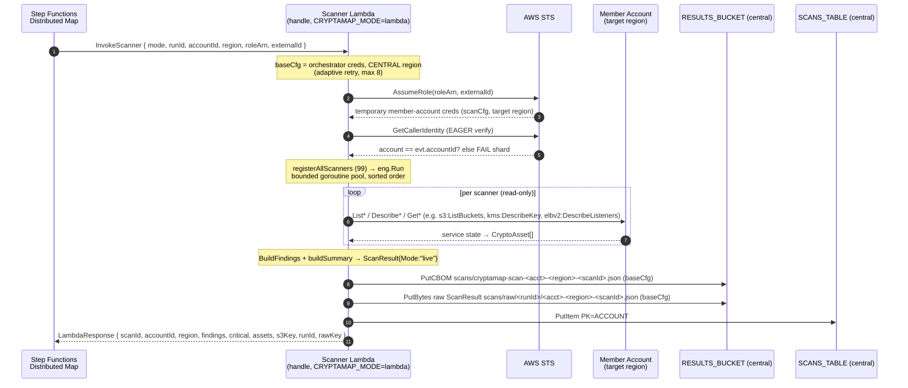
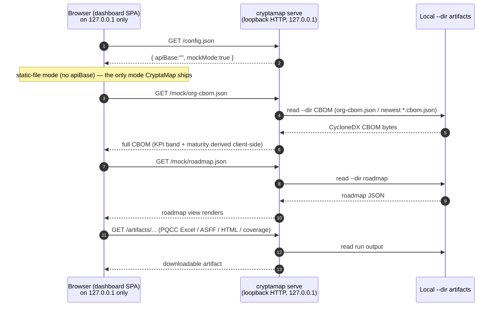

# 07 — API Flow

*Audience: engineers and reviewers who need to understand every API surface CryptaMap touches — the read-only AWS APIs it CALLS to discover crypto, how the local-first dashboard loads its data, the CLI command/flag "API", and the Lambda event contract that drives org-wide fan-out.*

This document covers:

1. **APIs CryptaMap CALLS** — the read-only AWS `List`/`Describe`/`Get` calls each scanner makes, grouped by service.
2. **How the dashboard loads its data** — CryptaMap is **local-first** and exposes **no public query API**; the dashboard reads on-disk artifacts served over loopback by `cryptamap serve`.

Plus the **CLI "API"** (commands/flags) and the **Lambda event contract** (`RoleArn`/`ExternalId`/`RunID` for org fan-out).

> Newcomer orientation: there are two supported *deployment shapes*, neither of which exposes an internet-facing API. (a) The **CLI** scans the caller account and writes local files — no exposed API. (b) The **`serve`** subcommand renders those local files on `127.0.0.1` — no AWS, no web surface. The org-scale **deployed stack** (Step Functions + scanner Lambda) only *calls* AWS read-only and writes evidence to a private S3 bucket; it stands up **no query API and no dashboard** (the former public CloudFront dashboard + DynamoDB query API were removed in the local-first redesign — see §2).

## Table of Contents

- [1. APIs CryptaMap CALLS (read-only AWS discovery)](#1-apis-cryptamap-calls-read-only-aws-discovery)
  - [1.1 The scanner contract](#11-the-scanner-contract)
  - [1.2 Calls grouped by service](#12-calls-grouped-by-service)
  - [1.3 SDK-level call discipline (retry, throttle, region)](#13-sdk-level-call-discipline-retry-throttle-region)
- [2. How the dashboard loads its data (local-first, no exposed API)](#2-how-the-dashboard-loads-its-data-local-first-no-exposed-api)
  - [2.1 The local artifact contract](#21-the-local-artifact-contract)
  - [2.2 Why there is no exposed query API](#22-why-there-is-no-exposed-query-api)
- [3. The CLI "API" (commands + flags)](#3-the-cli-api-commands--flags)
- [4. The Lambda event contract (org fan-out)](#4-the-lambda-event-contract-org-fan-out)
- [5. Sequence diagrams](#5-sequence-diagrams)
  - [5.1 A scan API call sequence (org fan-out)](#51-a-scan-api-call-sequence-org-fan-out)
  - [5.2 Dashboard → local artifact fetch (`serve`)](#52-dashboard--local-artifact-fetch-serve)
- [6. Cross-links](#6-cross-links)

---

## 1. APIs CryptaMap CALLS (read-only AWS discovery)

CryptaMap never mutates AWS. Every scanner is a read-only `List`/`Describe`/`Get` collector that turns service state into a `CryptoAsset`. The IAM grant backing these calls depends on the deployment: the **org fan-out** path (member scanner role + orchestrator role) uses a **custom least-privilege allowlist**, `CryptaMapScannerReadActions`, generated from the scanner source via `cmd/gen-policy` (`cdk/lib/security-stack.ts:103,234-256`; member template `cdk/templates/scanner-role-template.json:90-234`); the **single-account default Lambda** path uses the broader AWS-managed `ReadOnlyAccess` plus a 9-action inventory supplement (`cdk/lib/scanner-stack.ts:110-130`). Either way the surface is strictly read-only — `ReadOnlyAccess` is chosen over `SecurityAudit` in the single-account case so scanners get every `Describe`/`Get` that carries real crypto detail.

### 1.1 The scanner contract

Every per-service scanner implements one interface:

```go
type ServiceScanner interface {
    Name() string                 // canonical registry key, e.g. "s3", "kms_spec", "alb"
    Category() models.Category    // primary category for severity defaults
    Scan(ctx, cfg aws.Config) ([]models.CryptoAsset, error)
}
```

(`internal/scanner/types.go:14-18`.) One `Scan(...)` call scans one service in one `(account, region)` — the `aws.Config` passed in is already region-scoped (`internal/scanner/engine.go:72-163`). Scanners are wired into a registry by `registerAllScanners` (`cmd/cryptamap/register.go:16-23`); the registry returns them in deterministic sorted-name order (`internal/scanner/registry.go:27-40`), and the engine runs them through a bounded goroutine pool (default `MaxGoroutines=50`, `internal/scanner/engine.go:39-56`, `internal/scanner/engine.go:72-163`).

> The registry wires **99 scanners** today (coverage-expansion took it from 86 to 99): certmgmt 10 + keymgmt 9 + sdkpqc 3 + datarest 49 + transit 27 + runtime 1 (`cmd/cryptamap/register.go:16-56`, `cmd/cryptamap/register_datarest.go:9-48`, `cmd/cryptamap/register_transit.go:9-37`). **Note:** the shipping binary's `--help` text no longer hardcodes a count — `cmd/cryptamap/main.go:73-77` derives it from the live registry (`registeredScannerCount()` → `reg.Len()`, `main.go:58-62`), so `cryptamap --help` now prints the true 99 (previously "discovers cryptographic assets across 63 AWS services"), with `count_guard_test.go` asserting banner == registry. The in-code **comment** in `cmd/cryptamap/register.go:13-15` now also reads "99 scanners" with the correct 49/27/10/9/3/1 breakdown (the old "64 services" text has been corrected). Trust the `r.Register(...)` call totals (99) above. See [05-LOW-LEVEL-DESIGN.md](05-LOW-LEVEL-DESIGN.md) §4–§5 for the scanner contract and registry, and [06-DATA-FLOW.md](06-DATA-FLOW.md) §3 for the per-scanner classification meaning.

### 1.2 Calls grouped by service

A scanner's `Name()` is the registry key and often differs in punctuation from the AWS service id (e.g. `emr_serverless`, `cloudfront_certs`, `ec2_ssm`, `cloudtrail_evidence`). The table below is a representative, citation-grounded slice of the call surface, grouped by the AWS service the SDK client talks to. The crypto-classification meaning of each call is documented in [06-DATA-FLOW.md](06-DATA-FLOW.md) §3 (with the scanner contract in [05-LOW-LEVEL-DESIGN.md](05-LOW-LEVEL-DESIGN.md) §4); here we list **which APIs are invoked**.

| Category | Scanner `Name()` | AWS API calls (read-only) | Citations |
|---|---|---|---|
| data-at-rest | `s3` | `s3:ListBuckets` (paginated, region-filtered via `BucketRegion`), `s3:GetBucketEncryption`, `kms:DescribeKey` (for SSE-KMS spec) | `internal/services/datarest/s3.go:93-97`, `:149`, `:239` |
| data-at-rest | `dynamodb` | `dynamodb:ListTables`, `dynamodb:DescribeTable` (bounded-concurrent) | `internal/services/datarest/dynamodb.go:30-33`, `:81` |
| data-at-rest | `ebs` | `ec2:DescribeVolumes`, `kms:DescribeKey` | `internal/services/datarest/ebs.go:24-27`, `:66` |
| data-at-rest | `rds` | `rds:DescribeDBInstances` | `internal/services/datarest/rds.go:18-21`, `:41-47` |
| data-at-rest | `sqs` | `sqs:ListQueues`, `sqs:GetQueueAttributes` | `internal/services/datarest/sqs.go:21-24`, `:58-85` |
| data-at-rest | `backup` | `backup:ListBackupVaults`, `backup:DescribeBackupVault`, `kms:DescribeKey` (resolves an opaque vault key-id ARN to its custody tier; called only for the key-id case) | `internal/services/datarest/backup.go` (`Scan`, `resolveBackupKeyTier`) |
| data-at-rest | `msk` | `kafka:ListClustersV2` | `internal/services/datarest/msk.go:18-21`, `:60-65` |
| data-at-rest | `glue` | `glue:GetDataCatalogEncryptionSettings` (1 asset/region) | `internal/services/datarest/glue.go:21-24`, `:49-53` |
| data-at-rest | `container_images` (sdkpqc dir, but Category=data-at-rest) | `ecr:DescribeRepositories`, `ecr:DescribeImages`, `kms:DescribeKey` | `internal/services/sdkpqc/container_images.go:22-27`, `:117` |
| key-management | `kms_spec` | `kms:ListKeys`, `kms:DescribeKey` (bounded-concurrent) | `internal/services/keymgmt/kms_spec.go:148`, `:171` |
| key-management | `kms_usage` | `kms:ListAliases`, `kms:DescribeKey` on `TargetKeyId` | `internal/services/keymgmt/kms_usage.go:41-44`, `:114` |
| key-management | `kms_rotation` | `kms:ListKeys`, `kms:DescribeKey`, `kms:GetKeyRotationStatus` (only when rotation-applicable) | `internal/services/keymgmt/kms_rotation.go:20-23`, `:78` |
| key-management | `kms_custom_key_store` | `kms:DescribeCustomKeyStores` | `internal/services/keymgmt/kms_custom_key_store.go:25-28` |
| key-management | `cloudhsm` | `cloudhsmv2:DescribeClusters` | `internal/services/keymgmt/cloudhsm.go:20-23` |
| key-management | `cognito` | `cognito-idp:ListUserPools` | `internal/services/keymgmt/cognito.go:28-31` |
| key-management | `ec2keypairs` | `ec2:DescribeKeyPairs` | `internal/services/keymgmt/ec2keypairs.go:28-31` |
| key-management | `paymentcryptography` | `payment-cryptography:ListKeys`, `:GetKey` (per-key `MapConcurrent` fan-out, bounded-concurrent) | `internal/services/keymgmt/payments.go:255` (`ListKeys`), `:305` (`GetKey`), `:280` (`MapConcurrent`) |
| key-management | `secrets_rotation` | `secretsmanager:ListSecrets`, `kms:DescribeKey` | `internal/services/keymgmt/secrets_rotation.go:21-24`, `:93` |
| certificate | `acm` | `acm:ListCertificates`, `acm:DescribeCertificate` | `internal/services/certmgmt/acm.go:80`, `:88` |
| certificate | `acmpca` | `acm-pca:ListCertificateAuthorities` | `internal/services/certmgmt/acmpca.go:25-28`, `:125` |
| certificate | `iam_certs` | `iam:ListServerCertificates`, `iam:GetServerCertificate` (PEM parsed locally) | `internal/services/certmgmt/iam_certs.go:20-23`, `:89` |
| certificate | `iot_certs` | `iot:ListCertificates`, `iot:DescribeCertificate` | `internal/services/certmgmt/iot_certs.go:20-23`, `:82` |
| certificate | `cloudfront_certs` | `cloudfront:ListDistributions` | `internal/services/certmgmt/cloudfront_certs.go:19-22`, `:75` |
| certificate | `rolesanywhere` | `rolesanywhere:ListTrustAnchors` | `internal/services/certmgmt/rolesanywhere.go:46-49`, `:124` |
| certificate | `signer` | `signer:ListSigningProfiles`, `:GetSigningProfile` (bounded-concurrent) | `internal/services/certmgmt/signer.go:25-28`, `:91` |
| sdk-library | `ec2_ssm` | `ssm:DescribeInstanceInformation` | `internal/services/sdkpqc/ec2_ssm.go:19-22`, `:89` |
| sdk-library | `lambda_runtime` | `lambda:ListFunctions` | `internal/services/sdkpqc/lambda_runtime.go:19-22`, `:66` |
| data-in-transit | `alb` | `elbv2:DescribeLoadBalancers`, `:DescribeListeners`, `:DescribeSSLPolicies` (cached), `acm:DescribeCertificate` | `internal/services/transit/alb.go:66`, `:77`, `internal/services/transit/ssl_policy.go:73`, `internal/services/transit/acm_cert.go:72` |
| data-in-transit | `nlb` | `elbv2:DescribeLoadBalancers`, `:DescribeListeners`, `:DescribeSSLPolicies` (cached) | `internal/services/transit/nlb.go:26`, `:59` |
| data-in-transit | `cloudfront` | `cloudfront:ListDistributions`, `acm:DescribeCertificate` (us-east-1) | `internal/services/transit/cloudfront.go:80`, `internal/services/transit/acm_cert.go:49` |
| data-in-transit | `apigw_rest` | `apigateway:GetRestApis`, `:GetDomainNames`, `acm:DescribeCertificate` | `internal/services/transit/apigw_rest.go:66`, `:117` |
| data-in-transit | `apigw_http` | `apigatewayv2:GetApis`, `:GetDomainNames` (both **NextToken-paginated**; `GetDomainNames` error is **returned, not swallowed**, so a denied call errors the shard rather than reporting a clean empty success), `acm:DescribeCertificate` | `internal/services/transit/apigw_http.go:51` (GetApis), `:81` (GetDomainNames), `:67`/`:118` (`TruncationCapReached`) |
| data-in-transit | `vpn` | `ec2:DescribeVpnConnections` | `internal/services/transit/vpn.go:21`, `:60` |
| data-in-transit | `directconnect` | `directconnect:DescribeConnections` | `internal/services/transit/directconnect.go:19`, `:47` |
| data-in-transit | `clientvpn` | `ec2:DescribeClientVpnEndpoints`, `acm:DescribeCertificate` | `internal/services/transit/clientvpn.go:31`, `:49` |
| data-in-transit | `transferfamily` | `transfer:ListServers`, `:DescribeServer`, `:DescribeSecurityPolicy` | `internal/services/transit/transferfamily.go:71`, `:109` |
| data-in-transit | `iotcore` | `iot:ListDomainConfigurations`, `:DescribeDomainConfiguration`, `:ListThings` | `internal/services/transit/iotcore.go:28`, `:95` |
| data-in-transit | `msk_transit` | `kafka:ListClustersV2` | `internal/services/transit/msk_transit.go:19`, `:48` |
| data-in-transit | `opensearch_transit` | `opensearch:ListDomainNames`, `:DescribeDomain`, `acm:DescribeCertificate` | `internal/services/transit/opensearch_transit.go:20`, `:45` |
| data-in-transit | `rds_transit` / `aurora_transit` / `documentdb_transit` / `neptune_transit` | `rds`/`docdb`/`neptune` `DescribeDBClusters` + `DescribeDBInstances` (CA cert id → key family) | `internal/services/transit/rds_transit.go:20`, `internal/services/transit/aurora_transit.go:21`, `internal/services/transit/documentdb_transit.go:21`,`:80`, `internal/services/transit/neptune_transit.go:20`,`:69` |
| data-in-transit | `globalaccelerator` | `globalaccelerator:ListAccelerators`, `:ListListeners` (runs once, gated to us-east-1) | `internal/services/transit/globalaccelerator.go:35`, `:32` |
| runtime evidence | `cloudtrail_evidence` | `cloudtrail:LookupEvents` (per-eventName filtered + unfiltered TLS pass; 90-day lookback, 4 pages/event) | `internal/services/runtime/cloudtrail_evidence.go:229`, `:295`, `:44-48` |

> Two cross-account-relevant calls also run *outside* the scanners: `sts:GetCallerIdentity` (`internal/org/assumerole.go:37-50`, used by the CLI to learn its own account and by the Lambda to verify an assumed role) and `organizations:ListAccounts` (`internal/org/accounts.go:23-56`, used by the Step Functions seed step to enumerate the org).

### 1.3 SDK-level call discipline (retry, throttle, region)

- **Single throttle owner.** Both the CLI and the Lambda load the AWS SDK with **adaptive retry mode, max 8 attempts** (`cmd/cryptamap/main.go:406-422`, `cmd/cryptamap/lambda.go:66-69`). The engine's own `runWithRetries` deliberately retries ONLY coarse transient errors (`i/o timeout`, `connection reset`) and refuses to retry throttle classes (`Throttling`/`TooManyRequests`/`RequestLimitExceeded`/`503`) so the SDK is the *single* throttle-retry owner — avoiding the ~3-6x attempt amplification that worsened throttling at fleet scale (`internal/scanner/engine.go:166-210`).
- **Per-scanner errors always surface to stderr** (not gated on `--verbose`) so a silent auth failure never masquerades as an empty account (`internal/scanner/engine.go:129-145`).
- **Region scoping.** The CLI copies the base config per region and sets `.Region` before each `eng.Run` (`cmd/cryptamap/main.go:188-192`); the Lambda keeps the *base* config in the central region for writes and applies the *target* region only to `scanCfg` (`cmd/cryptamap/lambda.go:94-103`).
- **Graceful skips.** Opt-in/retired regional services (e.g. `qldb`, `timestream`, `paymentcryptography`) return `(zero assets, nil error)` rather than flagging a shard errored when they are simply not available in a region (`internal/services/keymgmt/payments.go:224-240`, `:261-264` not-in-region skip; see [05-LOW-LEVEL-DESIGN.md](05-LOW-LEVEL-DESIGN.md) §15).

---

## 2. How the dashboard loads its data (local-first, no exposed API)

CryptaMap exposes **no public HTTP query API**. It is **local-first by design**: the org's full crypto-weakness map is a harvest-now-decrypt-later target list, so a default deployment ships no internet-facing surface at all. An earlier design *did* deploy a CloudFront dashboard fronting a DynamoDB-backed query Lambda (API Gateway routes `/cbom`, `/roadmap`, `/summary`, `/scans`, `/history`); that whole tier — the `DashboardStack`, the query Lambda, CloudFront, and Cognito — was **removed** in the local-first redesign. `DataStack` is now an evidence store only and "deliberately exposes NO query API" (`cdk/lib/data-stack.ts:11-23`).

### 2.1 The local artifact contract

The supported way to view the map is the `serve` subcommand, which renders on-disk artifacts over a **loopback-only** HTTP listener (binds `127.0.0.1` only; no flag can bind it to a public interface — `cmd/cryptamap/serve.go:48,85,139`). It synthesizes a tiny static contract the dashboard SPA already understands:

| Local route | Served from | Citation |
|---|---|---|
| `/config.json` | synthesized as `{"apiBase":"","mockMode":true}` | `cmd/cryptamap/serve.go:65` |
| `/mock/org-cbom.json` | your `--dir` CBOM (`org-cbom.json` or newest `*.cbom.json`) | `cmd/cryptamap/serve.go:66` |
| `/mock/roadmap.json` | your `--dir` roadmap (`roadmap.json` or newest `*.roadmap.json`) | `cmd/cryptamap/serve.go:67` |
| `/artifacts/...` | the other run outputs (PQCC Excel, ASFF, HTML, coverage), downloadable | `cmd/cryptamap/serve.go:132,175` |

> The `/mock/` route names and the `mockMode` flag name the dashboard's *transport* (static file vs. a remote API), **not** the data's authenticity — a real scan's CBOM carries its own `cryptamap:mode` provenance (`live`/`merged`/`mock`), so the dashboard labels a real scan correctly even though it is served from the `/mock/` path (`cmd/cryptamap/serve.go:69-82`).

The dashboard's data client (`dashboard/src/services/api.ts`) reads this contract: it fetches `/config.json` (`api.ts:22-35`); with an empty `apiBase` / `mockMode:true` — the only mode CryptaMap ships — `fetchLatestCBOM`, `fetchSummary`, and `fetchRoadmap` read the static `/mock/*.json` files (`api.ts:39-43`, `:109-113`, `:184-188`).

### 2.2 Why there is no exposed query API

`api.ts` retains a dormant "live mode" branch (a non-empty `apiBase` causes it to `GET ${apiBase}/cbom` etc. — `api.ts:51`, `:115`, `:192`). **Nothing CryptaMap ships ever sets `apiBase`**: there is no CDK construct that stands up those routes, and `serve` hard-codes `apiBase:""`. The branch is retained only as an extension point for an operator who chooses to **self-host** their own private viewer against their own backend (`cdk/bin/app.ts:134-136`); CryptaMap itself provisions no such API. A reviewer should read the live-mode branch as "supported if *you* build the backend," not as a surface CryptaMap exposes.

This is a deliberate security posture, not a missing feature: a sensitive org-wide crypto inventory should not be reachable over the internet by default. The supported, safe path is local/artifact-first — run the scan, then `cryptamap serve` (or open the signed HTML report) on `127.0.0.1`.

> See also [10-SECURITY-AND-DATA-LOCALIZATION.md](10-SECURITY-AND-DATA-LOCALIZATION.md) §4 for the loopback `serve` invariant and why the deployment ships no anonymous data path.

---

## 3. The CLI "API" (commands + flags)

`main()` dispatches to the Lambda handler when `CRYPTAMAP_MODE=lambda`, otherwise builds the Cobra root command (`cmd/cryptamap/main.go:29-39`). Tool version is `1.0.0` (`cmd/cryptamap/main.go:27`).

**Root command `cryptamap` (runs a scan)** — flags (`cmd/cryptamap/main.go:70-80`):

| Flag | Short | Default | Meaning | Citation |
|---|---|---|---|---|
| `--config` | `-c` | `""` | YAML config path (empty → built-in defaults) | `:70`, `internal/config/loader.go:101-115` |
| `--regions` | `-r` | caller's region | regions to scan (comma-separated) | `:71`, `:152-158` |
| `--accounts` | `-a` | none | **accepted but NOT honored** by the CLI scan path | `:72`, `:173-177` |
| `--org` | | `false` | **accepted but NOT honored** by the CLI scan path | `:73`, `:173-177` |
| `--mock` | | `false` | synthesize mock data, no AWS calls | `:74`, `:122-145` |
| `--mock-scale` | | `5` | resources per service in mock mode | `:75` |
| `--output-dir` | `-o` | `./dist/scan-output` | local artifact directory | `:76` |
| `--verbose` | `-v` | `false` | verbose logging | `:78` |
| `--profile` | | `""` | AWS named profile | `:79` |
| `--org-merge` | | `false` | merge scanned regions into one org-wide CBOM + roadmap + coverage | `:80`, `:351-390` |

> **Critical CLI contract:** the CLI scan path is **single-account only** (the caller account). If `--org` or `--accounts` is passed, it emits a LOUD warning that those flags are NOT honored and that org-wide cross-account scanning is the Step Functions fan-out stack's job (`cmd/cryptamap/main.go:168-177`). Use `cryptamap org-merge-files` to merge externally-produced per-account CBOMs.

**Subcommands** (`cmd/cryptamap/main.go:83-87`):

- `org-merge-files` — offline (no-AWS) merge of N already-produced CycloneDX CBOM JSON files into one org CBOM + roadmap + coverage. It regenerates findings via the *same* `scanner.BuildFindings` used live, because the CBOM carries assets but not findings (`cmd/cryptamap/org_merge_files.go:70-142`, `:97`).
- `knowledge-status` — prints PQC-knowledge freshness/provenance (source, version, oldest fact, digest). No AWS, no network — safe air-gapped (`cmd/cryptamap/knowledge_status.go:29-89`).
- `serve` — serves the embedded dashboard SPA over **`127.0.0.1` ONLY** against a local CBOM + roadmap. There is deliberately **no bind-all / `--host` flag** — a hard invariant of the local-first design, so the dashboard never serves the inventory over the network (`cmd/cryptamap/serve.go:38-68`, `:84-91`). It synthesizes `/config.json` as `{"apiBase":"","mockMode":true}` to drive the dashboard's local-data path and serves the CBOM/roadmap at `/mock/org-cbom.json` and `/mock/roadmap.json` (`cmd/cryptamap/serve.go:109-132`). No AWS/network calls.

**Artifact naming.** `writeArtifacts` keys every per-region file off `cryptamap-scan-<acct>-<region>-<ts>` and emits `.cbom.json`, `.pqcc.xlsx`, `.report.html`, `.asff.json`, `.scan.json` (raw), optionally `.report.md`, and `.roadmap.json`/`.md` (`cmd/cryptamap/main.go:216-316`). `writeOrgMerge` keys every merged file off the same `prefix = cryptamap-org-<ts>` (`cmd/cryptamap/main.go:357`) and produces `cryptamap-org-<ts>.cbom.json` (`:361`) + roadmap (`.roadmap.json`/`.md`) + `cryptamap-org-<ts>.coverage.json` (`:382`) — i.e. the coverage matrix is `cryptamap-org-<ts>.coverage.json`, not a bare `coverage.json` (`cmd/cryptamap/main.go:351-390`).

---

## 4. The Lambda event contract (org fan-out)

The Step Functions Distributed Map invokes the scanner Lambda once per `(account, region)` with a JSON event. The struct lives in an **untagged** file (`lambda_event.go`) so it compiles and is unit-testable without the `lambda` build tag (`cmd/cryptamap/lambda_event.go:45-80`); the actual handler is build-tagged `//go:build lambda` (`cmd/cryptamap/lambda.go:1-3`), and the default build ships a fail-fast stub (`cmd/cryptamap/lambda_stub.go:12-15`).

**`LambdaEvent` fields** (`cmd/cryptamap/lambda_event.go:48-80`):

| Field | JSON key | Role |
|---|---|---|
| `Mode` | `mode` | always `"lambda"` |
| `Region` / `Regions` | `region` / `regions` | target scan region(s); `resolveScanRegion` falls back event → base cfg → `us-east-1` (`:85-94`) |
| `AccountID` | `accountId` | target member account |
| `RoleArn` | `roleArn` | member-account role to assume (e.g. `arn:<partition>:iam::<acct>:role/CryptaMapScannerRole`) |
| `ExternalId` | `externalId` | confused-deputy guard on `sts:AssumeRole` |
| `RoleSessionName` | `roleSessionName` | optional session name |
| `RunID` | `runId` | fan-out run id; namespaces raw shards under `scans/raw/<runId>/` |
| `Merge` | `merge` | terminal final-merge invocation (no scan) |
| `MergeAccount` | `mergeAccount` | tier-1 per-account merge invocation (no scan) |
| `ExpectedShards` | `expectedShards` | seed-emitted shard count for the completion barrier (`SCALING.md §4.4`) |

**Scan-event handling** (`cmd/cryptamap/lambda.go:56-186`):

1. Load `baseCfg` (orchestrator's own creds, central region, adaptive retry max 8) — kept in the **central region** so partials write to the central `RESULTS_BUCKET`/`SCANS_TABLE` (`:66-79`).
2. If `RoleArn != ""`, `org.AssumeRole` into the member account, re-set the target region (AssumeRole only copies the base), then **eagerly verify** the assumed creds via `sts:GetCallerIdentity` — failing the shard (visible as `FAILED` in the Map) if denied or if the landed account ≠ `evt.AccountID`. Without this eager check, a denied role would surface only as caught per-scanner errors and the shard would falsely return `SUCCEEDED` with 0 assets (`cmd/cryptamap/lambda.go:100-118`).
3. `registerAllScanners` + `eng.Run(scanCfg, evt.AccountID)` (`:121-130`).
4. Write the CycloneDX CBOM partial via `output.NewS3Writer(baseCfg, bucket, "scans/")` and **additionally** upload the full **raw `ScanResult` JSON** (assets AND findings, verbatim) under `scans/raw/<runId>/<accountId>-<region>-<scanId>.json` so the merge step recombines shards *losslessly* without re-deriving findings — using `baseCfg` (central creds), never `scanCfg` (`cmd/cryptamap/lambda.go:145-171`, key shape `cmd/cryptamap/lambda_event.go:123-125`).
5. Write a DynamoDB row to `SCANS_TABLE` (`PK=ACCOUNT#<acct>#REGION#<region>`, gzipped+base64 findings inline when under the 300 KB cap, else omitted with the full set still in S3) (`cmd/cryptamap/lambda.go:173-183`, `internal/output/dynamodb_writer.go:39-93`).

**Merge events** reuse the SAME binary: `mergeAccount:true` → `runMergeAccountMode` (tier 1, one account's region shards → `scans/account-merged/<runId>/<accountId>.json`) (`cmd/cryptamap/lambda.go:85-89`, `cmd/cryptamap/lambda_merge.go:147`); `merge:true` → `runMergeMode` (tier 2, streams per-account merged objects into the org CBOM + roadmap + `scans/latest/<runId>.*`) (`cmd/cryptamap/lambda.go:90-92`, `cmd/cryptamap/lambda_merge.go:213`). The `/summary` rollup the dashboard reads is produced here.

**The CDK side of the contract.** The Distributed Map's `InvokeScanner` task passes exactly `{ mode, runId, accountId, region, roleArn, externalId }` (`cdk/lib/org-fanout-stack.ts:300-316`). The seed Lambda builds the tuples by `organizations:ListAccounts` × enabled-regions and writes them to S3 for an `S3JsonItemReader` (the inline 256 KB SFN payload cap would otherwise hit `DataLimitExceeded` at ~1,219 tuples — `SCALING.md §4.2`) (`cdk/lib/org-fanout-stack.ts:143-195`, `:334-337`). The scanner Lambda's env (`RESULTS_BUCKET`, `SCANS_TABLE`, `SCANNER_ROLE_NAME`, `CRYPTAMAP_MODE=lambda`) is set in `cdk/lib/scanner-stack.ts:53-58`; the orchestrator-role trust (`sts:AssumeRole` only on the orchestrator, never on the member scanner role) is in `cdk/lib/security-stack.ts:74-79`. See [04-HIGH-LEVEL-DESIGN.md](04-HIGH-LEVEL-DESIGN.md) §9 and §11 for the full topology.

---

## 5. Sequence diagrams

### 5.1 A scan API call sequence (org fan-out)

This shows one `(account, region)` shard: the Lambda event contract, the cross-account assume-role, the read-only AWS discovery calls, and the central writes.



Citations: event `cmd/cryptamap/lambda_event.go:48-80`; base/scan config split `cmd/cryptamap/lambda.go:66-103`; eager verify `:100-118`; engine run `:121-130`; central writes `:145-183`; CDK invoke payload `cdk/lib/org-fanout-stack.ts:300-316`; assume-role `internal/org/assumerole.go:14-29`; read-only call examples `internal/services/datarest/s3.go:93-149`, `internal/services/keymgmt/kms_spec.go:148-171`, `internal/services/transit/alb.go:66-77`.

### 5.2 Dashboard → local artifact fetch (`serve`)

This shows the supported, local-first path: no AWS, no web surface — the dashboard SPA reads the on-disk artifacts that `cryptamap serve` renders over a loopback-only listener.



Citations: loopback-only listener `cmd/cryptamap/serve.go:48,139`; synthesized `/config.json` + `/mock/*` contract `cmd/cryptamap/serve.go:65-67`; downloadable `/artifacts/` `cmd/cryptamap/serve.go:132,175`; `/config.json` consumption `dashboard/src/services/api.ts:22-35`; static-file CBOM/summary/roadmap reads `api.ts:39-43`, `:109-113`, `:184-188`.

---

## 6. Cross-links

- [04-HIGH-LEVEL-DESIGN.md](04-HIGH-LEVEL-DESIGN.md) — what CryptaMap is (§1) and the three run modes / deployment shapes (§8).
- [05-LOW-LEVEL-DESIGN.md](05-LOW-LEVEL-DESIGN.md) — the `ServiceScanner` contract (§4), the deterministic registry (§5), and posture classification & finding generation (§8); see [06-DATA-FLOW.md](06-DATA-FLOW.md) §3 for the crypto-classification meaning of each AWS call.
- [05-LOW-LEVEL-DESIGN.md](05-LOW-LEVEL-DESIGN.md) §6–§8 — the goroutine pool, retry/throttle policy, and `BuildFindings` pipeline behind every `Scan`.
- [05-LOW-LEVEL-DESIGN.md](05-LOW-LEVEL-DESIGN.md) §3 — `CryptoAsset`/`Finding`/`ScanResult` shapes the APIs carry.
- [04-HIGH-LEVEL-DESIGN.md](04-HIGH-LEVEL-DESIGN.md) §9, §11 — the CDK stacks (data, security, scanner, org-fanout, alerting) and the Step Functions topology.
- [10-SECURITY-AND-DATA-LOCALIZATION.md](10-SECURITY-AND-DATA-LOCALIZATION.md) — why the deployment ships no internet-facing surface (no query API, no dashboard), loopback-only `serve`, and results-bucket protections.
- [../SCALING.md](../SCALING.md) — §4.2 S3 ItemReader vs 256 KB SFN cap, §4.3 response-size ceilings, §4.4 completion barrier.
