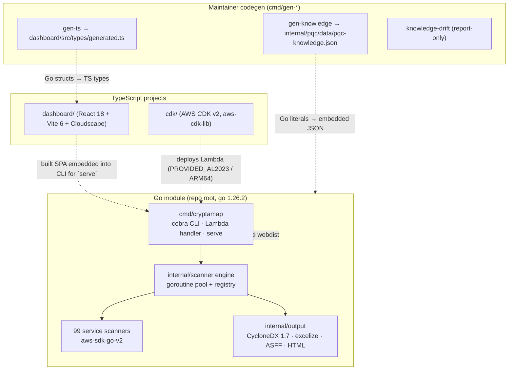
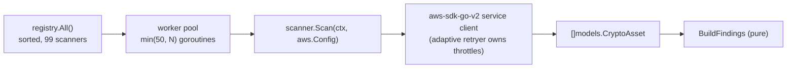
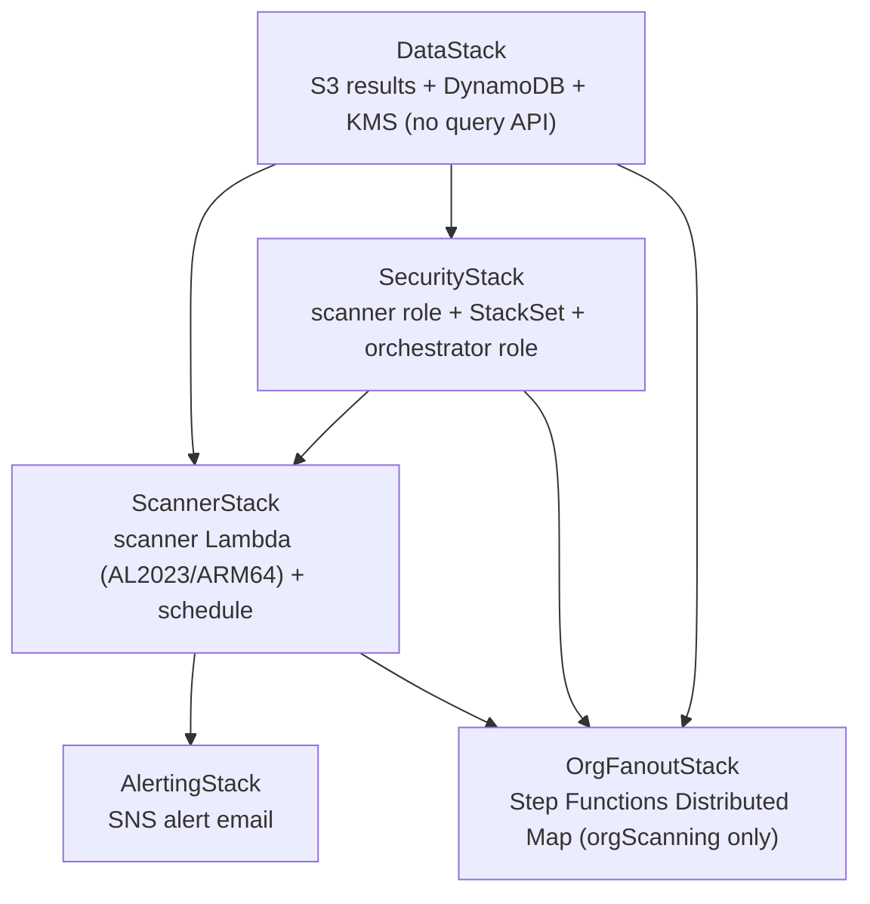
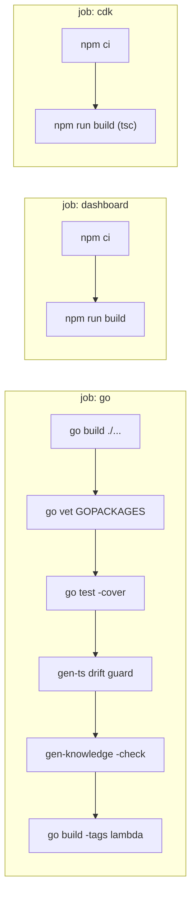
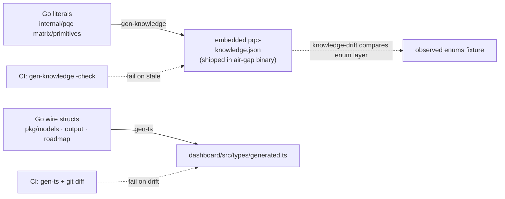

# 08 — Tech Stack

> **Audience + purpose:** Engineers and reviewers who need to know *what* CryptaMap is built from and *why each technology was chosen*. This is the canonical inventory of languages, libraries, frameworks, and the build/CI toolchain, with every version pinned to `go.mod` / `package.json` and every claim cited to source.

## Table of contents

1. [One-page summary](#1-one-page-summary)
2. [How the layers fit together](#2-how-the-layers-fit-together)
3. [Layer-by-layer technology matrix](#3-layer-by-layer-technology-matrix)
   - [3.1 CLI / engine layer (Go)](#31-cli--engine-layer-go)
   - [3.2 AWS SDK for Go v2 (scanners)](#32-aws-sdk-for-go-v2-scanners)
   - [3.3 Analysis & output layer](#33-analysis--output-layer)
   - [3.4 Frontend layer (dashboard SPA)](#34-frontend-layer-dashboard-spa)
   - [3.5 Infrastructure layer (AWS CDK + the 5 stacks)](#35-infrastructure-layer-aws-cdk--the-5-stacks)
   - [3.6 Build / CI toolchain](#36-build--ci-toolchain)
   - [3.7 Maintainer / codegen tools](#37-maintainer--codegen-tools)
4. [Version pinning policy & sources of truth](#4-version-pinning-policy--sources-of-truth)
5. [Cross-links](#5-cross-links)

---

## 1. One-page summary

CryptaMap is a **single Go module** (`github.com/aws-samples/cryptamap`, `go 1.26.2`) that compiles into one binary serving three personas: a local CLI scanner, a build-tagged AWS Lambda org fan-out handler, and an offline dashboard server. Around that Go core sit two TypeScript projects (a React/Cloudscape dashboard SPA and an AWS CDK app) and a thin maintainer codegen toolchain that keeps the three projects from drifting apart.

- **Go module root** is the repo root; `go.mod:1` declares the module and `go.mod:3` pins `go 1.26.2`.
- **Dashboard** lives under `dashboard/` — React 18 + Vite 6 + TypeScript 5 + Cloudscape (`dashboard/package.json`).
- **Infrastructure** lives under `cdk/` — AWS CDK v2 in **TypeScript** (`cdk/package.json`), synthesizing up to 5 stacks (`cdk/bin/app.ts`).
- **Glue:** two codegen commands (`cmd/gen-ts`, `cmd/gen-knowledge`) project the Go structs and PQC knowledge into the dashboard and the embedded data file, with CI staleness guards (`.github/workflows/ci.yml:60-71`).

> **Note on `aws-cdk-go` in `go.mod`:** `go.mod:6,79-80` lists `aws-cdk-go/awscdk/v2`, `constructs-go`, and `jsii-runtime-go` in the Go module graph, but the **deployed** CDK app is the TypeScript app in `cdk/` (`cdk/cdk.json:2` runs `npx ts-node --prefer-ts-exts bin/app.ts`; `cdk/package.json:21` depends on `aws-cdk-lib`). The Go CDK modules are present in the graph but the live infrastructure is authored in TypeScript — see [3.5](#35-infrastructure-layer-aws-cdk--the-5-stacks).

---

## 2. How the layers fit together

The Go binary is the center of gravity. The dashboard and CDK are independent TypeScript build targets, and the codegen tools are the single-source-of-truth bridges that stop the three from diverging (`cmd/gen-ts/main.go:1-17`).

---

## 3. Layer-by-layer technology matrix

### 3.1 CLI / engine layer (Go)

The scan engine, CLI dispatch, registry, and config loader are pure Go on top of a small, deliberately-light dependency set.

| Layer | Technology | Version | Why chosen |
|---|---|---|---|
| Language/runtime | **Go** | `1.26.2` | Single static cross-compiled binary for air-gap distribution; first-class goroutines for the per-service worker pool; `go:embed` lets the dashboard SPA ship inside the CLI. Pinned at `go.mod:3`. |
| CLI framework | **spf13/cobra** | `v1.10.2` | Sub-command tree (`cryptamap`, `org-merge-files`, `knowledge-status`, `serve`) with typed flags and `RunE` error propagation. Root command built in `cmd/cryptamap/main.go:55-89` (`cobra.Command` at `main.go:57`). Pinned at `go.mod:84`. |
| CLI flag parsing | **spf13/pflag** | `v1.0.9` (indirect) | POSIX flag parsing that cobra rides on. `go.mod:113`. |
| ID generation | **google/uuid** | `v1.6.0` | Random v4 UUIDs for `scanID` and per-finding IDs — `BuildFindings` sets `ID: uuid.NewString()` at `internal/scanner/findings.go:56`. `go.mod:82`. |
| Config format | **gopkg.in/yaml.v3** | `v3.0.1` | YAML config schema with `${VAR}` env-expansion and defaults-merge semantics (`internal/config/loader.go:101-126`). `go.mod:86`. |
| Concurrency primitive | Go stdlib `sync` / `math/rand` | (stdlib) | `sync.RWMutex`-guarded registry (`internal/scanner/registry.go:9-12`) and the bounded goroutine pool + jittered backoff in the engine (`internal/scanner/engine.go:72-163`, backoff `engine.go:221-229`). |

**Engine shape (grounding the "why Go"):** `Engine.Run` snapshots the sorted registry, sizes buffered `jobs`/`results` channels to the scanner count, and spawns `min(MaxGoroutines, #scanners)` workers under a `sync.WaitGroup` (`internal/scanner/engine.go:72-163`). The default pool is 50 goroutines (`engine.go:39-56`). Throttle retries are deliberately *not* handled by the engine — the AWS SDK's adaptive retryer owns them (`engine.go:198-210`), see [3.2](#32-aws-sdk-for-go-v2-scanners).

### 3.2 AWS SDK for Go v2 (scanners)

Every per-service scanner is a thin wrapper over an `aws-sdk-go-v2` service client, implementing the `ServiceScanner` interface (`internal/scanner/types.go:14-18`). `registerAllScanners` (`cmd/cryptamap/register.go:16-23`) wires **99 scanners** across **six** service families: certificate management (10), key management (9), SDK/library PQC (3) and runtime evidence (1) live in `register.go:25-56`; data-at-rest (49) lives in `cmd/cryptamap/register_datarest.go`; and data-in-transit (27) in `cmd/cryptamap/register_transit.go`. The count was verified by `grep -roh 'r.Register(' cmd/cryptamap/register*.go | wc -l` (= 99). A coverage-expansion took the registry from 86 to 99 scanners (the skipped-services audit promoted 13 to v1 — 11 data-at-rest + 2 certificate management).

> **Note — in-code counts (`--help` banner and `register.go` comment):** the shipping binary's `--help` text was once stale (it said "discovers cryptographic assets across 63 AWS services"). The banner now derives the count from the **live registry** rather than a hardcoded literal — `newRootCmd` interpolates `registeredScannerCount()` (which builds the registry via `registerAllScanners` and returns `reg.Len()`) into the `Long` string (`cmd/cryptamap/main.go:55-62,73-77`), so it now reads the true **99** and can never re-drift; `count_guard_test.go`'s `TestBannerScannerCount` asserts the banner number tracks `registry.Len()`. The `registerAllScanners` doc-**comment** at `register.go:13-15` was likewise once stale (it read "Adds 64 scanners … data-at-rest (28), data-in-transit (22), …") but now reads "Wires 99 scanners covering data-at-rest (49), data-in-transit (27), certificate management (10), key management (9), SDK/library PQC (3), and runtime evidence (1)" — so no stale in-code literal remains. The real `r.Register(...)` totals are 49 / 27 / 10 / 9 / 3 / 1 = 99. Trust the registration calls, the runtime banner, the corrected comment, and this doc's 99. (99 is the count of `r.Register` *calls*; the registry dedups by `Name()` at `internal/scanner/registry.go:23`, so distinct-scanner count equals 99 only if all names are unique — `registry_test.go` reconciles this.)

| Layer | Technology | Version | Why chosen |
|---|---|---|---|
| AWS SDK core | **aws-sdk-go-v2** | `v1.42.0` | Modular per-service clients (only the services scanned are linked); native context support; adaptive retryer that owns throttle backoff. `go.mod:8`. |
| SDK config | **aws-sdk-go-v2/config** | `v1.32.20` | `loadAWSConfig` builds region-scoped configs with adaptive retry capped at 8 attempts (`cmd/cryptamap/main.go:406-422`). `go.mod:9`. |
| Credentials | **aws-sdk-go-v2/credentials** | `v1.19.19` | Credential chain for CLI (caller account) and Lambda (assumed member-account role). `go.mod:10`. |
| STS | **aws-sdk-go-v2/service/sts** | `v1.42.3` | Caller-identity resolution + cross-account `AssumeRole` (`internal/services/common.go` region-less ARN; `cmd/cryptamap/lambda.go:100-118` eager assume-role verify). `go.mod:74`. |
| Organizations | **aws-sdk-go-v2/service/organizations** | `v1.51.6` | Account enumeration for org fan-out seeding. `go.mod:58`. |
| Lambda runtime | **aws-lambda-go** | `v1.54.0` | The build-tagged org fan-out handler (`//go:build lambda`, `cmd/cryptamap/lambda.go`). `go.mod:7`. |
| SDK error classification | **aws/smithy-go** | `v1.27.1` | Typed smithy API errors so scanners can distinguish "not subscribed / not in region / unsupported op" graceful-skips from real failures (used across `datarest`, `transit/directoryservice.go`). `go.mod:81`. |
| 90 service clients | **aws-sdk-go-v2/service/\*** | per `go.mod:11-78` | **90** direct-require service modules (counted via `grep -c 'aws-sdk-go-v2/service/'`); most are data-plane scanner clients, the rest (organizations, securityhub, sts) are orchestration/output. One module per scanned service (s3 `v1.102.2` `go.mod:65`, ec2 `v1.304.2` `:31`, kms `v1.53.0` `:50`, acm `v1.39.2` `:11`, elbv2 `v1.55.0` `:38`, rds `v1.118.4` `:61`, …). Modular linking keeps the binary lean and lets each scanner pin independently. (The coverage-expansion took the module count from 68 to 90 — the 13 new scanners added 14 modules: bedrock, bedrockagent, quicksight, kinesisanalyticsv2, eventbridge, sfn, sesv2, customerprofiles, workspacesweb, codebuild, mgn, kendra, appstream, xray.) |

> **What "pure" means here (and what it does NOT):** `BuildFindings` (`internal/scanner/findings.go:29-77`) is *pure/dependency-light* in that the **classification** it produces — `Posture`, `Severity`, `Mosca` score, and `Compliance` mappings — depends only on the input asset, so the offline org-merge adapter reproduces the same classification a live scan would. It is **not** byte-identical run-to-run: every call stamps a fresh random `ID: uuid.NewString()` (`findings.go:56`) and `CreatedAt`/`UpdatedAt: time.Now().UTC()` (`findings.go:30,72-73`). Any purity/equality test must exclude the UUID and the two timestamps.
>
> **Note — severity is not an unconditional worse-of:** `Severity` previously was the unconditional worse-of(posture-derived, Mosca/HNDL-derived), which over-alarmed quantum-SAFE assets (e.g. an AES-256 RDS/DynamoDB asset surfaced as CRITICAL purely on HNDL urgency). It is now `risk.SeverityFromPosture(posture)`, and the Mosca/HNDL bump (`HighestSeverity(..., SeverityFromMosca(...))`) is applied **only when `!risk.IsQuantumSafePosture(posture)`** (`findings.go:46-50`; `IsQuantumSafePosture` true for symmetric-only / pqc-hybrid / pqc-ready at `internal/risk/severity.go:42`). Genuinely vulnerable postures (no-encryption / legacy-tls / non-pqc-classical / unknown) keep the worse-of semantics unchanged. The classification stays deterministic-per-asset, so the purity note above still holds.

> **Build-time guard:** `lambda.go` is `//go:build lambda`-gated, so the default build never compiles the org handler. CI builds it explicitly with `go build -tags lambda` (`.github/workflows/ci.yml:76-77`).

### 3.3 Analysis & output layer

The output layer turns `[]CryptoAsset` + `[]Finding` into the report formats regulators and operators consume. CBOM is the canonical interchange format.

| Layer | Technology | Version | Why chosen |
|---|---|---|---|
| CBOM format | **CycloneDX 1.7** (hand-built structs) | spec `1.7` | The industry CBOM standard; emitted with `bomFormat: "CycloneDX"`, `specVersion: "1.7"` (`internal/output/cyclonedx.go:72-73`, structs `cyclonedx.go:19-21`). The data model (`pkg/models/asset.go`) is aligned to CDX 1.7 `cryptoProperties` (asset.go enums; `cmd/gen-ts/main.go:77` documents the alignment). No third-party CBOM library — the structs are authored in-repo. The deeper crypto-detail fields are emitted as flat `cryptamap:` properties (not nested in `algorithmProperties`/`protocolProperties`) precisely because the CDX 1.7 schema marks those sub-objects `additionalProperties:false`; the comment at `cyclonedx.go:130-137` explains this and `sanitizeForCDX` (`cyclonedx.go:239-264`) zeroes non-schema fields so the marshaled `cryptoProperties` still validates. **Note — two real-data schema leaks are closed:** (1) `sanitizeForCDX` **also zeroes `ProtocolProperties.Source`** (`cyclonedx.go:260`), which previously leaked a non-schema `source` key into `protocolProperties` and failed validation on live TLS components; the provenance is still carried as a top-level `cryptamap:`-namespaced component property. (2) `buildCBOM` now **omits the `cryptoProperties` object entirely when it is empty** (`isEmptyCryptoProperties`, `cyclonedx.go:153,273-280`) instead of emitting an invalid `{assetType:""}` block — so e.g. `lambda_runtime` (no observable crypto) is a valid inventory entry with posture "unknown" carried only via its top-level `cryptamap:*` properties. Both live and MERGED CBOMs now pass official CycloneDX 1.7 schema validation. |
| CBOM schema validation (test) | **santhosh-tekuri/jsonschema/v5** | `v5.3.1` | Validates emitted CBOM against the official CycloneDX 1.7 JSON Schema (jsonschema import at `internal/output/cyclonedx_test.go:13`; schema compiled by the shared `compileCDXSchema` helper at `:22-52`). The schema is bundled in-repo at `testdata/schemas/cdx-bom-1.7.schema.json` (`cyclonedx_test.go:26`, plus the spdx/jsf/cryptography-defs sub-schemas added at `:43-46`) and (re)fetched by `scripts/fetch-schema.sh`. **Note:** the validation test previously exercised only a benign fixture and so was a **fixture-only false-green** that missed the live `protocolProperties.source` leak and the empty-`cryptoProperties` block. It now (a) validates a sample scan deliberately carrying the **live shapes** that used to fail — a TLS component with the non-schema `ProtocolProperties.Source` and a Lambda-style component with empty `CryptoProperties{}` (`TestCycloneDXSchemaValidation`, `cyclonedx_test.go:75`), and (b) adds `TestCycloneDXSchemaValidationMerged` (`cyclonedx_test.go:84`) which merges two per-account shards via `merge.Merge` and validates the **merged org artifact**, so the org-wide CBOM is guaranteed schema-valid too. `go.mod:83`. |
| MITRE PQCC Excel | **xuri/excelize/v2** | `v2.10.1` | Generates the MITRE PQCC migration-inventory `.pqcc.xlsx` workbook (`internal/output/pqcc_excel.go:9,66`). Pure-Go XLSX writer (no Office/COM dependency) so it works in the air-gapped CLI. `go.mod:85`. Transitive Excel deps: `richardlehane/mscfb` `v1.0.6`, `msoleps` `v1.0.6`, `xuri/efp` `v0.0.1`, `xuri/nfp` `v0.0.2-…` (`go.mod:111-116`). |
| HTML report | Go stdlib `html/template` | (stdlib) | Self-contained `.report.html` written by `internal/output/html_report.go` — no JS framework, opens offline. |
| Markdown (PDF path) | **yuin/goldmark** | `v1.7.16` (indirect) | Markdown rendering pulled transitively; the `--pdf`/`.report.md` path emits Markdown (`internal/output/pdf_writer.go`, written by `cmd/cryptamap/main.go:216-316`). `go.mod:117`. |
| ASFF / Security Hub | **aws-sdk-go-v2/service/securityhub** | `v1.71.2` | Findings exported as ASFF for Security Hub (`internal/output/securityhub.go`, `securityhub_writer.go`). `go.mod:68`. |
| Risk scoring | in-repo (Mosca's Theorem) | n/a | `internal/risk` computes `Score = X+Y-Z` (`mosca.go:12-23`) with per-service Indian-BFSI defaults (`defaults.go:14-85`); no external dependency. |

The CLI's `writeArtifacts` fans these formats out per `(account, region)` result (`cmd/cryptamap/main.go:216-316`): `.cbom.json`, `.pqcc.xlsx`, `.report.html`, `.asff.json`, `.scan.json`, optional `.report.md`, and `.roadmap.json/.md`.

### 3.4 Frontend layer (dashboard SPA)

The dashboard is a separate TypeScript project under `dashboard/`. Its built bundle is embedded into the CLI (`cmd/cryptamap/web_embed.go:18`, `//go:embed all:webdist`; `var webDist embed.FS` at `:19`) and served loopback-only by `cryptamap serve` (`cmd/cryptamap/serve.go:38-104`).

> **The committed `webdist/` is a PLACEHOLDER, not the real SPA.** Per the comment at `web_embed.go:8-13`, the file checked into `cmd/cryptamap/webdist` is a stub `index.html` only — the real Vite output lives in `dashboard/dist`, which is outside `cmd/cryptamap`, so `go:embed` cannot reach it. A plain `make build-cli` / `go build` therefore embeds only the placeholder, and `cryptamap serve` from that binary renders a stub shell (and `serve.go:183` even errors `dashboard bundle missing index.html (run \`make build-serve\`)` when the bundle is absent). The **real** dashboard ships only when `make build-serve` (`Makefile:23-29`) copies `dashboard/dist/*` into `cmd/cryptamap/webdist` *before* `go build` — that target (and `make release`) is what produces a binary whose `serve` shows the real UI.

| Layer | Technology | Version | Why chosen |
|---|---|---|---|
| UI framework | **React** | `^18.3.1` | Component model for the dashboard SPA. `dashboard/package.json:17` (`react-dom` `^18.3.1`, `:18`). |
| Build tool / dev server | **Vite** | `^6.0.3` | Fast bundler producing the static SPA embedded into the CLI; `npm run build` = `tsc -b && vite build` (`dashboard/package.json:8,26`). |
| Vite React plugin | **@vitejs/plugin-react** | `^4.3.4` | JSX/Fast-Refresh support. `dashboard/package.json:24`. |
| Language | **TypeScript** | `^5.6.3` | Type safety against the generated wire types. `dashboard/package.json:25`. Types `@types/react` `^18.3.12`, `@types/react-dom` `^18.3.1` (`:22-23`). |
| Design system | **Cloudscape** | components `^3.0.1306`, collection-hooks `^1.0.97`, global-styles `^1.0.59` | AWS's open-source console design system — gives the dashboard a familiar AWS look without bespoke UI code. `dashboard/package.json:13-15`. |
| Routing | **react-router-dom** | `^6.28.0` | BrowserRouter deep-linking; `serve` falls back to `index.html` for client routes (`cmd/cryptamap/serve.go:147-175`). `dashboard/package.json:19`. |
| Client-side PDF | **html2pdf.js** | `^0.14.0` | In-browser report export from the dashboard. `dashboard/package.json:16`. Bumped from `^0.10.2` (resolving jspdf 3.0.4) to `^0.14.0` (jspdf 4.2.x + dompurify) to clear the 2026-06 AppSec/grype jspdf+html2pdf advisories. |
| Lint | **eslint** | (via `npm run lint`) | `dashboard/package.json:10`; non-blocking in `make lint` (`Makefile:80`). |

> **Generated types are the contract:** `dashboard/src/types/generated.ts` is produced by `go run ./cmd/gen-ts` from the Go wire structs and enums (`cmd/gen-ts/main.go:35,141-170`). The dashboard imports these; CI fails if they drift (`.github/workflows/ci.yml:60-64`). See [3.7](#37-maintainer--codegen-tools).

### 3.5 Infrastructure layer (AWS CDK + the 5 stacks)

The deployed infrastructure is an **AWS CDK v2 app in TypeScript** under `cdk/`, entered via `npx ts-node --prefer-ts-exts bin/app.ts` (`cdk/cdk.json:2`).

| Layer | Technology | Version | Why chosen |
|---|---|---|---|
| IaC framework | **aws-cdk-lib** | `^2.180.0` | Single CDK v2 monolithic library for all constructs. `cdk/package.json:21`. |
| CDK CLI (toolkit) | **aws-cdk** | `^2.180.0` | `cdk synth` / `deploy` / `diff` (`cdk/package.json:15`; Makefile targets `synth`/`deploy`/`destroy`, `Makefile:66-73`). |
| Constructs base | **constructs** | `^10.4.0` | CDK construct programming model. `cdk/package.json:22`. |
| CDK language | **TypeScript** + **ts-node** | TS `^5.6.0`, ts-node `^10.9.2` | App authored in TS, executed via ts-node (`--prefer-ts-exts`) at synth (`cdk/cdk.json:2`, `cdk/package.json:16-18`). |
| Lambda packaging target | `lambda.Runtime.PROVIDED_AL2023`, `Architecture.ARM_64` | n/a | The scanner Lambda runs the Go `bootstrap` binary cross-compiled to `linux/arm64` (`cdk/lib/scanner-stack.ts:40-44`; built by `Makefile:13-15` `build-lambda`, 1024 MB / 15 min). |
| Org orchestration | **Step Functions Distributed Map** (Standard) | via `aws-cdk-lib/aws-stepfunctions` | One child execution per `(account, region)` tuple, invoking the scanner Lambda (`cdk/lib/org-fanout-stack.ts:9,328-359`). Chosen for large-org fan-out without building bespoke fan-out plumbing. |
| Cross-account rollout | **CloudFormation StackSet** (SERVICE_MANAGED) | `cdk.CfnStackSet` | Rolls the read-only `CryptaMapScannerRole` out to every member account org-wide (`cdk/lib/security-stack.ts:147,156`); the orchestrator Lambda assumes it (`security-stack.ts:97-119`). |
| Result store | **S3** (KMS-encrypted) + **DynamoDB** (customer-managed KMS) | `aws-cdk-lib/aws-s3`, `aws-cdk-lib/aws-dynamodb` | Central results bucket + scans table (`cdk/lib/data-stack.ts`). DataStack is the evidence store **only** — it deliberately exposes **no query API** (local-first model; results are viewed via `cryptamap serve` or pulled from the bucket with operator creds — `data-stack.ts:13-16`). |
| Dashboard hosting | **none** (local-first) | — | No CloudFront/internet-facing dashboard stack is synthesized. The dashboard SPA is served locally by `cryptamap serve` over loopback against on-disk artifacts (`cdk/bin/app.ts:25-30,134`) — a structural guarantee that there is no public dashboard or query API by default. |

**The 5 stacks** (composed in `cdk/bin/app.ts`):

| Stack | Built when | Key cite |
|---|---|---|
| `DataStack` | always | `cdk/bin/app.ts:103` |
| `SecurityStack` | always | `cdk/bin/app.ts:105` |
| `ScannerStack` | always | `cdk/bin/app.ts:117` |
| `AlertingStack` | always | `cdk/bin/app.ts:181` |
| `OrgFanoutStack` | `orgScanning=true` only | `cdk/bin/app.ts:143,157` |

> There is no `DashboardStack`/CloudFront stack: the public-dashboard hosting path was removed in favour of the local-first model (`cryptamap serve` over loopback). See `cdk/bin/app.ts:25-30,134`.

Synth-time context defaults (placeholder org id `o-exampleorgid`, root `r-exam`, schedule `cron(0 6 ? * SUN *)`, fanout regions `us-east-1,ap-south-1`) are the active context values in `cdk/cdk.json` (`organizationId` `:23`, `orgRootId` `:22`, `scanSchedule` `:19`, `fanoutRegions` `:26`). The **same** defaults are duplicated as `?? '...'` fallbacks in `cdk/bin/app.ts` (`organizationId` `:36`, `orgRootId` `:35`, `scanSchedule` `:32`, `fanoutRegions` `:74`), which take effect if the corresponding context key is removed from `cdk.json`.

### 3.6 Build / CI toolchain

The repo root is the Go module root, with `dashboard/` and `cdk/` as sibling Node projects. The `Makefile` is the developer entry point; `.github/workflows/ci.yml` mirrors it in three independent jobs.

**Makefile targets** (`Makefile:1-83`):

| Target | What it does | Cite |
|---|---|---|
| `build` | `build-cli` + `build-cdk` + `build-dashboard` | `Makefile:7` |
| `build-cli` | `go build -o dist/cryptamap ./cmd/cryptamap` | `Makefile:9-11` |
| `build-lambda` | `GOOS=linux GOARCH=arm64 CGO_ENABLED=0 go build -tags lambda -ldflags="-s -w"` → `bootstrap` | `Makefile:13-15` |
| `build-cdk` | `cd cdk && npm run build && npx cdk synth` | `Makefile:17-18` |
| `build-dashboard` | `cd dashboard && npm run build` | `Makefile:20-21` |
| `build-serve` | builds dashboard, copies into `cmd/cryptamap/webdist`, rebuilds CLI with SPA embedded | `Makefile:23-29` |
| `release` | cross-compiles air-gap binaries via `scripts/release-build.sh` | `Makefile:31-32` |
| `generate-types` / `check-types` | `gen-ts` codegen + staleness diff guard | `Makefile:40-45` |
| `generate-knowledge` / `check-knowledge` | `gen-knowledge` codegen + `-check` staleness guard | `Makefile:34-38` |
| `test` / `vet` / `lint` | `go test … -cover`, `go vet`, dashboard eslint | `Makefile:47-54,78-80` |
| `mock` / `scan` / `synth` / `deploy` / `destroy` | end-to-end exercises and CDK lifecycle | `Makefile:56-73` |

**CI jobs** (`.github/workflows/ci.yml`) — three independent jobs so each toolchain fails on its own:

| CI guard | Why it exists | Cite |
|---|---|---|
| `go build ./...` runs **without** `cdk/node_modules` | CDK vendors a `%name%.template.go` init-template file that is not valid Go and would break `go build ./...` | `ci.yml:13-18,44-48` |
| Go version comes from `go.mod` | `actions/setup-go` `go-version-file: go.mod` keeps CI on the pinned toolchain (`go 1.26.2`) | `ci.yml:40-41` |
| **gen-ts drift guard** | Regenerate TS types and `git diff --exit-code` — Go model changes can never silently drift from the dashboard | `ci.yml:60-64` |
| **gen-knowledge staleness guard** | `go run ./cmd/gen-knowledge -check` fails if the embedded PQC JSON diverges from the Go literals | `ci.yml:70-71` |
| **lambda build** | `go build -tags lambda` covers the build-tagged org handler the default build skips | `ci.yml:76-77` |
| Node 20 for dashboard + cdk | both Node jobs pin `node-version: "20"` with npm cache | `ci.yml:91-94,112-117` |

**Release build** (`scripts/release-build.sh`): cross-compiles `darwin/{amd64,arm64}` + `linux/{amd64,arm64}` with `CGO_ENABLED=0 -ldflags="-s -w"` (static, stripped) and writes a `SHA256SUMS` manifest. Signing is left to the air-gapped operator's offline key (minisign/cosign) — the script makes no network or AWS calls (`scripts/release-build.sh` header).

### 3.7 Maintainer / codegen tools

These commands keep the three projects in sync. They are **not** linked into the customer scan binary (`cmd/cryptamap`) and never enter the air-gapped scan path (`cmd/knowledge-drift/main.go:1-5`).

| Tool | Technology | What it does | Why chosen / cite |
|---|---|---|---|
| `cmd/gen-ts` | Go stdlib `reflect` | Reflects the Go wire structs (`pkg/models`, `internal/output`, `internal/roadmap`) + enum vocabularies and emits `dashboard/src/types/generated.ts`. Deterministic, stdlib-only, no timestamp so `git diff` is stable. | Single source of truth for the Go↔TS contract; `enumGuard` fails generation if a named enum stops being a `string`. `cmd/gen-ts/main.go:1-31,216-223,238`. |
| `cmd/gen-knowledge` | Go stdlib `encoding/json` | Marshals `pqc.KnowledgeFromLiterals()` to `internal/pqc/data/pqc-knowledge.json` (the embedded baseline). `-check` mode is the CI staleness gate. | Zero transcription risk between the Go literals and the embedded JSON the air-gapped scanner reads. `cmd/gen-knowledge/main.go:1-15,30-65`. |
| `cmd/knowledge-drift` | Go (offline diff engine) | **Report-only** maintainer drift detector comparing the embedded enum/identifier layer against an "observed enums" fixture; never mutates the knowledge file, never makes network/MCP/AWS calls. | Keeps the deterministically-extractable AWS-enum layer honest while leaving the NIST judgment layer to human edit. `cmd/knowledge-drift/main.go:1-31`. |

---

## 4. Version pinning policy & sources of truth

- **Go dependencies** are pinned in `go.mod` (direct requires `go.mod:5-87`, indirect `go.mod:89-129`) and locked in `go.sum`. The toolchain version itself is `go.mod:3` and CI reads it via `go-version-file`.
- **Dashboard dependencies** are pinned with caret ranges in `dashboard/package.json:12-27` and locked in `dashboard/package-lock.json` (CI uses `npm ci`).
- **CDK dependencies** are pinned with caret ranges in `cdk/package.json:12-23` and locked in `cdk/package-lock.json` (CI uses `npm ci`).
- **CycloneDX 1.7** is asserted in code (`internal/output/cyclonedx.go:72-73`) and validated in test against the schema bundled at `testdata/schemas/cdx-bom-1.7.schema.json` — both the single-scan `TestCycloneDXSchemaValidation` and the merged-org `TestCycloneDXSchemaValidationMerged` (`internal/output/cyclonedx_test.go:75,84`, schema compiled at `:22-52`); `scripts/fetch-schema.sh` (re)fetches that bundle — re-run it when bumping CDX versions.
- **Generated artifacts** (`dashboard/src/types/generated.ts`, `internal/pqc/data/pqc-knowledge.json`) are never hand-edited — regenerate with `make generate-types` / `make generate-knowledge`; CI enforces this (`.github/workflows/ci.yml:60-71`).

> The exact version numbers in the tables above are transcribed from `go.mod` / `dashboard/package.json` / `cdk/package.json` at the cited line numbers. When those files change, this document's matrix must be re-derived from them — the manifests are authoritative, not this prose.

---

## 5. Cross-links

- [`01-REQUIREMENTS.md`](./01-REQUIREMENTS.md) — what CryptaMap is, the personas the binary serves, and the functional/non-functional requirements.
- [`04-HIGH-LEVEL-DESIGN.md`](./04-HIGH-LEVEL-DESIGN.md) — how the engine, scanners, and org fan-out fit together.
- [`05-LOW-LEVEL-DESIGN.md`](./05-LOW-LEVEL-DESIGN.md) — `CryptoAsset` / `Finding` / CBOM `cryptoProperties` shapes the SDK fills and gen-ts reflects.
- [`04-HIGH-LEVEL-DESIGN.md`](./04-HIGH-LEVEL-DESIGN.md) — the 99 service scanners and their `aws-sdk-go-v2` clients.
- [`06-DATA-FLOW.md`](./06-DATA-FLOW.md) — CycloneDX 1.7 CBOM, PQCC Excel, ASFF, HTML, roadmap as the data flows through the output layer.
- [`05-LOW-LEVEL-DESIGN.md`](./05-LOW-LEVEL-DESIGN.md) — the 5 CDK stacks, StackSets, and Step Functions Distributed Map in depth.
- [`09-TEST-COVERAGE.md`](./09-TEST-COVERAGE.md) — Makefile targets, CI guards, and codegen lifecycle as exercised by the test suite.
