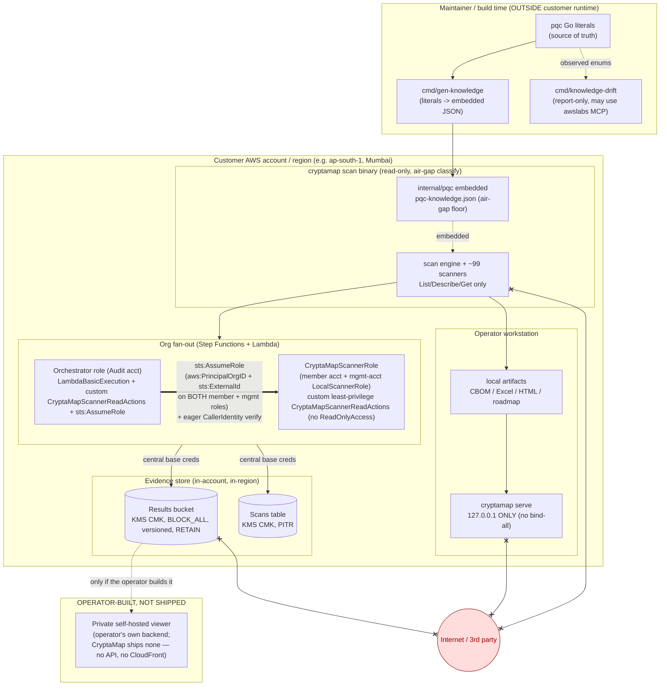

# 10 — Security & Data Localization

> **Audience:** security reviewers, auditors, and operators evaluating CryptaMap for production deployment in a regulated (Indian BFSI) environment.
> **Purpose:** state — and ground in code — the security posture of CryptaMap: a read-only-by-construction scanner, a confused-deputy-guarded cross-account model, a fail-closed CDK that ships no internet-facing surface (no query API, no dashboard), a loopback-only local serving layer, the data-localization guarantees (customer data never leaves the account / India), and the maintainer-vs-customer-runtime boundary enforced by dependency-purity tests.

## Table of contents

1. [Threat model in one paragraph](#1-threat-model-in-one-paragraph)
2. [Read-only IAM posture](#2-read-only-iam-posture)
3. [Cross-account assume-role + confused-deputy guard (member **and** management roles, fail-closed deploy guards)](#3-cross-account-assume-role--confused-deputy-guard)
4. [Secure-by-default CDK (no web/query-API surface, evidence store hardened at rest)](#4-secure-by-default-cdk)
5. [Why the serving layer has no anonymous data path (and how it's enforced)](#5-why-the-serving-layer-has-no-anonymous-data-path-and-how-its-enforced)
6. [Data-localization guarantees (incl. partition-aware findings)](#6-data-localization-guarantees)
7. [Maintainer-vs-customer-runtime boundary (air-gap purity)](#7-maintainer-vs-customer-runtime-boundary)
8. [Trust-boundary diagram](#8-trust-boundary-diagram)
9. [Residual risks / reviewer checklist](#9-residual-risks--reviewer-checklist)

Cross-references (relative): see [`../../DEPLOYMENT.md`](../../DEPLOYMENT.md) for the live deployment snapshot and the secure interaction recipes, and the sibling SDLC docs [`04-HIGH-LEVEL-DESIGN.md`](04-HIGH-LEVEL-DESIGN.md) (deployment topology + org fan-out architecture) and [`05-LOW-LEVEL-DESIGN.md`](05-LOW-LEVEL-DESIGN.md) (the PQC knowledge loader / self-updating-knowledge subsystem).

---

## 1. Threat model in one paragraph

CryptaMap's output is a **cryptographic inventory of an AWS organization** — a precise map of which resources use weak / classical / no encryption. That map is exactly the target list a *harvest-now-decrypt-later* (HNDL) adversary wants. The product's security design treats the inventory itself as the sensitive asset, and is built around two principles: **(a)** CryptaMap can only ever *read* the org it scans (no write/modify/delete IAM surface anywhere), and **(b)** the inventory must not leak — it stays in the customer's account / region by default, is served only over loopback, and the deployment stands up no internet-facing surface at all (no query API, no dashboard stack) for it to leak from. These properties are codified in IAM policy, CDK structure, the serve listener bind, and dependency-purity tests; the sections below cite each one.

---

## 2. Read-only IAM posture

CryptaMap never needs write access to do its job, and its IAM grants reflect that. The **org fan-out path** (member scanner role + orchestrator role) is built on a **custom least-privilege policy** — `CryptaMapScannerReadActions`, a generated allowlist of exactly the read actions the scanner code uses — *not* a broad AWS-managed policy. Only the **single-account default Lambda** path falls back to the AWS-managed `ReadOnlyAccess` (plus a small inventory supplement). No role anywhere carries an Admin or `*Access` write policy.

### 2.1 Member-account scanner role (StackSet template)

The member-account role is defined in a hand-authored CloudFormation template deployed org-wide by a StackSet. Its only permission is a **custom, generated least-privilege inline policy** — there is **no `ReadOnlyAccess` attachment**:

- Inline policy `CryptaMapScannerReadActions` (`PolicyName` at `cdk/templates/scanner-role-template.json:239`): a single read-only `Allow` statement (Sid `CryptaMapScannerReads`, action array `:90-234`, `Resource: *`) listing exactly the per-resource crypto-detail `Describe`/`Get`/`List` actions the scanners use (`kms:DescribeKey`, `acm:DescribeCertificate`, `iam:GetServerCertificate`, `elasticloadbalancing:DescribeListeners`, …). The action array is **generated** from the single source of truth `cmd/gen-policy` (`make generate-policy`; CI `make check-policy` fails on drift) — never hand-edited.
- The trust policy is double-gated: `sts:AssumeRole` is allowed only when `aws:PrincipalOrgID` matches the org **and** a required `sts:ExternalId` is presented (`cdk/templates/scanner-role-template.json:56-70`), so only the orchestrator inside this organization can assume it.
- The template's own description states plainly it creates a role with *"a CUSTOM least-privilege inline policy (NOT the broad AWS-managed ReadOnlyAccess) … NOTHING in this template grants write access."* — `cdk/templates/scanner-role-template.json:3`.

**Why a custom allowlist and not `ReadOnlyAccess`/`SecurityAudit`?** A deliberate, documented choice: the permission surface should be exactly — and only — the actions the scanner code actually issues, so it can never silently drift broader than the code. The list is regenerated from the scanner source, so a new scanner's reads are added intentionally (see the rationale at `cdk/lib/security-stack.ts:228-256`).

### 2.2 Orchestrator role (Audit / hub account)

The orchestrator role (which the Scanner Lambda *runs as* for the org fan-out) carries:

- `AWSLambdaBasicExecutionRole` (CloudWatch Logs only) as its sole AWS-managed policy — explicitly **not** `ReadOnlyAccess` (`cdk/lib/security-stack.ts:92-99`, with the rationale comment at `:93-97`).
- The **same custom `CryptaMapScannerReadActions` least-privilege read policy** as the member role, attached via `addScannerReadPolicy` (`cdk/lib/security-stack.ts:103,234-256`) — the scanner Lambda runs as this role for the management-account branch of the fan-out, so it needs the reads too.
- A scoped `sts:AssumeRole` statement that can only assume `…:role/CryptaMapScannerRole` in any account in the partition — `cdk/lib/security-stack.ts:105-110`. `sts:AssumeRole` lives **only** on the orchestrator, never on the member scanner role.
- `organizations:ListAccounts` (to enumerate the org) — `cdk/lib/security-stack.ts:122-123`.

> **Note:** the orchestrator execution role carries `AWSLambdaBasicExecutionRole` + the custom `CryptaMapScannerReadActions` least-privilege policy (verified at `cdk/lib/security-stack.ts:92-103`) — **not** the broad AWS-managed `ReadOnlyAccess` or `SecurityAudit`. The adjacent comment in `cdk/lib/scanner-stack.ts:104-106` is kept in sync with this.

### 2.3 Single-account default Lambda role (no orchestrator supplied)

When CryptaMap is deployed for a **single account** (no org orchestrator role injected), the scanner Lambda's default execution role takes the broader AWS-managed **`ReadOnlyAccess`** plus a 9-action inventory supplement — this is the *only* place `ReadOnlyAccess` is used:

- `ReadOnlyAccess` managed policy, added only `if (!props.executionRole)` — `cdk/lib/scanner-stack.ts:110-114`.
- `CryptaMapInventorySupplement` inline statement (`resource-explorer-2:Search/GetView/ListViews`, `apigatewayv2:GetDomainNames/GetApis`, `cassandra:Select`, `cloudhsm:DescribeClusters`, `timestream:DescribeEndpoints/ListDatabases`) — `cdk/lib/scanner-stack.ts:115-130`.

**Why `ReadOnlyAccess` here and not `SecurityAudit`?** Completeness of *crypto detail*: `SecurityAudit` omits several `Describe`/`Get` calls that carry real cryptographic detail. `ReadOnlyAccess` is broader than `SecurityAudit` but still strictly read-only — no mutate/delete capability — and this path scans only the single caller account, not the org.


### 2.4 Runtime non-destructive behavior

The Go scan engine and every one of the ~99 service scanners issue only `List`/`Describe`/`Get`-class AWS API calls; there is no mutate path in the scan binary. The retry policy is read-safe (idempotent reads only) and deliberately does **not** amplify throttles — the engine re-runs whole scans only on coarse transient I/O errors and leaves throttle backoff to the SDK adaptive retryer (`internal/scanner/engine.go:198-210`, mirrored in the Lambda's single throttle owner at `cmd/cryptamap/lambda.go:62-69`). The reader posture is the same across the CLI live path (`cmd/cryptamap/main.go` `loadAWSConfig`) and the org Lambda path.

> **Reviewer takeaway:** there is no IAM action in CryptaMap's grant set, and no AWS API call in its code, that can change customer state. The strongest privilege it holds is *read-everything*, justified by crypto-detail completeness and bounded to read-only by the managed policy.

---

## 3. Cross-account assume-role + confused-deputy guard

Org-wide scanning uses the standard hub-and-spoke model: a single **orchestrator** role in the Audit account assumes a **read-only scanner** role in each member account. The trust relationship is locked down with a *double* confused-deputy guard — `aws:PrincipalOrgID` **and** an `sts:ExternalId` — and is verified eagerly at runtime. The same double guard now applies to **both** the member-account scanner role (§3.1) **and** the management/orchestrator-account local scanner role (§3.1.1) — one uniform trust contract across every account in the org.

### 3.1 The trust policy (member side)

The member scanner role's `AssumeRolePolicyDocument` (`cdk/templates/scanner-role-template.json:45-62`) permits exactly one principal (the orchestrator role ARN) and gates it with two `StringEquals` conditions:

```jsonc
"Condition": {
  "StringEquals": {
    "aws:PrincipalOrgID": { "Ref": "OrganizationId" },   // org membership (cross-org guard)
    "sts:ExternalId":     { "Ref": "ExternalId" }          // shared secret (confused-deputy guard)
  }
}
```

- `aws:PrincipalOrgID` requires the calling principal to belong to this AWS Organization (your org id, e.g. the placeholder `o-exampleorgid`) — `cdk/templates/scanner-role-template.json:55-58`, parameter description at `:12-16`. This blocks any principal outside the org from assuming the role, even if it somehow learned the role ARN.
- `sts:ExternalId` is a second, layered guard: the orchestrator must pass the exact external id (`NoEcho` parameter, default `cryptamap-scanner`, overridable per-deployment) on `sts:AssumeRole` — `cdk/templates/scanner-role-template.json:23-28`, `:55,59`.

The CDK side that produces these values is `cdk/lib/security-stack.ts:42-44` (defaults), `:18-24` (props doc), and the StackSet parameters at `:179-187`. The external id is threaded into the Step Functions seed Lambda env (`SCANNER_EXTERNAL_ID`) and onto every fan-out tuple at `cdk/lib/org-fanout-stack.ts:97`, `:127-128`, `:172-174`, `:308-315`.

### 3.1.1 The trust policy (management / orchestrator-account side)

The SERVICE_MANAGED StackSet deploys `CryptaMapScannerRole` only to **member** accounts — never to the management/orchestrator account itself — so the CDK creates a counterpart `LocalScannerRole` in that account for the org fan-out's management-account branch (`cdk/lib/security-stack.ts:110-119`, `:121-138`).

> **Note:** previously this management-account `LocalScannerRole` was trusted by a **bare `ArnPrincipal(orchestrator.roleArn)` with NO conditions** — it had neither the `aws:PrincipalOrgID` nor the `sts:ExternalId` guard that the member-account StackSet role already enforced. That was a real asymmetry: the management account (the most privileged in the org) held the *weakest* scanner-role trust, leaving it open to a confused-deputy assume by any principal that learned the role ARN. It is now hardened to **exactly mirror** the member-side double guard:
>
> ```typescript
> assumedBy: new iam.ArnPrincipal(orchestrator.roleArn).withConditions({
>   StringEquals: {
>     'aws:PrincipalOrgID': organizationId,   // org membership (cross-org guard)
>     'sts:ExternalId': externalId,            // shared secret (confused-deputy guard)
>   },
> }),
> ```
>
> — `cdk/lib/security-stack.ts:126-131`, with the intent comment at `:116-119`/`:123-125` ("the SAME trust as the member StackSet role … so the fan-out treats every account uniformly under one trust contract"). **Net effect:** both the member scanner role and the management local scanner role now require `aws:PrincipalOrgID` **and** `sts:ExternalId` to be assumed; there is no longer a privileged account with a weaker trust.

### 3.1.2 Fail-closed org-scan deploy: no public-default ExternalId, no placeholder org IDs

The confused-deputy guard above is only as strong as the values bound into it, so the CDK app now **refuses to synthesize an org-scan deployment** with the demo/placeholder identifiers that ship in the repo:

> **Note:** `cdk/bin/app.ts` now throws at synth time on an org-scan deploy when the trust values are still the public defaults:
> - **Public-default ExternalId:** `if (orgScanning && (!scannerExternalId || scannerExternalId === 'cryptamap-scanner')) throw …` — `cdk/bin/app.ts:56-60`. The literal `cryptamap-scanner` ships in `cdk.json` / the StackSet template as a demo value; using it for a real org install would defeat the `sts:ExternalId` half of the double guard. The operator MUST pass `-c scannerExternalId=<your-private-value>`. (Single-account / non-org demo synth is unaffected — the default stays usable there.)
> - **Placeholder org identifiers:** `if (orgRootId === 'r-exam' || organizationId === 'o-exampleorgid' || …) throw …` — `cdk/bin/app.ts:144-156`. Synthesizing org scanning against the fictional defaults (`r-exam` / `o-exampleorgid`, also referenced in §3.1) would wire the StackSet-role trust + assume-role scoping to a non-existent org; the operator MUST pass `-c organizationId=<your-org-id> -c orgRootId=<your-root-id>`.
>
> Both guards are fail-closed: a misconfigured org deploy now stops at synth rather than silently standing up weakened trust.

### 3.2 AssumeRole client (Go)

The Go orchestrator builds assumed-role credentials with the external id when present:

- `internal/org/assumerole.go:14-29` — `AssumeRole(ctx, base, roleArn, externalID, sessionName)` sets `o.ExternalID` only when non-empty (`:17-19`) and defaults the session name to `cryptamap-scanner` (`:22-24`).
- `internal/org/assumerole.go:32-34` — `RoleARN(accountID, roleName)` builds the canonical `arn:aws:iam::<acct>:role/<role>`.

### 3.3 Eager runtime verification (anti-silent-failure)

A subtle but important guard: STS credentials resolve *lazily*, so a denied or mis-targeted assume-role would otherwise surface only as per-scanner errors inside the engine, and the shard would still return `SUCCEEDED` with **0 assets** — making a permission failure look like a legitimately empty account. The Lambda forecloses this by eagerly verifying the assumed identity immediately after assuming the role:

- `cmd/cryptamap/lambda.go:100-118` — after `org.AssumeRole`, it calls `org.CallerIdentity(ctx, scanCfg)` (`internal/org/assumerole.go:37-50`) and:
  - **fails the shard** if the STS call errors (`cmd/cryptamap/lambda.go:111-114`), recording it as `FAILED` (visible) in the Distributed Map rather than a silent empty success;
  - **fails the shard on account mismatch** — if the assumed account id is not the expected `evt.AccountID`, it returns an error (`cmd/cryptamap/lambda.go:115-117`), confirming the orchestrator landed in the intended account and did not get redirected.

The org-fanout architecture (Step Functions Distributed Map, S3 ItemReader, hierarchical merge) is documented in [`04-HIGH-LEVEL-DESIGN.md`](04-HIGH-LEVEL-DESIGN.md) (§9 Org fan-out, §11 Deployment topology); here the security-relevant facts are the org-id + external-id trust gate and the eager identity check.

### 3.4 The CLI does NOT do cross-account

A deliberate scoping decision: the `cryptamap` CLI accepts `--org`/`--accounts` for compatibility but **explicitly does not honor them** — it scans only the single caller account and warns loudly. The cross-account fan-out exists **only** in the Step Functions + Lambda stack. See the warning at `cmd/cryptamap/main.go:173-177`. This keeps the high-privilege assume-role path inside the controlled, infra-deployed orchestrator and out of an operator's ad-hoc CLI session.

---

## 4. Secure-by-default CDK

> All of the following follow one design principle (developed in Section 5): the deployment ships **no internet-facing surface at all** — no query API and no dashboard stack — so the crypto inventory is never reachable over the network. The only supported viewer runs on loopback (§5).

### 4.1 No internet-facing web or query-API surface is synthesized

The strongest possible version of "secure-by-default" is to ship no internet-facing surface at all — and that is what the CDK does. An earlier design deployed an opt-in CloudFront dashboard (with basic-auth / Cognito) fronting a DynamoDB-backed query API (`/cbom`, `/roadmap`, `/summary`, `/scans`, `/history`) guarded by an `AWS_IAM` authorizer and a no-anonymous-presigned-S3 rule. In the **local-first redesign that whole tier was removed**: there is no `DashboardStack`, no CloudFront/Cognito, no `allowPublicDashboard` flag, and no query API anywhere in the CDK.

- The CDK synthesizes exactly **five stacks** — Data, Security, Scanner, Alerting, and (only when `orgScanningEnabled`) OrgFanout — and **no web/dashboard stack** (`cdk/bin/app.ts:103-181`; the design comment at `:25-31` and `:134-136` states that no internet-facing surface is built).
- `DataStack` is an **evidence store only** and "deliberately exposes NO query API" — it has no API Gateway, no query Lambda, no routes, no authorizer, and no presigned-URL path (`cdk/lib/data-stack.ts:11-23`). The crypto inventory is never reachable over the network from the deployed stack.

This makes a public crypto-inventory surface *structurally impossible to stand up by accident*: a default deploy has no web surface, and there is no opt-in flag that creates one. The supported way to view the map is the loopback-only local `serve` (§5).

> The dashboard SPA's data client retains a dormant "live mode" branch (`dashboard/src/services/api.ts`) for operators who choose to **self-host** their own private viewer against their own backend, but CryptaMap itself provisions no such API — nothing it ships ever sets a non-empty `apiBase`.

### 4.2 Evidence store hardened at rest

The results bucket and scans table (`DataStack`) are encrypted with a customer-managed KMS CMK (annual rotation), block all public access, enforce SSL, version objects, retain on stack destroy, and have access logging + PITR:

- CMK with `enableKeyRotation` and `RETAIN` removal — `cdk/lib/data-stack.ts:31-35`.
- Results bucket: `KMS` CMK encryption, `BLOCK_ALL`, `versioned`, `RETAIN`, `enforceSSL`, server-access logs — `cdk/lib/data-stack.ts:51-67`.
- Scans table: customer-managed KMS, `RETAIN`, PITR enabled — `cdk/lib/data-stack.ts:71-80`.
- Scanner Lambda log retention is six months (`cdk/lib/scanner-stack.ts:45-48`).

---

## 5. Why the serving layer has no anonymous data path (and how it's enforced)

CryptaMap's output is the HNDL target list described in Section 1 — an attacker's shopping list of which resources are not quantum-safe. The serving layer is therefore designed around a single rule: **a deployment exposes no internet-facing surface to read the inventory from at all, and the only supported viewer runs on loopback.** This section states why that is the right design, and where the code enforces it.

**Why "no surface" beats "an authenticated surface."** An earlier design exposed a query API behind an `AWS_IAM` authorizer and deliberately streamed bytes through the authorized Lambda rather than minting an anonymous presigned-S3 URL (a presigned URL is signature-authenticated *but anonymously fetchable*, so it would bypass front-door auth). Rather than carry the ongoing burden of keeping that surface locked down, the local-first redesign **removed the surface entirely** — no API, no presigned path, no CORS question to get wrong. The inventory is simply not reachable over the network from the deployed stack.

**The design that enforces the rule (structural, not just configuration):**

1. **No query API exists** — `DataStack` is an evidence store only and "deliberately exposes NO query API" (`cdk/lib/data-stack.ts:11-23`): no API Gateway, no query Lambda, no routes, no presigned-URL path. There is nothing to authenticate against because there is nothing exposed.
2. **No web/dashboard stack is synthesized** — there is no `DashboardStack`, no CloudFront, no Cognito, and no `allowPublicDashboard` opt-in; the CDK builds five non-web stacks only (`cdk/bin/app.ts:103-181`, design comment `:25-31,134-136`). A default deploy has no public web surface, and there is no flag that creates one.
3. **Evidence stays in a private, encrypted bucket** — collected CBOM/scan output lands in the `DataStack` results bucket with `BLOCK_ALL` public access, KMS-CMK encryption, and `enforceSSL` (`cdk/lib/data-stack.ts:51-67`); it is read back only by an operator with explicit S3/KMS credentials.
4. **Loopback-only local serve** as the supported view (Section 6.2): the local dashboard binds to `127.0.0.1` only, with no bind-all flag, so the supported way to view the map never touches the network (`cmd/cryptamap/serve.go:48,85,139`).

The deployment-model decision (local/artifact-first by default; private self-hosted viewer as an operator-built option; **no** public-by-default / SaaS) is recorded in [`04-HIGH-LEVEL-DESIGN.md`](04-HIGH-LEVEL-DESIGN.md) (§11 Deployment topology) and summarized operationally in [`../../DEPLOYMENT.md`](../../DEPLOYMENT.md).

---

## 6. Data-localization guarantees

CryptaMap is designed so that **customer cryptographic-inventory data never has to leave the customer's account, region, or country (India) by default.** Three mechanisms enforce this.

### 6.1 Default model: data stays in-account / in-region

- **CLI / artifact-first:** the default `cryptamap` run is a local scan that writes CBOM / PQCC Excel / HTML / ASFF / roadmap / coverage artifacts to a local output directory; nothing is uploaded anywhere by the CLI itself. (Default output dir and the local-write path are in `cmd/cryptamap/main.go`, `writeArtifacts`.)
- **Org fan-out:** partials and the merged org CBOM are written to the **central results bucket in the org's own account**, using the orchestrator's central credentials — never sent to any third party. The Lambda writes with the *base* (central) config precisely so artifacts land centrally (`cmd/cryptamap/lambda.go:142-171`).
- **Region pinning for India:** the org fan-out defaults its region list to `us-east-1,ap-south-1` (Mumbai), with the primary Indian BFSI region (`ap-south-1`) as the data home and `us-east-1` retained only for genuinely global services (IAM, CloudFront) that surface there — `cdk/bin/app.ts:51-56`. The base config keeps the central/home region for writes and never repoints it to a scan region (`cmd/cryptamap/lambda.go:73-78`), so evidence is written in the home region.
- The deployment-model decision explicitly rejects a public-by-default or SaaS model where data would egress the account; see [`04-HIGH-LEVEL-DESIGN.md`](04-HIGH-LEVEL-DESIGN.md) (§11 Deployment topology).

### 6.2 Loopback-only serving (no network exposure of the inventory)

The local dashboard server binds to `127.0.0.1` **only**, by hard invariant — there is deliberately no `--host` / `--listen` / bind-all flag:

- The listener address is hard-coded `127.0.0.1:<port>` — `cmd/cryptamap/serve.go:87-88`.
- The command doc states the invariant and its motivation explicitly: binding only to loopback is exactly what keeps a network-exposed dashboard from ever serving the inventory — `cmd/cryptamap/serve.go:48,85` and the hard-coded `127.0.0.1` bind at `:139`.
- The server makes **no AWS and no network calls** — it reads the local CBOM + roadmap from `--dir` and renders them in-browser (`cmd/cryptamap/serve.go:60`, `:70-104`). Reaching it from another host is an explicit out-of-band choice (e.g. an SSH tunnel), never a flag the tool offers.
- The dashboard SPA is served from a `go:embed`-ed directory (`go:embed all:webdist`, `cmd/cryptamap/web_embed.go:18-19`), so a *released* binary serves the UI with no external asset fetch. **Build caveat (security-relevant, not a defect):** the committed `webdist/` contents are a **placeholder `index.html` only** (`cmd/cryptamap/web_embed.go:8-13`); the real Vite bundle is staged into `cmd/cryptamap/webdist` by `make build-serve` (Makefile:23-29) *before* `go build`. A plain `make build-cli` / vanilla `go build` therefore embeds only the placeholder and `cryptamap serve` renders a stub shell, not the real dashboard. This does **not** weaken the loopback/no-network guarantees above — whatever is embedded is still served only over `127.0.0.1` with zero network/AWS calls — but a reviewer evaluating the served UI must use a `make build-serve`/release binary.

### 6.3 Air-gap-baked knowledge (classification needs no network)

CryptaMap classifies crypto from **baked-in baseline knowledge**, so a scan never needs to phone home to a documentation oracle to decide whether something is quantum-safe:

- The PQC knowledge baseline is embedded into the binary via `go:embed data/pqc-knowledge.json` — described as "the air-gap floor: the binary classifies correctly with zero network/doc access" (`internal/pqc/embed.go:5-11`).
- At runtime the loader parses the embedded default first and only *optionally* overlays a validated, newer on-disk override (env-gated `CRYPTAMAP_KNOWLEDGE_FILE` / `CRYPTAMAP_KNOWLEDGE_DIR`); absent/invalid/older → the embedded default stands. There is no implicit filesystem scan and no network fetch (`internal/pqc/knowledge.go:243-298`). The load path "never opens a socket or spawns a process" (`internal/pqc/knowledge.go:36-37`).
- The embedded JSON is *generated from* maintainer-edited Go literals and golden-tested for round-trip equality, so there is zero transcription risk (`internal/pqc/embed.go:5-9`, `internal/pqc/knowledge.go:13-37,79-112`).

The self-updating knowledge design (customer-side refresh via the public awslabs MCP, with the embedded baseline as the air-gap floor) is documented in [`05-LOW-LEVEL-DESIGN.md`](05-LOW-LEVEL-DESIGN.md) (§10 PQC knowledge loader: embed → override); the security-relevant fact here is that the **default** classification path is fully offline.

### 6.4 Partition-aware findings (GovCloud / China sovereignty)

CryptaMap can run in non-commercial AWS partitions — GovCloud (`aws-us-gov`) and China (`aws-cn`) — which are *sovereign*: ARNs are partition-scoped, and a Security Hub finding emitted with the wrong partition prefix is rejected by the receiving region. The ASFF / Security Hub exporter now derives the partition from each finding's own region instead of assuming commercial `aws`:

> **Note:** the ASFF exporter previously **hardcoded the partition to `"aws"`** on both the finding's `Resources[].Partition` and the `ProductArn`, so a finding from a GovCloud/China region carried a commercial-partition ARN that the target Security Hub would reject (and the partition tag misrepresented where the resource actually lives). It now follows the finding's region:
> - **`PartitionForRegion(region)`** maps `us-gov-*` → `aws-us-gov`, `cn-*` → `aws-cn`, everything else (incl. `ap-south-1` / `us-east-1`) → `aws` — `internal/output/securityhub.go:59-68`.
> - **`Resources[].Partition`** is now `PartitionForRegion(f.Region)` (was hardcoded `"aws"`) — `internal/output/securityhub.go:208-216`.
> - **`ProductArn`** partition is corrected the same way: `expandProductArn` rewrites a leading `arn:aws:` to `arn:<partition>:` when the finding's region maps to a non-commercial partition — `internal/output/securityhub.go:84-95`.
> - **Commercial output is byte-for-byte identical** — the rewrite only fires for non-`aws` partitions, so existing `ap-south-1` / `us-east-1` findings are unchanged (verified; regression test `securityhub_partition_test.go`).
>
> This is a sovereignty/correctness fix: a finding now states the partition the scanned resource actually lives in, and is accepted by the partition-local Security Hub rather than silently rejected. Note CryptaMap derives the partition from the region only — it does not itself ship findings across a partition boundary; the locality guarantees of §6.1 are unchanged.

### 6.5 Key-custody surfacing (customer CMK vs AWS-managed default) — honest-or-undetermined

For a BFSI key-custody / data-localization claim, *who holds the key* is as load-bearing as *whether something is encrypted*: an "encrypted" resource under an AWS-managed default key is a materially different custody posture than one under a customer-managed CMK (which the customer can rotate, disable, audit, and — with imported / CloudHSM-backed material — hold sovereignly). CryptaMap therefore surfaces the custody tier per asset rather than collapsing everything to "encrypted", and is deliberately built to **refuse to falsely assert customer custody** — when it cannot prove a key is customer-managed, it reports the tier as *undetermined* rather than guessing.

- **`kms_spec` carries the raw custody facts:** for every KMS key the scanner emits `keyManager` (`KeyMetadata.KeyManager`: `AWS` vs `CUSTOMER`) and `origin` (`AWS_KMS` / `EXTERNAL` (imported BYOK) / `AWS_CLOUDHSM`) straight from `kms:DescribeKey` — `internal/services/keymgmt/kms_spec.go:201,230-231`. These let a reviewer separate AWS-default from customer-CMK, and customer-CMK from sovereign imported / HSM-backed material.
- **PROVEN LIVE (2026-06-17/18):** the `kms_byok` leg of the internal Layer-4 pass (see [`VALIDATION.md`](../VALIDATION.md)) stood up a customer symmetric CMK and an RSA-3072 CMK and classified them correctly in a live `create → scan → verify → teardown` run — `keyManager=CUSTOMER`, `origin=AWS_KMS`, with the RSA key flagged non-pqc-classical (quantum-vulnerable), contrasted against AWS-managed keys (`keyManager=AWS`) in the same scan. The `EXTERNAL` (imported BYOK) and `AWS_CLOUDHSM` origins are unit-tested (`TestKMSSpecKeyTierAndOrigin`), not live.
- **Two genuine custody bugs were found and fixed by live validation — both a *false* customer-custody positive** (labeling the AWS-managed default key as a customer CMK), which is exactly the BFSI-critical distinction:
  - **`codebuild`:** AWS returns the default key as a fully-qualified ARN (`arn:…:alias/aws/s3`), but the scanner matched only the bare alias and so mislabeled it `customer-cmk`. `isAWSManagedS3Key()` now matches the alias as an ARN suffix (partition-agnostic, case-insensitive), with a live-form regression case — `internal/services/datarest/codebuild.go:42-99`.
  - **`backup`:** the scanner previously recorded a raw key-id ARN with no custody tier. `resolveBackupKeyTier()` now calls `kms:DescribeKey` and maps `KeyMetadata.KeyManager` (`AWS` → `aws-managed-default`, `CUSTOMER` → `customer-cmk`); on a `DescribeKey` failure (e.g. access denied / cross-account) it **stays `kms-key-custody-undetermined`** and annotates the asset rather than guessing — `internal/services/datarest/backup.go:20-22,59-82,171-181`. Covered by `TestBackupKeyTierResolution`. `kms:DescribeKey` was already present in the scanner IAM policy (no grant change), consistent with the read-only posture of §2.
- **The undetermined tier is the honesty guarantee, not a gap:** the scanner never converts "I could not resolve this key" into "the customer holds custody." This keeps a custody claim derived from a CryptaMap inventory defensible — a `customer-cmk` label means it was proven customer-managed, and an unprovable key reads as `kms-key-custody-undetermined` (the same fail-honest discipline as the eager-identity check in §3.3).

---

## 7. Maintainer-vs-customer-runtime boundary

There is a strict separation between **maintainer tooling** (which may consult AWS documentation / MCP oracles to refresh knowledge) and the **customer scan binary** (which must never carry such a dependency). This boundary is a pre-commitment fence **enforced by dependency-purity tests**, so it cannot silently erode.

### 7.1 The two purity tests

| Test | Package guarded | Forbidden transitive deps | Citation |
|---|---|---|---|
| `TestPurityScanBinaryHasNoDocOracleDeps` | `cmd/cryptamap` (the customer scan binary) | `aws-documentation-mcp`, `awslabs`, `mcp-server` | `cmd/cryptamap/purity_test.go:21-58` |
| `TestPurityKnowledgeSubsystemHasNoNetworkDeps` | `internal/pqc` (the air-gap knowledge core) | `net/http`, `os/exec`, `aws-sdk-go-v2`, `smithy-go`, `aws-documentation-mcp`, `awslabs`, `mcp-server` | `internal/pqc/purity_test.go:16-57` |

Both tests shell out to `go list -deps <pkg>` and scan the *full transitive import set*, failing the build the moment a forbidden marker appears (`cmd/cryptamap/purity_test.go:38-57`, `internal/pqc/purity_test.go:37-56`). They are "pre-commitment guards: they bite the moment such a dependency is added, **before** it can ship" (`cmd/cryptamap/purity_test.go:30-37`, `internal/pqc/purity_test.go:29-36`).

Note the two guards have intentionally different strictness:
- `internal/pqc` is the **air-gap-pure** core: it forbids even `net/http`, `os/exec`, and the AWS SDK / smithy — it answers purely from embedded data with no socket, no subprocess, no live AWS call (`internal/pqc/purity_test.go:9-27`).
- `cmd/cryptamap` is necessarily allowed `net/http` and `os/exec` (the AWS SDK and credential providers legitimately use them); its guard is narrower and blocks only the **doc-oracle / knowledge-refresh MCP** markers, which are the thing that must never leak into the customer binary (`cmd/cryptamap/purity_test.go:9-28`).

### 7.2 The maintainer tools live outside the scan binary

The knowledge-refresh / drift tools are separate `main` packages that the customer scan binary does **not** import:

- `cmd/gen-knowledge` — regenerates the embedded knowledge JSON from the maintainer-edited literals; "no network, no internal tooling" in its current phase (`cmd/gen-knowledge/main.go:1-16`).
- `cmd/knowledge-drift` — a **MAINTAINER-ONLY, REPORT-ONLY** drift detector, explicitly *"NOT imported by the customer scan binary (cmd/cryptamap) — it never enters the air-gapped scan path"*; it "makes NO network, MCP, or AWS calls" and never mutates the knowledge file (`cmd/knowledge-drift/main.go:1-32`). Any future online doc-fetch wiring (public awslabs MCP) feeds this maintainer path only, and would be caught by the purity tests if it ever leaked into `cmd/cryptamap` or `internal/pqc`.

> **Reviewer takeaway:** "could a future knowledge-refresh feature make a scan phone home to an external oracle?" — No, not without breaking a build-gating test. The fence is mechanical, not aspirational.

---

## 8. Trust-boundary diagram



**How to read it:** the heavy `==>` edge is the only privilege-escalation step in the system, and it is double-gated (org id + external id) and runtime-verified. Everything in the `CUST` box stays in the customer's account/region. The `SELFHOST` box is dashed because CryptaMap **ships no internet-facing surface at all** — no query API and no dashboard stack; a private viewer is something an operator would build themselves against their own backend. The `x--x` edges show that the scan engine, the loopback server, and the evidence bucket never expose the inventory to the internet.

---

## 9. Residual risks / reviewer checklist

| # | Property to verify | Where it is enforced |
|---|---|---|
| 1 | No write/mutate IAM action anywhere | `cdk/templates/scanner-role-template.json:90-234` (custom `CryptaMapScannerReadActions` read-only allowlist), `cdk/lib/security-stack.ts:92-110,234-256` |
| 2 | Cross-account trust double-gated (org id + external id) on **both** member **and** management/orchestrator scanner roles | `cdk/templates/scanner-role-template.json:45-62` (member); `cdk/lib/security-stack.ts:121-138` (management `LocalScannerRole`, double-gated) |
| 2a | Org-scan synth fails closed on public-default ExternalId / placeholder org IDs | `cdk/bin/app.ts:56-60` (ExternalId), `:144-156` (org/root id) |
| 3 | Assume-role identity verified before scanning (no silent empty success) | `cmd/cryptamap/lambda.go:100-118` |
| 4 | CLI cannot do cross-account (high-priv path is infra-only) | `cmd/cryptamap/main.go:173-177` |
| 5 | No web/dashboard stack synthesized (no CloudFront, no Cognito, no `allowPublicDashboard`) | `cdk/bin/app.ts:103-181`, design comment `:25-31,134-136` |
| 6 | `DataStack` exposes no query API (no API Gateway / query Lambda / routes / presigned path) | `cdk/lib/data-stack.ts:11-23` |
| 8 | Evidence store KMS-CMK encrypted, no public access, retained | `cdk/lib/data-stack.ts:31-80` |
| 9 | Local serve loopback-only, no bind-all, no network | `cmd/cryptamap/serve.go:48,85,139` |
| 10 | Classification works fully offline (air-gap baseline) | `internal/pqc/embed.go:5-11`, `internal/pqc/knowledge.go:243-298` |
| 11 | Doc-oracle / MCP cannot leak into the scan or knowledge core | `cmd/cryptamap/purity_test.go:21-58`, `internal/pqc/purity_test.go:16-57` |
| 12 | Data home region defaults to India (ap-south-1) | `cdk/bin/app.ts:51-56`, `cmd/cryptamap/lambda.go:73-78` |
| 13 | ASFF / Security Hub findings carry the correct partition in GovCloud/China (commercial unchanged) | `internal/output/securityhub.go:59-68,84-95,208-216` |
| 14 | Key custody surfaced (customer CMK vs AWS-managed default; `keyManager`/`origin`); scanner never falsely asserts customer custody — unprovable → `kms-key-custody-undetermined` | `internal/services/keymgmt/kms_spec.go:201,230-231`; `internal/services/datarest/codebuild.go:42-99`; `internal/services/datarest/backup.go:20-22,59-82,171-181` |

**Known operational notes (non-defects):** a few regional/opt-in services (e.g. `globalaccelerator`, `qldb`, `timestream`) gracefully skip when not endpoint-resolvable or not subscribed in a region (see [`../../DEPLOYMENT.md`](../../DEPLOYMENT.md):95-97); these are honest skips, not silent data drops, and never mask an assume-role failure (which is hard-failed per item 3).
